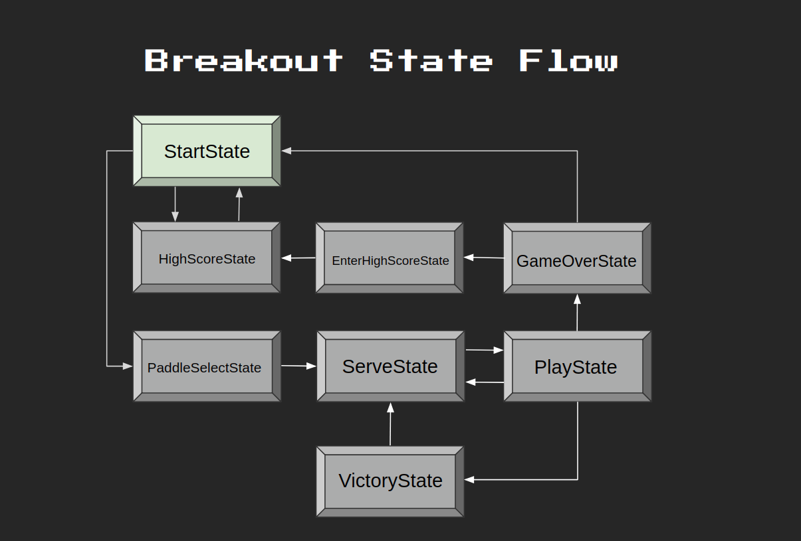

# 04. 砖块，组织，精灵图

2.28，Week2 打砖块。

## State Flow



## Sprite Sheet


只用加载一次大图，然后根据需要切出小图。

把蓝绿红紫切出来，与 `gFrames['paddles']` 的 1 到 16 一一对应。

:::code-group

```lua [切图工具]
function GenerateQuads(atlas, tilewidth, tileheight)
    local sheetWidth = atlas:getWidth() / tilewidth
    local sheetHeight = atlas:getHeight() / tileheight

    local sheetCounter = 1
    local spritesheet = {}

    for y = 0, sheetHeight - 1 do
        for x = 0, sheetWidth - 1 do
            spritesheet[sheetCounter] = love.graphics.newQuad(
                x * tilewidth,
                y * tileheight,
                tilewidth,
                tileheight,
                atlas
            )
            sheetCounter = sheetCounter + 1
        end
    end

    return spritesheet
end

function table.slice(tbl, first, last, step)
    local sliced = {}

    for i = first or 1, last or #tbl, step or 1 do
        sliced[#sliced + 1] = tbl[i]
    end

    return sliced
end

function GenerateQuadsPaddles(atlas)
    local x = 0
    local y = 64

    local counter = 1
    local quads = {}

    for i = 0, 3 do
        -- smallest
        quads[counter] = love.graphics.newQuad(x, y, 32, 16, atlas)
        counter = counter + 1
        -- medium
        quads[counter] = love.graphics.newQuad(x + 32, y, 64, 16, atlas)
        counter = counter + 1
        -- large
        quads[counter] = love.graphics.newQuad(x + 96, y, 96, 16, atlas)
        counter = counter + 1
        -- huge
        quads[counter] = love.graphics.newQuad(x, y + 16, 128, 16, atlas)
        counter = counter + 1

        x = 0
        y = y + 32
    end

    return quads
end
```

```lua [Paddle Render]
function Paddle:init()
    self.x = VIRTUAL_WIDTH / 2 - 32
    self.y = VIRTUAL_HEIGHT - 32
    self.dx = 0
    self.width = 64
    self.height = 16
    self.skin = 1
    self.size = 2
end

-- ...

function Paddle:render()
    love.graphics.draw(gTextures['main'], gFrames['paddles'][4 * (self.skin - 1) + self.size], self.x, self.y)
end
```

```lua [gFrames]
gTextures = {
    ['main'] = love.graphics.newImage('graphics/breakout.png')
}

gFrames = {
    ['paddles'] = GenerateQuadsPaddles(gTextures['main'])
}
```

:::
