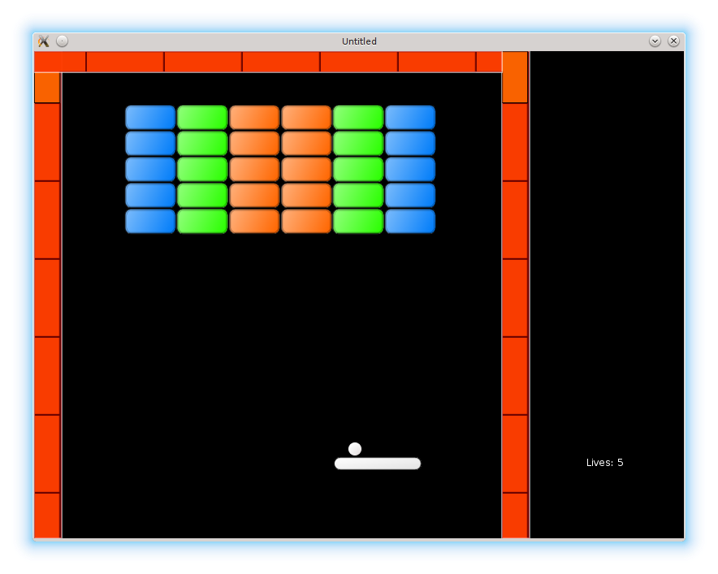

# 00. Home

This tutorial describes how to write a more or less full-featured [Arkanoid](https://en.wikipedia.org/wiki/Arkanoid) ([Breakout](https://en.wikipedia.org/wiki/Breakout_%28video_game%29)) clone.

本教程讲的是如何编写一个功能基本完整的 [Arkanoid](https://en.wikipedia.org/wiki/Arkanoid)（又称 [Breakout](https://en.wikipedia.org/wiki/Breakout_%28video_game%29)）克隆版。

Here are several screenshots from various stages of the development process:

以下是开发过程中不同阶段的一些截图：

<p align="center">
<a href="./01"></a>
<a href="./06"></a>
<br>
<a href="./23"></a>
<a href="./27"></a>
<br>
<a href="./33"></a>
</p>

The intended audience are people, who have basic programming experience, but have
trouble structuring their code for projects bigger than "Hello World".
An Arkanoid, while simple, contains many elements found in more elaborate games.
My aim is to introduce a typical code structure,
and to provide a starting point for further modifications.

本教程面向的是已经具备基础编程经验、但在组织“Hello World”之外项目代码时会感到吃力的人。Arkanoid 虽然简单，但包含了许多更复杂游戏里也常见的元素。我的目标是介绍一种典型的代码结构，并提供一个可继续扩展和修改的起点。

Lua programming language and [LÖVE](https://love2d.org/) framework are used.
Basic programming experience is assumed.
Familiarity with Lua and LÖVE is beneficial but not necessary.
Some non-obvious Lua idioms are briefly explained.

本教程使用 Lua 语言和 [LÖVE](https://love2d.org/) 框架。默认读者已经具备基础编程经验。熟悉 Lua 和 LÖVE 会有帮助，但不是必要条件。文中也会简要解释一些不太直观的 Lua 习惯用法。

## Installation

The code can be downloaded using `git`

代码可以通过 `git` 下载：

```sh
cd /your-path/
git clone https://github.com/noooway/love2d_arkanoid_tutorial
```

or by Github's ["Clone or download -> Download ZIP"](https://github.com/noooway/love2d_arkanoid_tutorial/archive/master.zip) button.

也可以通过 Github 的 ["Clone or download -> Download ZIP"](https://github.com/noooway/love2d_arkanoid_tutorial/archive/master.zip) 按钮下载。

Each step can be run with the LÖVE interpreter by issuing a `love`
command followed by the folder name, for example

每一步都可以用 LÖVE 解释器运行，只需执行 `love` 命令并跟上对应文件夹名，例如：

```sh
cd /your-path/love2d_arkanoid_tutorial
love 1-01_TheBallTheBrickThePlatform
```

## Contents

**Chapter 1** describes how to build a prototype for an Arkanoid-type
game in the most straightforward way,
without relying too much on any external libraries or advanced language features.

**Chapter 1** 讲的是如何用最直接的方式搭建一个 Arkanoid 类游戏的原型，尽量少依赖外部库或高级语言特性。

**Chapter 2** expands the prototype, introducing gamestates, basic graphics and sound.
At the end of this chapter, the general frame of the game is complete. What is left
is to fill it with the details.

**Chapter 2** 在原型的基础上继续扩展，引入游戏状态、基础图形与声音。到本章结束时，游戏的整体框架已经完整，剩下的就是填充细节。

**Chapter 3** proceeds to add functionality to achieve a full-featured game.
While the first two chapters are rather general, material in this chapter is mostly
specific for Arkanoid-type games.

**Chapter 3** 继续补齐功能，最终完成一个功能完整的游戏。前两章相对通用，而本章内容则主要针对 Arkanoid 类游戏本身。

**Appendices** - which are not written yet :) - demonstrate some additional topics, such as how to use environments to
define Lua modules, classes, and so on.

**Appendices**（目前还没写 :) ）会展示一些额外话题，比如如何使用环境来定义 Lua 模块、类等。

I realize that the length of the tutorial - almost 30 parts -
is probably a bit too much. On the other hand,
the amount of work necessary to write a game is
commonly underestimated and this tutorial
clearly shows what it actually takes to develop even a simple one.

我知道这套教程的长度——将近 30 篇——可能有点太长了。另一方面，写一个游戏真正需要的工作量常常被低估，而这套教程恰好能清楚展示：即便是一个简单的游戏，也需要投入多少实际工作。

One last thing before we start: feedback is crucial.
If you have any critique, suggestions, improvements or just any other ideas, please let me know.

在开始之前还有一句话：反馈非常重要。如果你有任何批评、建议、改进意见或其它想法，请一定告诉我。

**Chapter 1: Prototype**

1. [The Ball, The Brick, The Platform](./01)
2. [Game Objects as Lua Tables](./02)
3. [Bricks and Walls](./03)
4. [Detecting Collisions](./04)
5. [Resolving Collisions](./05)
6. [Levels](./06)

&nbsp;&nbsp;&nbsp; Appendix A: [Storing Levels as Strings](./07)  
&nbsp;&nbsp;&nbsp; Appendix B: Optimized Collision Detection ([draft](./08))

<!-- -->

**Chapter 2: General Code Structure**

1. [Splitting Code into Several Files](./09)
2. [Loading Levels from Files](./10)
3. [Straightforward Gamestates](./11)
4. [Advanced Gamestates](./12)
5. [Basic Tiles](./13)
6. [Different Brick Types](./14)
7. [Basic Sound](./15)
8. [Game Over](./16)

&nbsp;&nbsp;&nbsp; Appendix B: Stricter Modules  
&nbsp;&nbsp;&nbsp; Appendix C-1: Intro to Classes  
&nbsp;&nbsp;&nbsp; Appendix C-2: Chapter 2 Using Classes.

<!-- -->

**Chapter 3 (deprecated): Details**

1. [Improved Ball Rebounds](./17)
2. [Ball Launch From Platform (Two Objects Moving Together)](./18)
3. [Mouse Controls](./19)
4. [Spawning Bonuses](./20)
5. [Bonus Effects](./21)
6. [Glue Bonus](./22)
7. [Add New Ball Bonus](./23)
8. [Life and Next Level Bonuses](./24)
9. [Random Bonuses](./25)
10. [Menu Buttons](./26)
11. [Wall Tiles](./27)
12. [Side Panel](./28)
13. [Score](./29)
14. [Fonts](./30)
15. [More Sounds](./31)
16. [Final Screen](./32)
17. [Packaging](./33)

<!-- -->

**Beyond Programming:**

1. Game Design
2. Minimal Marketing ([draft](https://github.com/noooway/love2d_arkanoid_tutorial/wiki/Minimal-Marketing))
3. Finding a Team ([draft](https://github.com/noooway/love2d_arkanoid_tutorial/wiki/Finding-a-Team))

[Acknowledgements](https://github.com/noooway/love2d_arkanoid_tutorial/wiki/Acknowledgements)  
[Archive](https://github.com/noooway/love2d_arkanoid_tutorial/wiki/Archive)
