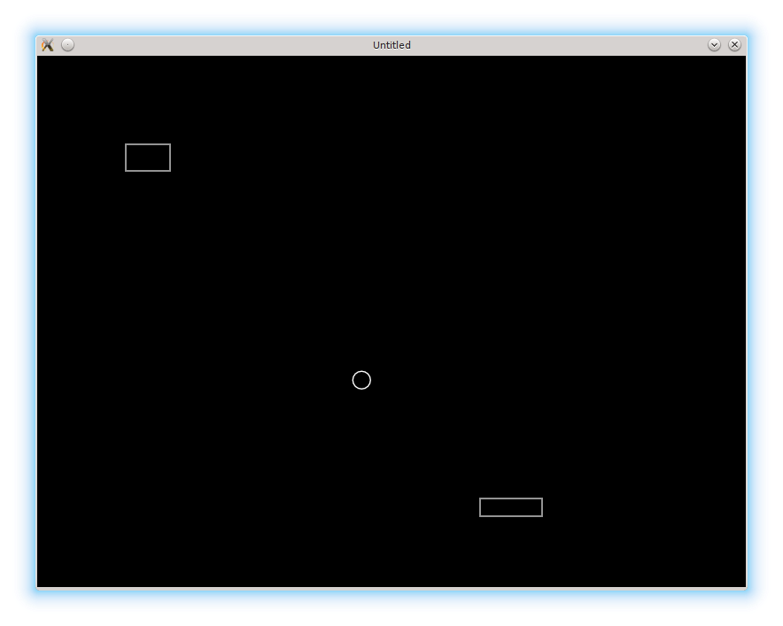

# 01. The Ball, The Brick, The Platform

A typical videogame consists of a number of interacting game objects such as a main character,
enemies, obstacles and so on. Each object has certain
properties, that control how it is displayed, responds to player actions and
interacts with other game elements.

一个典型的电子游戏由许多相互作用的游戏对象组成，比如主角、敌人、障碍等。每个对象都有一些属性，用来控制它如何显示、如何响应玩家操作，以及如何与其它游戏元素互动。

Things that are absolutely essential to any arkanoid-type game are a moving platform,
a number of bricks that the player has to break, and a ball bouncing back and forth between them.
Let's start from getting them on a screen, so there is something to play with.

任何 Arkanoid 类型游戏里最基础、必不可少的东西就是：可移动的平台、玩家需要打碎的砖块，以及在它们之间来回弹跳的球。我们先把这些东西画到屏幕上，让它至少“有得玩”。

<p align="center">

</p>

As the LÖVE [hamster ball demo](https://love2d.org/wiki/Tutorial:Hamster_Ball) tells us,
we need to define `love.load`, `love.update`, and `love.draw` callbacks.
`love.load` is executed only once right after the game is launched,
`love.update` is continually executed to update states of the game objects, and
`love.draw` redraws the screen according to the current state of the objects.
These functions have to operate on some objects, so we also need to define them and their properties.

正如 LÖVE 的 [hamster ball demo](https://love2d.org/wiki/Tutorial:Hamster_Ball) 所示，我们需要定义 `love.load`、`love.update` 和 `love.draw` 这几个回调。`love.load` 只会在游戏启动后执行一次，`love.update` 会持续运行以更新游戏对象的状态，而 `love.draw` 则会根据对象当前状态重绘屏幕。这些函数必须操作一些对象，所以我们也需要先把对象及其属性定义出来。

```lua
--(*1)

function love.load()
end

function love.update(dt)
end

function love.draw()
end
```

(\*1): beginning of the file is a good place to define properties of several game objects

(\*1)：文件开头是定义若干游戏对象属性的好地方。

It's possible to represent objects as simple Lua tables with fields holding necessary properties.

我们可以把对象表示为简单的 Lua 表，用字段保存需要的属性。

The ball has position and speed:

球需要有位置和速度：

```lua
local ball = {}
ball.position_x = 300
ball.position_y = 300
ball.speed_x = 300
ball.speed_y = 300
```

Same for the platform, but it doesn't need to have `speed_y` (since it moves only horizontally):

平台也是一样，不过它不需要 `speed_y`（因为只沿水平方向移动）：

```lua
local platform = {}
platform.position_x = 500
platform.position_y = 500
platform.speed_x = 300
```

The brick doesn't need speed at all:

砖块完全不需要速度：

```lua
local brick = {}
brick.position_x = 100
brick.position_y = 100
```

This information is enough to define `love.update()` callback.

这些信息已经足够用来定义 `love.update()` 回调。

```lua
function love.update( dt )
   ball.position_x = ball.position_x + ball.speed_x * dt --(*1)
   ball.position_y = ball.position_y + ball.speed_y * dt

   if love.keyboard.isDown("right") then  --(*2)
      platform.position_x = platform.position_x + (platform.speed_x * dt)
   end
   if love.keyboard.isDown("left") then
      platform.position_x = platform.position_x - (platform.speed_x * dt)
   end
end
```

(\*1): The ball's position is updated according to it's speed.
(\*2): The platform reacts on the arrow keys, as suggested by the [Hamster demo](https://love2d.org/wiki/Tutorial:Hamster_Ball).

(\*1)：球的位置会根据它的速度进行更新。
(\*2)：平台根据方向键进行移动，这和 [Hamster demo](https://love2d.org/wiki/Tutorial:Hamster_Ball) 的做法一致。

In order to define `love.draw()`, we need some additional properties for our objects: a radius for the ball, and a width and a height for the brick and the platform.
Actual values are not important right now, so they can be assigned somewhat arbitrary.

为了定义 `love.draw()`，我们还需要补充一些属性：球的半径，以及砖块和平台的宽度、高度。具体数值暂时并不重要，随便给个合理值即可。

```lua
   ..... --(*1)
   ball.radius = 10
   .....
   platform.width = 70
   platform.height = 20
   .....
   brick.width = 50
   brick.height = 30
   .....
```

(\*1): I'm going to use 5 dots to denote code skips. Usually it's is clear from the context.

(\*1)：我会用 5 个点表示省略的代码，这通常从上下文就能看懂。

Of course, it is reasonable to place these properties near the position and the speed definitions.

当然，把这些属性放在位置和速度定义的附近会更合理。

Now it is possible to define `love.draw()` callback.
There are a number of functions in [`love.graphics`](https://love2d.org/wiki/love.graphics), which are capable to draw graphical primitives.
We need [`love.graphics.circle`](https://love2d.org/wiki/love.graphics.circle) for the ball and [`love.graphics.rectangle`](https://love2d.org/wiki/love.graphics.rectangle) for the brick and the platform.
With them, `love.draw()` can be defined in the following way:

现在就可以定义 `love.draw()` 回调了。[`love.graphics`](https://love2d.org/wiki/love.graphics) 里有不少函数可以用来绘制图形基础元素。球需要用 [`love.graphics.circle`](https://love2d.org/wiki/love.graphics.circle) 来画，砖块和平台则用 [`love.graphics.rectangle`](https://love2d.org/wiki/love.graphics.rectangle)。有了这些，`love.draw()` 就可以这样写：

```lua
function love.draw()
   local segments_in_circle = 16
   love.graphics.circle( 'line',
			 ball.position_x,
			 ball.position_y,
			 ball.radius,
			 segments_in_circle )
   love.graphics.rectangle( 'line',
			    platform.position_x,
			    platform.position_y,
			    platform.width,
			    platform.height )
   love.graphics.rectangle( 'line',
			    brick.position_x,
			    brick.position_y,
			    brick.width,
			    brick.height )
end
```

The last two remaining functions are `love.quit()` and `love.load()`.
We do not need them right now, but it is nice to put a remainder about them:

剩下两个函数是 `love.quit()` 和 `love.load()`。当前并不需要它们，但在代码里留个提醒也挺好：

```lua
function love.load()
end
.....
function love.quit()
  print("Thanks for playing! Come back soon!")
end
```
