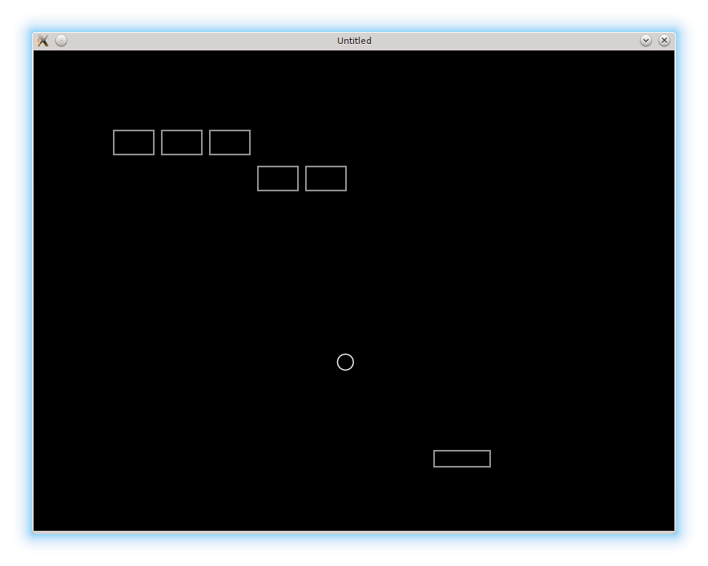

# 02. Game Objects as Lua Tables

In the [first part](./01), several game objects have been introduced. Before moving further, it is useful to establish
a way the game objects are represented in the code.

在[第一部分](./01)里我们已经引入了几个游戏对象。继续往下之前，先明确这些对象在代码中的表示方式，会更有帮助。

<p align="center">

</p>

In complex games a number of interacting game objects can be wast and it is common
to use object-oriented approach in the code to organize and structure them.
In such case, each game object is represented as an instance of a class.
For simple games, such as this one, it is not necessary, and it is suffice to use
basic Lua functionality and represent each game object as a simple Lua table.
However, I plan to demonstrate how to use an object-oriented approach in the appendices.

在复杂游戏里，交互的游戏对象数量会非常庞大，因此通常会用面向对象的方式来组织和结构化代码。在这种情况下，每个游戏对象都是某个类的实例。但对于像本教程这样的简单游戏，这并非必要，使用 Lua 的基础功能，把每个游戏对象表示成一个普通的 Lua 表就足够了。不过在附录里我还是会演示如何使用面向对象的方法。

Regarding the initial code, a first thing to notice is that `love.update` and `love.draw`
can be split into several functions, corresponding to update and draw of independent game objects:

对于初始代码，首先要注意的是，`love.update` 和 `love.draw` 可以拆成多个函数，对应各个独立游戏对象的更新和绘制：

```lua
function love.update( dt )
   ball.update( dt )
   platform.update( dt )
   .....
end

function love.draw()
   ball.draw()
   platform.draw()
   .....
end
```

The `ball.update` and `ball.draw` are defined as

`ball.update` 和 `ball.draw` 可以这样定义：

```lua
function ball.update( dt )
   ball.position_x = ball.position_x + ball.speed_x * dt
   ball.position_y = ball.position_y + ball.speed_y * dt
end

function ball.draw()
   local segments_in_circle = 16
   love.graphics.circle( 'line',
                         ball.position_x,
                         ball.position_y,
                         ball.radius,
                         segments_in_circle )
end
```

The functions for the platform are similar.

平台的函数也是类似的。

With bricks, however, the situation is more complicated.
First of all, there are going to be several of them, each one with it's own characteristics.
I rename the `brick` table from the previous part into `bricks`, where I'm going to store all the relevant information. Individual bricks themselves are going to be stored in the `bricks.current_level_bricks` table, which will be populated on level construction.

但砖块就没那么简单了。首先，砖块会有很多个，每个还可能有各自的属性。因此我把上一部分里的 `brick` 表改名为 `bricks`，用它来存放所有相关信息。单个砖块本身会存到 `bricks.current_level_bricks` 这个表里，它会在构建关卡时被填充。

```lua
local bricks = {}
bricks.current_level_bricks = {}
.....
```

Each single brick is represented as a table with `position_x`, `position_y`, `width` and `height` fields.
I define a special function `bricks.new_brick` to construct such objects:

每个砖块都用一个表来表示，包含 `position_x`、`position_y`、`width` 和 `height` 这些字段。我定义了一个专门的 `bricks.new_brick` 函数来构造这种对象：

```lua
function bricks.new_brick( position_x, position_y, width, height )
   return( { position_x = position_x,
             position_y = position_y,
             width = width or bricks.brick_width,           --(*1)
             height = height or bricks.brick_height } )
end
```

(\*1): `x = a or b` is a common idiom in Lua. If `a` is not `nil` and not `false`, than the result of `a or b` expression is `a` and `x = a`, otherwise the result of `a or b` is `b` and `x = b`. It is commonly used in function definitions to provide default values to variables where it has a form `local_to_function_variable = function_argument or default_value`. If the user does not provide `function_argument` to the function call, it's value is `nil` and `default_value` is used. In this case, if `width` is supplied as an argument to the `bricks.new_brick` call, than that value is used; otherwise the default one `bricks.brick_width` is used.

(\*1)：`x = a or b` 是 Lua 里很常见的写法。如果 `a` 既不是 `nil` 也不是 `false`，那么表达式 `a or b` 的结果就是 `a`，于是 `x = a`；否则结果就是 `b`，于是 `x = b`。这通常用于函数参数的默认值，比如 `local_var = function_argument or default_value`。当调用时没有提供 `function_argument`，它的值就是 `nil`，于是会采用 `default_value`。在这里，如果给 `bricks.new_brick` 传了 `width` 参数，就用它；否则就用默认值 `bricks.brick_width`。

To draw an individual brick, the following function is used:

绘制单个砖块可以用下面这个函数：

```lua
function bricks.draw_brick( single_brick )
   love.graphics.rectangle( 'line',
                            single_brick.position_x,
                            single_brick.position_y,
                            single_brick.width,
                            single_brick.height )
end
```

As before, there is nothing to `update` in brick:

和之前一样，砖块本身没有什么需要更新的：

```lua
function bricks.update_brick( single_brick )
end
```

To add a newly constructed brick to `bricks.current_level_bricks` table, special function is defined:

为了把新建的砖块加入 `bricks.current_level_bricks` 表，需要定义一个专用函数：

```lua
function bricks.add_to_current_level_bricks( brick )
   table.insert( bricks.current_level_bricks, brick )
end
```

For demonstration purposes, I explicitly construct several bricks in `love.load`:

为了演示，我在 `love.load` 里手动构建了几个砖块：

```lua
function love.load()
   bricks.add_to_current_level_bricks( bricks.new_brick( 100, 100 ))
   bricks.add_to_current_level_bricks( bricks.new_brick( 160, 100 ))
   .....
end
```

It is possible to update and draw each brick by iterating over `bricks.current_level_bricks` and
calling the corresponding function for each individual brick:

通过遍历 `bricks.current_level_bricks`，并对每个砖块调用对应函数，就可以完成砖块的更新与绘制：

```lua
function bricks.draw()
   for _, brick in pairs( bricks.current_level_bricks ) do   --(*1)
      bricks.draw_brick( brick )
   end
end

function bricks.update( dt )
   for _, brick in pairs( bricks.current_level_bricks ) do
      bricks.update_brick( brick )
   end
end
```

(\*1): an underscore `_` is a valid Lua name, that is commonly used for dumb variables,
that are not necessary in the further code.

(\*1)：下划线 `_` 在 Lua 中是合法变量名，通常用于表示“占位变量”，也就是后续不需要用到的值。

Calls to these functions have to be placed in the `love.update` and `love.draw`.

这些函数的调用需要放到 `love.update` 和 `love.draw` 里：

```lua
function love.update( dt )
   ball.update( dt )
   platform.update( dt )
   bricks.update( dt )
end

function love.draw()
   ball.draw()
   platform.draw()
   bricks.draw()
end
```
