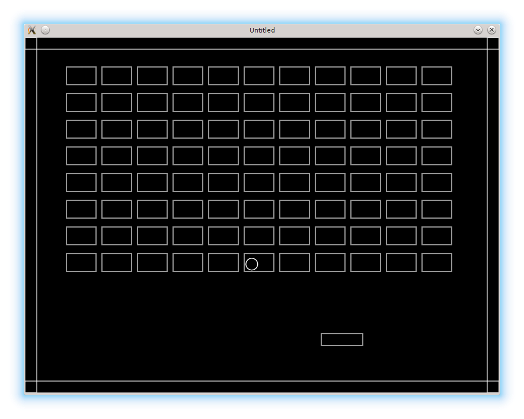

# 03. Bricks and Walls

In Arkanoid bricks are arranged in a 2d-pattern.
The next step is to add an array of bricks on the screen and walls to the borders.

在 Arkanoid 里，砖块是按二维阵列排列的。下一步就是把一组砖块放到屏幕上，并在边缘加上墙体。

<p align="center">

</p>

The simplest way to create a 2d-pattern is to define several rows and columns of bricks:

创建二维阵列最简单的方法，就是定义砖块的行数和列数：

```lua
bricks.rows = 8
bricks.columns = 11
```

For each brick we have to provide it's top-left corner position.
It can be calculated using it's row and column indices, individual brick's width and height,
vertical and horizontal distances between the bricks, and position of the top-left brick
relative to the top-left corner of the screen:

每个砖块都需要一个左上角坐标。这个坐标可以根据行列索引、单个砖块的宽高、砖块之间的水平与垂直间距，以及最左上砖块相对屏幕左上角的位置来计算：

```lua
local new_brick_position_x = bricks.top_left_position_x +
   ( col - 1 ) *                                           --(*1)
   ( bricks.brick_width + bricks.horizontal_distance )
local new_brick_position_y = bricks.top_left_position_y +
   ( row - 1 ) *                                           --(*1)
   ( bricks.brick_height + bricks.vertical_distance )
```

(\*1): indexing in Lua starts from `1` instead of `0`.

(\*1)：Lua 的索引是从 `1` 开始，而不是 `0`。

When actual values for the parameters are provided, it is possible to populate
`bricks.current_level_bricks` by looping over possible values of the row and column indices:

当这些参数有了具体数值之后，就可以通过遍历行列索引来填充 `bricks.current_level_bricks`：

```lua
local bricks = {}
bricks.rows = 8                    --(*1a)
bricks.columns = 11
bricks.top_left_position_x = 70
bricks.top_left_position_y = 50
bricks.brick_width = 50
bricks.brick_height = 30
bricks.horizontal_distance = 10
bricks.vertical_distance = 15      --(*1b)
bricks.current_level_bricks = {}
.....
function bricks.construct_level()
   for row = 1, bricks.rows do
      for col = 1, bricks.columns do
         local new_brick_position_x = bricks.top_left_position_x +   --(*2)
            ( col - 1 ) *
            ( bricks.brick_width + bricks.horizontal_distance )
         local new_brick_position_y = bricks.top_left_position_y +   --(*2)
            ( row - 1 ) *
            ( bricks.brick_height + bricks.vertical_distance )
         local new_brick = bricks.new_brick( new_brick_position_x,   --(*3)
                                             new_brick_position_y )
         bricks.add_to_current_level_bricks( new_brick )             --(*4)
      end
   end
end
```

(\*1a)-(\*1b): definition of the properties necessary to compute top left corner position for each brick.  
(\*2): top left position is computed.  
(\*3): a new brick is created.  
(\*4): the new brick is inserted into the bricks table.

(\*1a)-(\*1b)：定义用于计算每个砖块左上角坐标所需的属性。  
(\*2)：计算左上角坐标。  
(\*3)：创建新的砖块。  
(\*4)：把新砖块插入砖块表。

In this part, I also want to add the walls on the borders of the screen.
A wall is a rectangle, just like a brick is, so I use a `walls` table which is
similar to `bricks` in it's structure.

在这一部分里，我还要在屏幕边缘加上墙。墙本质上也是一个矩形，和砖块类似，所以我用一个 `walls` 表来管理，它的结构和 `bricks` 很像。

There is a minor difference in `walls.new_wall` constructor: I do not provide a
default width and height for the wall:

`walls.new_wall` 的构造函数有一个小差别：我不会为墙提供默认的宽高。

```lua
function walls.new_wall( position_x, position_y, width, height )
   return( { position_x = position_x,
             position_y = position_y,
             width = width,
             height = height } )
end
```

In `walls.construct_walls`, the left, right, top and bottom walls are constructed and then manually
inserted into the `walls.current_level_walls` table:

在 `walls.construct_walls` 中，会创建左、右、上、下四面墙，然后手动插入 `walls.current_level_walls` 表：

```lua
function walls.construct_walls()
   local left_wall = walls.new_wall(
      0,
      0,
      walls.wall_thickness,
      love.graphics.getHeight()
   )
   local right_wall = walls.new_wall(
      love.graphics.getWidth() - walls.wall_thickness,
      0,
      walls.wall_thickness,
      love.graphics.getHeight()
   )
   local top_wall = walls.new_wall(
      0,
      0,
      love.graphics.getWidth(),
      walls.wall_thickness
   )
   local bottom_wall = walls.new_wall(
      0,
      love.graphics.getHeight() - walls.wall_thickness,
      love.graphics.getWidth(),
      walls.wall_thickness
   )
   walls.current_level_walls["left"] = left_wall
   walls.current_level_walls["right"] = right_wall
   walls.current_level_walls["top"] = top_wall
   walls.current_level_walls["bottom"] = bottom_wall
end
```

Constructors for the walls and the bricks have to be placed in `love.load`, so
the walls and the bricks are created on the start of the game:

砖块和墙的构造函数需要放在 `love.load` 里，这样游戏一开始就会创建它们：

```lua
function love.load()
   bricks.construct_level()
   walls.construct_walls()
end
```

Finally, the `love.update` and `love.draw` functions now look like:

最后，`love.update` 和 `love.draw` 就变成这样：

```lua
function love.update( dt )
   ball.update( dt )
   platform.update( dt )
   bricks.update( dt )
   walls.update( dt )
end

function love.draw()
   ball.draw()
   platform.draw()
   bricks.draw()
   walls.draw()
end
```
