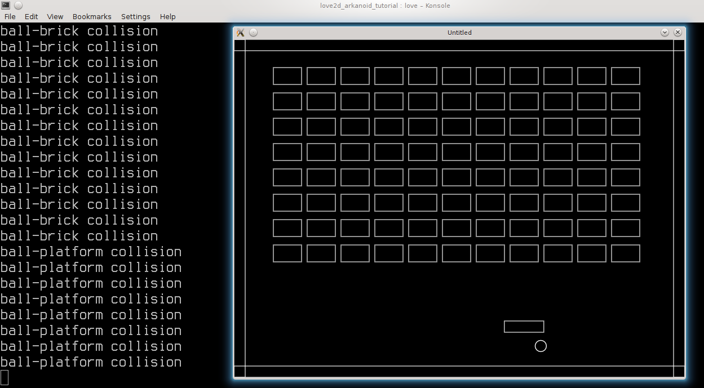

# 04. Detecting Collisions

The next step is to deal with collisions. A collision happens when two objects overlap. First we need to detect an overlap, then to react on it (i.e. resolve collision). Collisions are the part of the game, where a good piece of it's logic resigns. In this part I implement basic collision detection.

<p align="center">

</p>

It is convenient to store all collision-related functions in a special table:

```lua
local collisions = {}
```

Collisions have to be detected each update cycle --
`collisions.resolve_collisions` function is added into `love.update`
( the function is called `resolve_collisions`, but currently it will be doing only detection ).

```lua
function love.update( dt )
   .....
   collisions.resolve_collisions()
end
```

There are 4 types of collisions: ball-platform, ball-walls, ball-bricks and platform-walls.
Each of them is checked separately:

```lua
function collisions.resolve_collisions()
   collisions.ball_platform_collision( ball, platform )
   collisions.ball_walls_collision( ball, walls )
   collisions.ball_bricks_collision( ball, bricks )
   collisions.platform_walls_collision( platform, walls )
end
```

For simplicity, I'm going to approximate the ball by an axis-aligned square.
It significantly simplifies collision detection and collision resolution and it turns out to be sufficient for the current prototype. After that, all 4 types of collisions can be treated as collisions of rectangles.

It is convenient to have a helper function that detects an overlap of
two rectangles. Suppose the rectangles - `a` and `b` - represented
by tables with the fields `x`,`y`,`width` and `height`.
We can detect an overlap with ([_see the second answer_](http://gamedev.stackexchange.com/questions/586/what-is-the-fastest-way-to-work-out-2d-bounding-box-intersection); _add an explanation here_)

```lua
function collisions.check_rectangles_overlap( a, b )
   local overlap = false
   if not( a.x + a.width < b.x  or b.x + b.width < a.x  or
           a.y + a.height < b.y or b.y + b.height < a.y ) then
      overlap = true
   end
   return overlap
end
```

This function expects two tables with fields `x`,`y`,`width` and `height`.
However, our game objects have different representation.
To detect an overlap, it is necessary to prepare the `a` and `b` rectangles first.
After that it is possible to use `collisions.check_rectangles_overlap` and in the case of overlap print a message in the console.

```lua
function collisions.ball_platform_collision( ball, platform )
   local a = { x = platform.position_x,                  --(*1)
               y = platform.position_y,
               width = platform.width,
               height = platform.height }
   local b = { x = ball.position_x - ball.radius,        --(*1)
               y = ball.position_y - ball.radius,
               width = 2 * ball.radius,
               height = 2 * ball.radius }
   if collisions.check_rectangles_overlap( a, b ) then   --(*2)
      print( "ball-platform collision" )                 --(*3)
   end
end
```

(\*1): rectangles `a` and `b` are constructed from the properties of the game objects.  
(\*2): the overlap between `a` and `b` is checked.  
(\*3): if they overlap, a message to the console is printed.

The ball-bricks, ball-walls, and platform-walls collisions are dealt with in a same fashion.
The only difference is that it is necessary to iterate over all bricks and all walls.
For example, for the ball-bricks case:

```lua
function collisions.ball_bricks_collision( ball, bricks )
   local b = { x = ball.position_x - ball.radius,           --(*1)
               y = ball.position_y - ball.radius,
               width = 2 * ball.radius,
               height = 2 * ball.radius }
   for i, brick in pairs( bricks.current_level_bricks ) do  --(*2)
      local a = { x = brick.position_x,                     --(*3)
                  y = brick.position_y,
                  width = brick.width,
                  height = brick.height }
      if collisions.check_rectangles_overlap( a, b ) then   --(*4)
         print( "ball-brick collision" )
      end
   end
end
```

(\*1): rectangle for the ball is constructed.  
(\*2): iteration over bricks starts.  
(\*3),(\*4): for each brick, the rectangle is constructed and the overlap with the ball is checked

The last change for this part is unrelated to collisions: the `love.keyreleased` callback is added, so the game exits when `Esc` key is pressed (released, actually).

```lua
function love.keyreleased( key, code )
   if  key == 'escape' then
      love.event.quit()
   end
end
```
