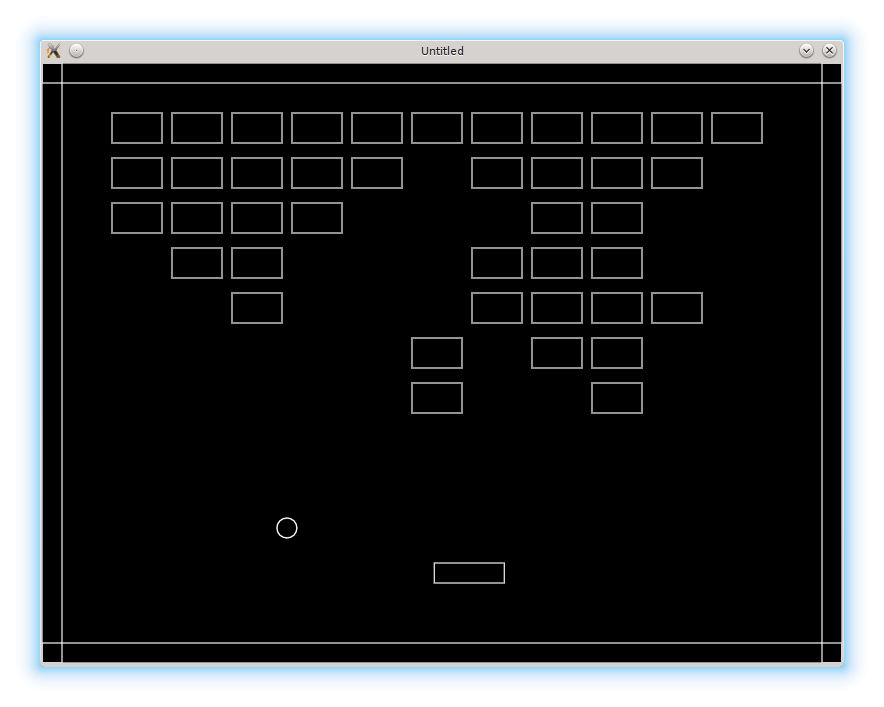
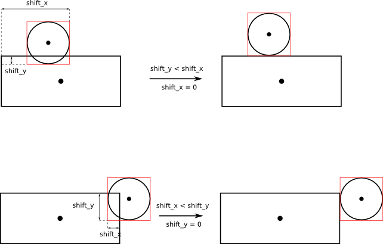

# 05. Resolving Collisions

Ok, we can detect collisions. Now it's time to deal with how our objects react on them, i.e. with the collision resolution.

碰撞已经能检测了。现在要处理的是对象如何对碰撞作出反应，也就是碰撞的处理（collision resolution）。

<p align="center">

</p>

When two objects overlap, it turns out convenient to return from the `collisions.check_rectangles_overlap` not only the fact of the overlap but also a displacement necessary to resolve the overlap.
I suppose that the shape `b` is the one that has to be displaced, and the `a` should remain
in place. If the center of the `b` is to the right from the center of the `a`, the `b` is shifted right to resolve the overlap, in the other case - left ( shift is negative ). Same for y-axis.

当两个对象重叠时，仅返回“是否重叠”还不够，最好还能返回一个“需要移动多少才能解除重叠”的位移值。这里我假设 `b` 需要移动，而 `a` 保持不动。如果 `b` 的中心在 `a` 的中心右侧，那么 `b` 就向右移动来消除重叠；反之则向左（位移为负）。y 轴方向也是同理。

```lua
function collisions.check_rectangles_overlap( a, b )
   local overlap = false
   local shift_b_x, shift_b_y = 0, 0
   if not( a.x + a.width < b.x  or b.x + b.width < a.x  or
           a.y + a.height < b.y or b.y + b.height < a.y ) then
      overlap = true
      if ( a.x + a.width / 2 ) < ( b.x + b.width / 2 ) then
         shift_b_x = ( a.x + a.width ) - b.x                    --(*1a)
      else
         shift_b_x = a.x - ( b.x + b.width )                    --(*1b)
      end
      if ( a.y + a.height / 2 ) < ( b.y + b.height / 2 ) then
         shift_b_y = ( a.y + a.height ) - b.y                   --(*2)
      else
         shift_b_y = a.y - ( b.y + b.height )                   --(*2)
      end
   end
   return overlap, shift_b_x, shift_b_y                         --(*3)
end
```

(\*1a): `b` to the right from the center of `a`; shift `b` to the right  
(\*1b): `b` to the left from `a`; shift to the left.  
(\*2): same for y axis.  
(\*3): shift is returned along with the fact of the overlap

(\*1a)：`b` 在 `a` 的中心右侧，把 `b` 向右移动。  
(\*1b)：`b` 在 `a` 左侧，把 `b` 向左移动。  
(\*2)：y 轴同理。  
(\*3)：除了是否重叠之外，还返回位移量。

Now, in collision-resolution functions we need to check for overlap,
and if it happens - react on in.
For platform-ball collision, there is no need to modify the platform,
but it is necessary to change the ball direction.
`ball.rebound` is responsible for this.

现在在碰撞处理函数里，我们需要检查是否重叠，并在发生重叠时做出响应。以平台-球碰撞为例：平台本身不需要动，但球的方向必须改变。这个处理由 `ball.rebound` 来完成。

```lua
function collisions.ball_platform_collision( ball, platform )
   local overlap, shift_ball_x, shift_ball_y
   local a = { x = platform.position_x,
               y = platform.position_y,
               width = platform.width,
               height = platform.height }
   local b = { x = ball.position_x - ball.radius,
               y = ball.position_y - ball.radius,
               width = 2 * ball.radius,
               height = 2 * ball.radius }
   overlap, shift_ball_x, shift_ball_y =
      collisions.check_rectangles_overlap( a, b )
   if overlap then
      ball.rebound( shift_ball_x, shift_ball_y )       --(*1)
   end
end
```

(\*1): if there is an overlap between the ball and the platform, make ball rebound.

(\*1)：如果球和平台发生重叠，就让球反弹。

<p align="center">

</p>

In `ball.rebound` function the overlap values are passed.
I determine the minimal one of them, zero the other one and shift the ball by the nonzero value (see the figure; _todo: redraw it_).
Besides, the speed direction along the shift axis is reversed.

在 `ball.rebound` 函数里会传入重叠位移。我会取两者中的较小值，把另一项置为 0，然后让球沿非零方向移动（见图；_待重绘_）。同时，沿着移动方向的速度也要反向。

```lua
function ball.rebound( shift_ball )
   local min_shift = math.min( math.abs( shift_ball.x ),
                               math.abs( shift_ball.y ) )
   if math.abs( shift_ball.x ) == min_shift then
      shift_ball.y = 0
   else
      shift_ball.x = 0
   end
   ball.position = ball.position + shift_ball
   if shift_ball.x ~= 0 then
      ball.speed.x = -ball.speed.x
   end
   if shift_ball.y ~= 0 then
      ball.speed.y = -ball.speed.y
   end
end
```

Ball-wall collisions are resolved in a similar fashion.
Platform-wall is the same, but there is no need to change the velocity of the platform.

球-墙的碰撞处理方式类似。平台-墙也是一样，只是平台的速度不需要反向。

For the ball-brick collision it is necessary to delete the brick on collision.
Brick reaction on the collision is described by `bricks.brick_hit_by_ball` function.
For now, the only reaction is to remove the brick from the `bricks.current_level_bricks` table.
This is done by executing `table.remove`.
To implement this, it is necessary to pass the index of the brick into `bricks.current_level_bricks`.

球-砖块碰撞时需要把砖块删除。砖块对碰撞的反应由 `bricks.brick_hit_by_ball` 函数描述。目前唯一的反应就是把砖块从 `bricks.current_level_bricks` 表里移除，这可以通过 `table.remove` 实现。为此，需要把砖块在表中的索引传进去。

```lua
function collisions.ball_bricks_collision( ball, bricks )
   local overlap, shift_ball_x, shift_ball_y
   .....
   for i, brick in pairs( bricks.current_level_bricks ) do
      .....
      overlap, shift_ball_x, shift_ball_y =
         collisions.check_rectangles_overlap( a, b )
      if overlap then
         ball.rebound( shift_ball_x, shift_ball_y )
         bricks.brick_hit_by_ball( i, brick,                     --(*1)
                                   shift_ball_x, shift_ball_y )
      end
   end
end

function bricks.brick_hit_by_ball( i, brick, shift_ball_x, shift_ball_y )
   table.remove( bricks.current_level_bricks, i )                --(*2)
end
```

(\*1): brick reaction on the collision is stored in the `bricks.brick_hit_by_ball` function.  
(\*2): brick is removed from the `bricks.current_level_bricks`

(\*1)：砖块的碰撞反应放在 `bricks.brick_hit_by_ball` 函数里。  
(\*2)：从 `bricks.current_level_bricks` 里移除该砖块。
