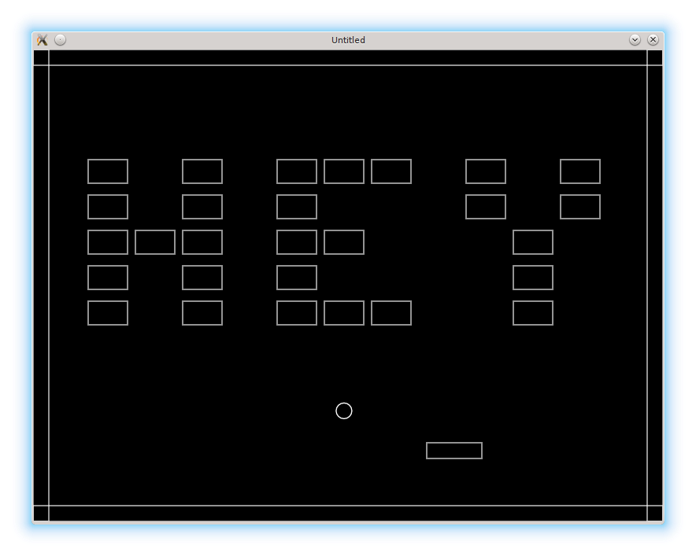

# 06. Levels

The next step is to implement different levels.

下一步是实现不同的关卡。

<p align="center">

</p>

All levels-related information will be held at the `levels` table.
The actual sequence of levels will be stored in the `levels.sequence` array.

所有与关卡相关的信息都放在 `levels` 表里。关卡的实际顺序放在 `levels.sequence` 数组中。

```lua
local levels = {}
.....
levels.sequence = {}
```

I represent each level as a 2d-table.
Inner tables correspond to the rows of the bricks.
In the future, the numbers will indicate the brick types;
currently they only show whether the brick is present on certain position or not.

我用一个二维表来表示每一关。内层表对应砖块的行。以后这些数字会用来表示砖块类型；现在它们只表示该位置是否有砖块。

```lua
levels.sequence[1] = {
   { 0, 0, 0, 0, 0, 0, 0, 0, 0, 0, 0 },
   { 0, 0, 0, 0, 0, 0, 0, 0, 0, 0, 0 },
   { 1, 0, 1, 0, 1, 1, 1, 0, 1, 0, 1 },
   { 1, 0, 1, 0, 1, 0, 0, 0, 1, 0, 1 },
   { 1, 1, 1, 0, 1, 1, 0, 0, 0, 1, 0 },
   { 1, 0, 1, 0, 1, 0, 0, 0, 0, 1, 0 },
   { 1, 0, 1, 0, 1, 1, 1, 0, 0, 1, 0 },
   { 0, 0, 0, 0, 0, 0, 0, 0, 0, 0, 0 },
}

levels.sequence[2] = {
   { 0, 0, 0, 0, 0, 0, 0, 0, 0, 0, 0 },
   { 0, 0, 0, 0, 0, 0, 0, 0, 0, 0, 0 },
   { 1, 1, 0, 0, 1, 0, 1, 0, 1, 1, 1 },
   { 1, 0, 1, 0, 1, 0, 1, 0, 1, 0, 0 },
   { 1, 1, 1, 0, 0, 1, 0, 0, 1, 1, 0 },
   { 1, 0, 1, 0, 0, 1, 0, 0, 1, 0, 0 },
   { 1, 1, 1, 0, 0, 1, 0, 0, 1, 1, 1 },
   { 0, 0, 0, 0, 0, 0, 0, 0, 0, 0, 0 },
}
```

Since there are several levels, it is necessary to maintain the current level number:

既然有多关，就需要维护当前关卡号：

```lua
levels.current_level = 1
```

Changes are necessary in `bricks.construct_level` function, to make it
receive one of the `levels.sequence[.....]` tables with bricks arrangement.

需要改一下 `bricks.construct_level`，让它接收 `levels.sequence[.....]` 中的某个砖块排列表。

```lua
function bricks.construct_level( level_bricks_arrangement )
   bricks.no_more_bricks = false
   for row_index, row in ipairs( level_bricks_arrangement ) do         --(*1)
      for col_index, bricktype in ipairs( row ) do
         if bricktype ~= 0 then                                        --(*2)
            local new_brick_position_x = bricks.top_left_position_x +
               ( col_index - 1 ) *
               ( bricks.brick_width + bricks.horizontal_distance )
            local new_brick_position_y = bricks.top_left_position_y +
               ( row_index - 1 ) *
               ( bricks.brick_height + bricks.vertical_distance )
            local new_brick = bricks.new_brick( new_brick_position_x,
                                                new_brick_position_y )
            table.insert( bricks.current_level_bricks, new_brick )
         end
      end
   end
end
```

(\*1): Instead of the fixed number of rows and columns, the iteration goes
over the elements of the `level_bricks_arrangement`.  
(\*2): The brick is created if it's type is nonzero.

(\*1)：不再用固定行列数，而是遍历 `level_bricks_arrangement` 的元素。  
(\*2)：只有当砖块类型不是 0 时才创建砖块。

When there are no more bricks left, switch to the next level happens.
The number of remaining bricks is monitored by `bricks.update` function.
If there are none, a function to switch to the next level could be called.
However, instead of that, I raise the `bricks.no_more_bricks` flag, which
is checked each update cycle

当砖块全部被打完时，就该切换到下一关。剩余砖块数由 `bricks.update` 监控。如果已经没有砖块了，本可以直接调用切关函数，但我选择设置一个 `bricks.no_more_bricks` 标志，并在每次更新时检查它。

```lua
function bricks.update( dt )
   if #bricks.current_level_bricks == 0 then    --(*1)
      bricks.no_more_bricks = true
   else
      for _, brick in pairs( bricks.current_level_bricks ) do
         bricks.update_brick( brick )
      end
   end
end

function love.update( dt )
   .....
   levels.switch_to_next_level( bricks )
end
```

(\*1): The number of remaining bricks is equivalent to the length of the `bricks.current_level_bricks` table.

(\*1)：剩余砖块数等于 `bricks.current_level_bricks` 表的长度。

If it is on, then the `current_level` is updated,
the new set of bricks is constructed and the ball is repositioned.

如果这个标志为真，就更新 `current_level`，构建新的砖块集合，并重置球的位置。

```lua
function levels.switch_to_next_level( bricks )
   if bricks.no_more_bricks then
      .....
         levels.current_level = levels.current_level + 1
         bricks.construct_level( levels.sequence[levels.current_level] )
         ball.reposition()
      .....
      end
   end
end

function ball.reposition()
   ball.position_x = 200
   ball.position_y = 500
end
```

It is possible to directly call the `levels.switch_to_next_level`
in the `bricks.update` instead of rising the `bricks.no_more_bricks` flag.
However, the flag will be more convenient later, when gamestates are introduced.

你也可以在 `bricks.update` 中直接调用 `levels.switch_to_next_level`，而不是设置 `bricks.no_more_bricks` 标志。但后面引入游戏状态（gamestates）时，这个标志会更方便。

It is also necessary to do something special when there are no more levels, i.e. when the game is finished.
For now, displaying a simple congratulations message should be sufficient.

当关卡全部通关时，也需要做点特别处理。现在先简单显示一条祝贺信息就够了。

The total number of levels equals to the length of the `levels.sequence` array.
It is possible to check whether the `levels.current_level` is the last one by comparing
it with the `#levels.sequence`. When there are no more levels left,
`switch_to_next_level` function raises the `levels.gamefinished` flag.

关卡总数等于 `levels.sequence` 数组的长度。把 `levels.current_level` 和 `#levels.sequence` 比较，就能判断是否已经到最后一关。当没有更多关卡时，`switch_to_next_level` 会设置 `levels.gamefinished` 标志。

```lua
function levels.switch_to_next_level( bricks )
   if bricks.no_more_bricks then
      if levels.current_level < #levels.sequence then       --(*1)
         levels.current_level = levels.current_level + 1                  --(*2)
         bricks.construct_level( levels.sequence[levels.current_level] )
         ball.reposition()
      else
         levels.gamefinished = true                                       --(*3)
      end
   end
end
```

(\*1): checks, whether the `levels.current_level` is the last one.  
(\*2): if not, update the level counter, construct new level and reposition the ball.  
(\*3): otherwise signal that the game is finished.

(\*1)：检查 `levels.current_level` 是否为最后一关。  
(\*2)：如果不是，更新关卡编号，构建新关卡并重置球的位置。  
(\*3)：否则标记游戏结束。

When `levels.gamefinished` is on, the message is displayed

当 `levels.gamefinished` 为 true 时显示提示信息：

```lua
function love.draw()
   .....
   walls.draw()
   if levels.gamefinished then
      love.graphics.printf( "Congratulations!\n" ..
			       "You have finished the game!",
			    300, 250, 200, "center" )
   end
end
```

Through this tutorial I've chosen to represent levels as 2d Lua tables.
In the [appendix A](./07) a
method to store them as text strings is demonstrated.

在本教程中，我选择用二维 Lua 表来表示关卡。在[附录 A](./07) 里会演示如何用文本字符串来存储关卡。
