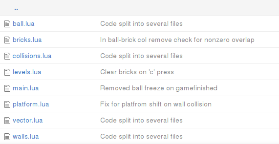

# 09. Splitting Code Into Several Files

In this part I'm finally going to split the `main.lua` into several smaller files.

这一部分我们终于要把 `main.lua` 拆分成多个更小的文件。

<p align="center">

</p>

In Lua, a main program can load external files using `require` function.
When a file is `require`d, the code inside it is executed.
By default, the execution takes place in the global environment of the main program.
Thus, every variable that is not declared `local`, will be visible in the main program.
The `local` variables are accessible only from the file, and do not pollute the global environment.
If the external file has a `return` statement, that would be the result of the `require` statement
in the main program.

在 Lua 中，主程序可以用 `require` 来加载外部文件。被 `require` 的文件会被执行。默认情况下，它会在主程序的全局环境中运行，因此任何没有声明为 `local` 的变量都会暴露到主程序中。`local` 变量只在该文件内可见，不会污染全局环境。如果外部文件有 `return` 语句，那么它的返回值就是主程序里 `require` 的返回值。

Typically, inside the external file a temporary table is created; all the definitions, that are going to be exported into the main program, are added into that table. Then, the table is `return`ed into the main program.
Auxiliary functions and variable are declared `local` and are not added into it.

通常情况下，会在外部文件里创建一个临时表，把需要导出的定义都放进去，然后把这个表 `return` 回主程序。辅助函数和变量则声明为 `local`，不放进这个表里。

For demonstration, suppose there is a `greetings.lua` file with the following content:

举个例子，假设有一个 `greetings.lua` 文件，内容如下：

```lua
local greetings = {}  --(*1)

greetings.hello_message = "Hello from Greetings module."

function greetings.say_hello()
  print( greetings.hello_message )
end

local secret = "IDDQD"

function greetings.reveal_secret()
  print( secret )
end

function make_mess()
   mess = "terrible"
end

return greetings --(*2)
```

(\*1): declaration of the `greetings` table, where all the module definitions will be added.
Typically such table is declared `local`.  
(\*2): this table is `return`ed at the end of the module.

(\*1)：声明 `greetings` 表，用来存放模块要导出的所有定义。通常这个表会声明为 `local`。  
(\*2)：在模块末尾把这个表 `return` 出去。

It is possible to load and test this module from the Lua interpreter:

可以在 Lua 解释器里加载并测试这个模块：

```lua
> greet = require "greetings"   --(*1)
> greet.hello_message           --(*2)
Hello from Greetings module.
> greet.say_hello()             --(*2)
Hello from Greetings module.
> greet.secret                  --(*3)
nil
> greet.reveal_secret()         --(*3)
IDDQD
> mess                          --(*5)
nil
> greet.make_mess()             --(*4)
stdin:1: attempt to call a nil value (field 'make_mess')
stack traceback:
        stdin:1: in main chunk
        [C]: in ?
> make_mess()                   --(*4)
> greet.mess                    --(*5)
nil
> mess                          --(*5)
terrible
```

(\*1): "greetings" is required. The `.lua` extension is omitted. The returned table is
assigned to the `greet` variable. For interpreter to be able to find the "greetings.lua",
it has to be launched from the same folder where the file is stored.  
(\*2): both `hello_message` and `say_hello` are accessible from the `greet` table.  
(\*3): `secret` is declared `local` and can't be accessed from the interpreter.
However, `greet.reveal_secret` function has access to this variable.  
(\*4): the `make_mess` definition is not prefixed neither with `local` nor with module table.
This function becomes defined in the global namespace.  
(\*5): `mess` variable is initially empty in the global namespace.
After the call to the `make_mess` function, the `mess` variable
becomes defined in the global scope, not in the `greet` table.

(\*1)：`require` 了 "greetings"，省略了 `.lua` 扩展名。返回的表赋给变量 `greet`。解释器要能找到 "greetings.lua"，需要从该文件所在目录启动。  
(\*2)：`hello_message` 和 `say_hello` 都可以通过 `greet` 表访问。  
(\*3)：`secret` 是 `local`，解释器里无法直接访问，但 `greet.reveal_secret` 可以访问它。  
(\*4)：`make_mess` 既没有加 `local`，也没有挂到模块表上，因此它会被定义到全局命名空间。  
(\*5)：`mess` 变量在全局命名空间里最初是空的。调用 `make_mess` 后，`mess` 变成全局变量，而不是 `greet` 表里的字段。

It can be seen, that with such a simple approach to module creation,
it is necessary to be careful not to accidentally put a variable or function declaration
in the global scope. Every declaration should be either `local` or go into `greetings` table.
A workaround can be provided by environment manipulations.
I plan to address this issue in the Appendix.

可以看到，这种简单的模块写法要求我们小心，避免不小心把变量或函数定义到全局作用域里。每个定义要么是 `local`，要么放进 `greetings` 表。可以通过环境（environment）的操作来规避这个问题，我会在附录里讲。

Regarding the game code, following this scheme, it is necessary to move each
table in a separate file and add a return statement returning this table.

对应到游戏代码，按这个方案需要把每个表拆到单独文件里，并在末尾 `return` 这个表。

```lua
local levels = {}
levels.current_level = 1
levels.gamefinished = false
levels.sequence = {}
.....
return levels
```

After that, in the `main.lua` it is necessary to `require` these files:

然后在 `main.lua` 里 `require` 这些文件：

```lua
local ball = require "ball"
local platform = require "platform"
local bricks = require "bricks"
local walls = require "walls"
local collisions = require "collisions"
local levels = require "levels"

.....
```

Apart from that, the rest of the code in the `main.lua` and modules doesn't change.

除此之外，`main.lua` 和各模块里的其它代码都不需要改。

The only thing I want to introduce in this chapter is `vector` module
from [HUMP](https://github.com/vrld/hump) library.
It defines a class for a 2d-vector, which can be used to simplify arithmetical
manipulations on coordinates.

本章唯一还要引入的新东西是 [HUMP](https://github.com/vrld/hump) 库里的 `vector` 模块。它定义了一个二维向量类，可以用来简化坐标相关的运算。

```lua
local vector = require "vector"

local ball = {}
ball.position = vector( 200, 500 ) --(*1)
ball.speed = vector( 700, 700 )
ball.radius = 10

function ball.update( dt )
   ball.position = ball.position + ball.speed * dt  --(*2)
end

function ball.draw()
   local segments_in_circle = 16
   love.graphics.circle( 'line',
			 ball.position.x,      --(*3)
			 ball.position.y,
			 ball.radius,
			 segments_in_circle )
end
```

(\*1): Instead of `ball.position_x` and `ball.position_y` there is now a single 2d vector `ball.position`,
holding `x` and `y` components inside. Same for the `ball.speed`.  
(\*2): HUMP.vector defines several operations on vectors, such as addition. This allows to simplify
the code.  
(\*3): Individual components of the vector can be accessed using table indexing notation.

(\*1)：用一个二维向量 `ball.position` 取代 `ball.position_x` 和 `ball.position_y`，其中包含 `x` 和 `y` 分量；`ball.speed` 也是同样。  
(\*2)：HUMP.vector 为向量定义了加法等操作，能让代码更简洁。  
(\*3)：向量的分量可以用表索引的方式访问。
