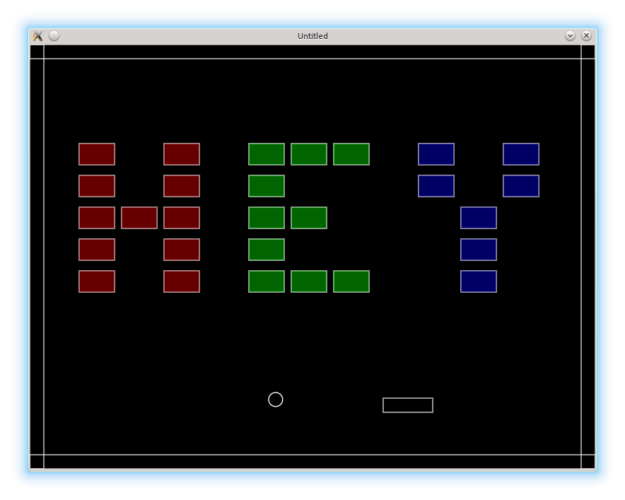

# 10. Loading Levels From Files

While we are talking about splitting the code, I also want to move level definitions into separate files.
This is not immediately necessary, but will become convenient later, when the amount of levels will grow.

<p align="center">

</p>

The files with the levels descriptions will be kept at the `levels` folder.
It is possible to write each level-file as a separate Lua module.
However, it is considered a good practice to avoid any code in level files, preferably making them data-only. Therefore, the only thing that remains from the Lua module structure is the return statement.
Here is an example of `hey.lua`:

```lua
return {
   { 0, 0, 0, 0, 0, 0, 0, 0, 0, 0, 0 },
   { 0, 0, 0, 0, 0, 0, 0, 0, 0, 0, 0 },
   { 1, 0, 1, 0, 2, 2, 2, 0, 3, 0, 3 },
   { 1, 0, 1, 0, 2, 0, 0, 0, 3, 0, 3 },
   { 1, 1, 1, 0, 2, 2, 0, 0, 0, 3, 0 },
   { 1, 0, 1, 0, 2, 0, 0, 0, 0, 3, 0 },
   { 1, 0, 1, 0, 2, 2, 2, 0, 0, 3, 0 },
   { 0, 0, 0, 0, 0, 0, 0, 0, 0, 0, 0 }
}
```

Previously the order of the levels was maintained by the `levels.sequence` array.
I also want to move it into a separate file `sequence.lua`.
It is going to store an array of level filenames.

```lua
return {
   "hey",
   "bye"
}
```

The `levels.sequence` has to be `required` inside the `levels` module:

```lua
.....
levels.sequence = require "levels/sequence"
```

To load the contents of the current level file, a separate function is defined:

```lua
function levels.require_current_level()
   local level_filename = "levels/" .. levels.sequence[ levels.current_level ] --(*1)
   local level = require( level_filename )
   return level
end
```

(\*1): current level filename is appended to the "levels/" folder.

`love.load` and `levels.switch_to_next_level( bricks, ball )`
have to be update to use this function.

```lua
function love.load()
   level = levels.require_current_level()
   bricks.construct_level( level )
   .....
end

function levels.switch_to_next_level( bricks, ball )
    .....
         levels.current_level = levels.current_level + 1
         level = levels.require_current_level()
         bricks.construct_level( level )
    .....
end
```

Apart from these modifications, there are a couple of other things I want to introduce in this part.
First, to facilitate the bricks destruction process, I want to define
a function `bricks.clear_current_level_bricks()`, that is going to clear all the remaining bricks on the level.
It is going to be called when the `c` key is pressed.

```lua
function love.keyreleased( key, code )
   if key == 'c' then
      bricks.clear_current_level_bricks()
   .....
end

function bricks.clear_current_level_bricks()
   for i in pairs( bricks.current_level_bricks ) do
      bricks.current_level_bricks[i] = nil
   end
end
```

The main point, of course, is to automatically achieve the condition
of switching to the next level.

The second thing is bricks coloring, depending on the brick's type.
To implement this, in `bricks.draw_brick` it is necessary to set
the value of the fill color using this property.
Bricks of type 1 will be in red, 2 - green, and 3 - blue.

```lua
function bricks.draw_brick( single_brick )
   love.graphics.rectangle( 'line',
                            single_brick.position.x,
                            single_brick.position.y,
                            single_brick.width,
                            single_brick.height )
   local r, g, b, a = love.graphics.getColor( )
   if single_brick.bricktype == 1 then                 --(*1)
      love.graphics.setColor( 255, 0, 0, 100 )
   elseif single_brick.bricktype == 2 then
      love.graphics.setColor( 0, 255, 0, 100 )
   elseif single_brick.bricktype == 3 then
      love.graphics.setColor( 0, 0, 255, 100 )
   end
   love.graphics.rectangle( 'fill',                    --(*2)
                            single_brick.position.x,
                            single_brick.position.y,
                            single_brick.width,
                            single_brick.height )
   love.graphics.setColor( r, g, b, a )                --(*3)
end
```

(\*1): choose drawing color for the brick.  
(\*2): add fill representation.  
(\*3): restore the default colorscheme.
