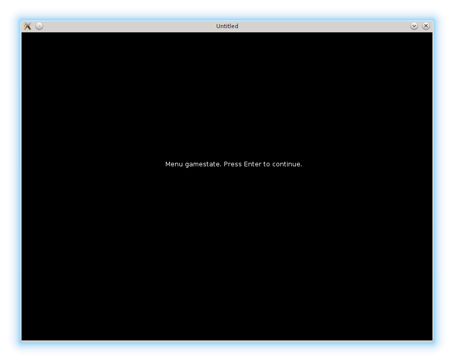

# 11. Straightforward Gamestates

A typical game has a menu screen, a congratulations screen and some kind of a pause regime.
These different game modes are called gamestates.
In this part, a simple implementation for such functionality is discussed.

一个典型游戏会有菜单界面、通关或祝贺界面，以及某种暂停状态。这些不同的游戏模式被称为 gamestates。本节讨论一种简单的实现方式。

<p align="center">

</p>

I'm going to define 4 gamestates: "menu", "game", "gamepaused" and "gamefinished".
In the straightforward implementation it is enough to maintain a simple
variable `gamestate` to switch between them.
It is declared in the `main.lua` and initialized to the first game state - "menu".

我会定义 4 个 gamestate：“menu”、“game”、“gamepaused” 和 “gamefinished”。在最直接的实现里，用一个简单的变量 `gamestate` 来切换它们就够了。它在 `main.lua` 中声明，并初始化为第一个状态——“menu”。

```lua
 local gamestate = "menu"
```

After that, in each love callback an if-else structure is necessary to check this variable:

接下来，在每个 love 回调里都需要用 if-else 来检查这个变量：

```lua
function love.update( dt )
   if gamestate == "menu" then
   .....
   elseif gamestate == "game" then
   .....
   elseif gamestate == "gamepaused" then
   .....
   elseif gamestate == "gamefinished" then
   .....
   end
end
```

In the "menu" state, a message is shown on the screen. When the Enter is pressed, the game starts
(the state is changed to the "game"). On Esc the game is exited.

在 “menu” 状态下，屏幕上会显示一条提示信息。按下 Enter 开始游戏（状态切换为 “game”），按 Esc 退出游戏。

```lua
function love.draw()
   if gamestate == "menu" then
      love.graphics.print("Menu gamestate. Press Enter to continue.",   --(*1)
                           280, 250)
   elseif gamestate == "game" then
   .....
end

function love.keyreleased( key, code )
   if gamestate == "menu" then
      if key == "return" then
         gamestate = "game"                                             --(*2)
      elseif key == 'escape' then
         love.event.quit()                                              --(*3)
      end
   elseif gamestate == "game" then
   .....
end
```

(\*1): display a message on the screen.  
(\*2): on Enter, start the game  
(\*3): on Esc - quit.

(\*1)：在屏幕上显示提示信息。  
(\*2)：按 Enter 开始游戏。  
(\*3)：按 Esc 退出。

There is nothing to update in this state, so the corresponding section
of the `love.update` is empty:

这个状态下没有需要更新的内容，所以 `love.update` 里的对应分支是空的：

```lua
function love.update( dt )
   if gamestate == "menu" then
   elseif gamestate == "game" then
   .....
end
```

For the "game" gamestate, the contents of the `love.draw` and `love.update` are
transferred from the previous part. In `love.keyreleased` there is a minor difference: on Esc instead of quitting, the
game switches to "gamepaused" state.

在 “game” 状态下，`love.draw` 和 `love.update` 的内容沿用上一部分的实现。`love.keyreleased` 中有个小区别：按 Esc 不再退出，而是切换到 “gamepaused”。

In the "gamepaused" state I want to freeze the ball and platform and display a message on the screen.
This can be implemented if the game objects are drawn but not updated.

在 “gamepaused” 状态中，我希望球和平台冻结，同时在屏幕上显示提示信息。只绘制对象、不更新对象即可实现。

```lua
function love.draw()
   .....
   elseif gamestate == "gamepaused" then
      ball.draw()
      platform.draw()
      bricks.draw()
      walls.draw()
      love.graphics.print(
         "Game is paused. Press Enter to continue or Esc to quit",
         50, 50)
   elseif gamestate == "gamefinished" then
   .....
end

function love.update( dt )
   .....
   elseif gamestate == "gamepaused" then     --(*1)
   elseif gamestate == "gamefinished" then
   .....
end
```

(\*1): the "gamepaused" update part is empty.

(\*1)：`gamepaused` 的更新部分是空的。

The `love.keyreleased` callback is similar to the "menu".

`love.keyreleased` 的处理逻辑和 “menu” 类似。

The "gamefinished" state is entered when there are no more levels.

当没有更多关卡时，会进入 “gamefinished” 状态。

```lua
function switch_to_next_level( bricks, ball, levels )          --(*1)
   if bricks.no_more_bricks then
      .....
      elseif levels.current_level >= #levels.sequence then
         gamestate = "gamefinished"                            --(*2)
      end
   end
end
```

(\*1): This function is moved from `levels` table. An explanation is below.  
(\*2): When there are no more levels, gamestate is switched to "gamefinished".

(\*1)：这个函数从 `levels` 表中移了出来，原因见下文。  
(\*2)：当没有更多关卡时，把 gamestate 切换为 “gamefinished”。

"Gamefinished" is similar to the "menu" except that on Enter it resets the level counter and
restarts the game from the first level.

“gamefinished” 与 “menu” 类似，区别是按 Enter 会重置关卡计数，并从第一关重新开始。

```lua
function love.keyreleased( key, code )
   .....
   elseif gamestate == "gamefinished" then
      if key == "return" then
         levels.current_level = 1
         level = levels.require_current_level()
         bricks.construct_level( level )
         ball.reposition()
         gamestate = "game"
      elseif key == 'escape' then
         love.event.quit()
      end
   end
end
```

There is also one minor catch with `levels.switch_to_next_level`.
The `gamestate` variable is defined in the scope of `main.lua`.
If it is simply passed into this function, it will be passed by value and it won't be
possible to change it from "game" to "gamefinished".
There are several solutions to this problem; I've simply moved
this function from `levels` table inside the `levels.lua` to `main.lua`.

`levels.switch_to_next_level` 还有个小坑：`gamestate` 变量定义在 `main.lua` 的作用域里。如果只是把它作为参数传给函数，那它会按值传递，就无法在函数里把它从 “game” 改成 “gamefinished”。这个问题有多种解法，我这里干脆把这个函数从 `levels.lua` 里的 `levels` 表挪到了 `main.lua`。

```lua
function switch_to_next_level( bricks, ball, levels )
   if bricks.no_more_bricks then
      if levels.current_level < #levels.sequence then
         levels.current_level = levels.current_level + 1
         level = levels.require_current_level()
         bricks.construct_level( level )
         ball.reposition()
      elseif levels.current_level >= #levels.sequence then
         gamestate = "gamefinished"
      end
   end
end
```
