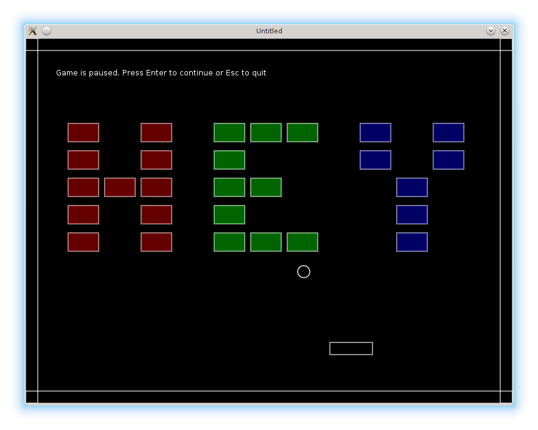

# 12. Advanced Gamestates

As the number of game objects increases, it becomes cumbersome to use if-else to maintain gamestates.
It is more convenient to put each gamestate into a separate file.
In this part I want to introduce such a more sophisticated gamestates system.

随着游戏对象数量增加，用 if-else 来维护 gamestate 会越来越笨重。把每个 gamestate 放到独立文件里更方便。本节要介绍一套更完善的 gamestate 系统。

<p align="center">

</p>

The scheme is following: each gamestate is represented by a table, containing it's own `draw`, `update` and other LÖVE callbacks, as well as all the necessary game objects. Reference to this table is stored in a special variable in the main program. Each LÖVE callback is redirected to an appropriate gamestate callback. Transition between the gamestates is achieved by changing the variable to point to another gamestate table.

整体思路如下：每个 gamestate 用一个表来表示，里面包含自己的 `draw`、`update` 等 LÖVE 回调，以及所需的游戏对象。在主程序里用一个专门变量保存对该表的引用。主程序中的每个 LÖVE 回调都会被转发到当前 gamestate 的回调中。切换状态就是让这个变量指向另一个 gamestate 表。

Let's start from the `gamestates` module. It defines a variable `current_state` that points to the
currently active gamestate, and two functions: `set_state` and `state_event` -
responsible for switching gamestates and redirecting callbacks.

先从 `gamestates` 模块开始。它定义了一个 `current_state` 变量，指向当前激活的 gamestate，并提供两个函数：`set_state` 和 `state_event`，负责切换状态与转发回调。

The definition of the `state_event` is:

`state_event` 的定义如下：

```lua
local gamestates = {}

local current_state = nil                                            --(*1)

function gamestates.state_event( function_name, ... )
   if current_state and type( current_state[function_name] ) == 'function' then
      current_state[function_name](...)                              --(*2)
   end
end
```

(\*1): `current_state` points to the currently active gamestate.  
(\*2): If function with `function_name` is present in the gamestate, this function is called.
Ellipsis `...` is used to forward arguments of the `state_event` to the `current_state[function_name]`.
In Lua, `...` is called a vararg expression. In the argument list of a function, it indicates, that the function accepts arbitrary number of arguments. In the body of the function, `...` acts like a multivalued function, returning all the collected arguments.

(\*1)：`current_state` 指向当前激活的 gamestate。  
(\*2)：如果当前 gamestate 里有名为 `function_name` 的函数，就调用它。`...` 用于把 `state_event` 的参数原样转发给 `current_state[function_name]`。在 Lua 中，`...` 称为可变参数表达式：在函数参数列表中表示可接收任意数量的参数；在函数体中，它会返回所有收集到的参数。

The `set_state` function expects a state name as a string. It requires the corresponding
gamestate module. To prevent multiple requirement of the same modules, they are cached
in the `loaded` table.

`set_state` 接收一个字符串形式的状态名，并 `require` 对应的 gamestate 模块。为了避免重复加载同一个模块，它们会被缓存到 `loaded` 表里。

```lua
local loaded = {}                                                    --(*1)

function gamestates.set_state( state_name, ... )
   gamestates.state_event( 'exit' )                                  --(*2)
   local old_state_name = get_key_for_value( loaded, current_state ) --(*3)
   current_state = loaded[ state_name ]                              --(*4)
   if not current_state then
      current_state = require( state_name )                          --(*5)
      loaded[ state_name ] = current_state
      gamestates.state_event( 'load', old_state_name, ... )
   end
   gamestates.state_event( 'enter', old_state_name, ... )            --(*6)
end

return gamestates
```

(\*1): The already required gamestates are stored in the `loaded` table with gamestate names used as keys.  
(\*2): When gamestates change, "exit" callback of the current state is called (if it is defined).  
(\*3): `get_key_for_value` traverses `loaded` table and extracts the name under which the `current_state`
is stored in that table.  
(\*4): If the new state has been loaded already, `current_state` will point to that state.  
(\*5): If the new state hasn't been loaded already, it is required and cached in the `loaded` table. After that, 'load' callback of that state is called.  
(\*6): After that, "enter" callback is called. Both "load" and "enter" receive old gamestate
as an argument (this is not used now, but it will turn convenient later).

(\*1)：已经加载过的 gamestate 会存进 `loaded` 表，键是 gamestate 名称。  
(\*2)：切换状态时，会调用当前状态的 “exit” 回调（如果定义了）。  
(\*3)：`get_key_for_value` 遍历 `loaded` 表，找出当前 `current_state` 对应的键名。  
(\*4)：如果新状态已加载，`current_state` 直接指向它。  
(\*5)：如果新状态还没加载，就 `require` 并缓存进 `loaded` 表，然后调用该状态的 “load” 回调。  
(\*6)：之后调用 “enter” 回调。“load” 和 “enter” 都会接收旧状态作为参数（目前没用到，但以后会方便）。

In the `main.lua` LÖVE callbacks are redirected to `gamestates.state_event` according to the
following definitions:

在 `main.lua` 中，LÖVE 回调按如下方式转发到 `gamestates.state_event`：

```lua
function love.update( dt )
   gamestates.state_event( "update", dt )
end

function love.draw()
   gamestates.state_event( "draw" )
end

function love.keyreleased( key, code )
   gamestates.state_event( "keyreleased", key, code )
end
```

After that, each gamestate can be moved into a separate file.
For example, the `menu.lua` for the "menu" state is:

然后就可以把每个 gamestate 移到单独文件中。例如，"menu" 状态对应的 `menu.lua`：

```lua
local menu = {}

function menu.update( dt )
end

function menu.draw()
   love.graphics.print("Menu gamestate. Press Enter to continue.",
                       280, 250)
end

function menu.keyreleased( key, code )
   if key == "return" then
      gamestates.set_state( "game", { current_level = 1 } )
   elseif key == 'escape' then
      love.event.quit()
   end
end

return menu
```

The usefulness of such an approach can be seen most clearly for the "game" gamestate:
all the game objects are now local to this state.

这种做法在 “game” 状态里最能体现优势：所有游戏对象都变成了该状态的局部变量。

```lua
local ball = require "ball"
local platform = require "platform"
local bricks = require "bricks"
local walls = require "walls"
local collisions = require "collisions"
local levels = require "levels"

local game = {}

.....

function game.update( dt )
   ball.update( dt )
   platform.update( dt )
   bricks.update( dt )
   walls.update( dt )
   collisions.resolve_collisions( ball, platform, walls, bricks )
   game.switch_to_next_level( bricks, ball, levels )
end

function game.draw()
   ball.draw()
   platform.draw()
   bricks.draw()
   walls.draw()
end

.....

return game
```

There are several minor subtleties that need an attention to make this scheme work.

要让这套方案顺利工作，还需要注意一些小细节。

The first one regards the requiring of the "gamestates" module.
The functions of this module have to be accessible from each of the gamestates.
This can be achieved by placing `local gamestates = require "gamestates"` in each of the `menu.lua`, `game.lua`, etc. However, that would result in circular dependencies.
To avoid that, I explicitly load this module only from the `main.lua` and store it in a global variable.

第一点是关于 `gamestates` 模块的 `require`。各个状态都需要访问这个模块的函数。理论上可以在 `menu.lua`、`game.lua` 等文件里都写 `local gamestates = require "gamestates"`，但这会导致循环依赖。为避免这一点，我只在 `main.lua` 中显式加载它，并把它放到全局变量里。

```lua
gamestates = require "gamestates"
```

Second.
In the "gamepaused" state I want to display the ball, the platform, the bricks and the walls as the background.
However, these objects are now local to the "game", and are not available in the "gamepaused".
The solution is to pass them as arguments in the `set_state` call.

第二点。在 “gamepaused” 状态下，我希望把球、平台、砖块和墙画出来作为背景，但这些对象现在是 “game” 状态的局部变量，在 “gamepaused” 里拿不到。解决办法是在 `set_state` 调用时把它们作为参数传过去。

```lua
function game.keyreleased( key, code )
   .....
   elseif  key == 'escape' then
      gamestates.set_state( "gamepaused", { ball, platform, bricks, walls } )
   end
end
```

On entering the "gamepaused", it is necessary to store the received game objects somewhere.
I use `local game_objects` variable, available to the whole module.

进入 “gamepaused” 后，需要把传来的游戏对象存起来。我用一个模块级的 `local game_objects` 变量来保存。

```lua
local game_objects = {}

function gamepaused.enter( prev_state, ... )
   game_objects = ...
end
```

After that, in the `draw` callback it is possible to iterate over the contents of the `game_objects` table.
If any of it's members happens to have `draw` method, this method is called.

之后在 `draw` 回调里遍历 `game_objects` 表，如果某个成员有 `draw` 方法就调用它。

```lua
function gamepaused.draw()
   for _, obj in pairs( game_objects ) do
      if type(obj) == "table" and obj.draw then
         obj.draw()
      end
   end
   love.graphics.print(
      "Game is paused. Press Enter to continue or Esc to quit",
      50, 50 )
end
```

Finally, upon exiting the "gamepaused" it is necessary to delete the references to the used game objects.

最后，退出 “gamepaused” 时需要清掉这些对象的引用。

```lua
function gamepaused.exit()
   game_objects = nil
end`
```

Third.
The "game" gamestate can be entered from the "menu", "gamefinished" and "gamepaused" states.
When it is entered for the first time, it is convenient to construct the walls, because they
do not change during the game.

第三点。“game” 状态可以从 “menu”、“gamefinished” 和 “gamepaused” 进入。第一次进入时，最好先构建墙体，因为它们在游戏中不会变化。

```lua
function game.load( prev_state, ... )
   walls.construct_walls()
end
```

When "game" is entered from the "menu" or from the "gamefinished", it should start from
the first level. When it is resumed from the "gamepaused", it should continue from the point
where it has stopped. It is convenient to pass the level number into `game.enter` as an optional argument.
If it is present, corresponding level is loaded. If it is missing, it is assumed that all objects are
already in place and it is safe to continue:

当从 “menu” 或 “gamefinished” 进入 “game” 时，应该从第一关开始；从 “gamepaused” 恢复时，则应该从暂停处继续。可以把关卡号作为可选参数传给 `game.enter`。如果有该参数，就加载对应关卡；如果没有，则默认所有对象已就位，可以直接继续：

```lua
function game.enter( prev_state, ... )
   args = ...
   if args and args.current_level then
      levels.current_level = args.current_level
      local level = levels.require_current_level()
      bricks.construct_level( level )
      ball.reposition()
   end
end
```

Using such an approach, transitions from the "menu" and "gamefinished" are

按这种方式，从 “menu” 和 “gamefinished” 进入 “game” 的写法如下：

```lua
function menu.keyreleased( key, code )
   if key == "return" then
      gamestates.set_state( "game", { current_level = 1 } )
   .....
   end
end

function gamefinished.keyreleased( key, code )
   if key == "return" then
      gamestates.set_state( "game", { current_level = 1 } )
   .....
   end
end
```

It is also convenient to use `gamestates.set_state` to switch between the levels: the
next level is passed to this function as an optional argument.

同样，也可以用 `gamestates.set_state` 来切换关卡：把下一关的关卡号作为可选参数传进去。

```lua
function game.switch_to_next_level( bricks, ball, levels )
   if bricks.no_more_bricks then
      if levels.current_level < #levels.sequence then
         gamestates.set_state( "game", { current_level = levels.current_level + 1 } )
      else
         gamestates.set_state( "gamefinished" )
      end
   end
end
```
