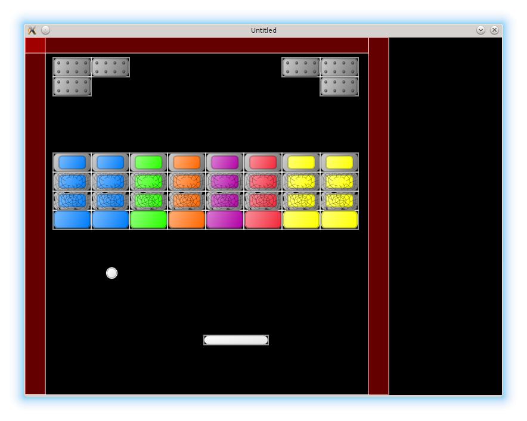
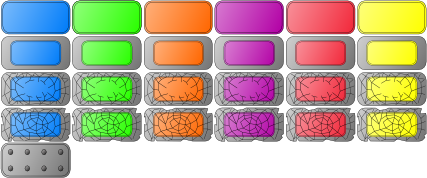

# 13. Basic Tiles

In this part, I want to improve the graphical representation of the game objects.
An idea is to associate each game object with a certain image and use it instead of the circles and rectangles.

这一部分我想改进游戏对象的图形表现。一个思路是给每个游戏对象关联一张图片，用它们替换原来的圆形和矩形。

<p align="center">

</p>

LÖVE has several functions in the [love.graphics](https://love2d.org/wiki/love.graphics) module, which allow to load and display images on the screen.
In particular, we are interested in [love.graphics.newImage](https://love2d.org/wiki/love.graphics.newImage), which loads an image from the hard drive, [love.graphics.draw](https://love2d.org/wiki/love.graphics.draw), which displays it, and [love.graphics.newQuad](https://love2d.org/wiki/love.graphics.newQuad) which allows to select a rectangular piece from the image and display only this piece, instead of the whole image.

LÖVE 在 [love.graphics](https://love2d.org/wiki/love.graphics) 模块里提供了多种用于加载和显示图片的函数。这里我们重点关注三个：从硬盘加载图片的 [love.graphics.newImage](https://love2d.org/wiki/love.graphics.newImage)、显示图片的 [love.graphics.draw](https://love2d.org/wiki/love.graphics.draw)，以及用于从图片中选取一个矩形区域只绘制该区域的 [love.graphics.newQuad](https://love2d.org/wiki/love.graphics.newQuad)。

LÖVE operates only with raster formats, such as png or jpg.
This immediately forces us to choose a resolution for the game.
I use 800x600 (which probably is not optimal these days).
It is set with `love.window.setMode` function at the start of the game, in the `love.load` in the `main.lua`:

LÖVE 只支持位图格式，比如 png 或 jpg。这就迫使我们必须选定一个游戏分辨率。我用的是 800x600（现在看来可能并不理想）。它在游戏开始时通过 `love.window.setMode` 设定，放在 `main.lua` 的 `love.load` 里：

```lua
function love.load()
   local love_window_width = 800
   local love_window_height = 600
   love.window.setMode( love_window_width,
                        love_window_height,
                        { fullscreen = false } )
   .....
end
```

It is common to draw the graphics in the high resolution first, and then scale down as needed.
In my case, I've drawn all the game images in a vector svg format (using [Inkscape](https://inkscape.org/en/) vector graphics editor), which LÖVE doesn't support, and it was necessary to export them into raster.

常见做法是先用高分辨率绘制图形，再按需要缩小。在我的情况下，我用矢量 svg 格式绘制了全部游戏素材（使用 [Inkscape](https://inkscape.org/en/) 矢量编辑器），但 LÖVE 不支持 svg，所以必须把它们导出成位图。

_(insert a couple of figs: whole game screen mockup, tileset with all objects in a single file, one object - one file, compromise. E.g.: [everything in a single file: kenney platformer pack](https://opengameart.org/content/platformer-art-complete-pack-often-updated), [compromise: characters with animation are separate from ground](https://opengameart.org/content/a-platformer-in-the-forest), [one object - one file: each object with it's animation in a separate file](https://opengameart.org/content/space-ship-shooter-pixel-art-assets) )_

_（此处插入几张图：完整游戏界面草图、把所有对象放在单一 tileset 中、一个对象一个文件、以及折中方案等。例如：[所有内容在一个文件里：kenney platformer pack](https://opengameart.org/content/platformer-art-complete-pack-often-updated)、[折中：角色动画和地面分开](https://opengameart.org/content/a-platformer-in-the-forest)、[一个对象一个文件：每个对象的动画单独存放](https://opengameart.org/content/space-ship-shooter-pixel-art-assets)）_

It is common to draw a more-or-less complete game screen to correctly get sizes, proportions, and colors of the different game objects; to obtain a complete impression of how everything looks together.
When this is done, it is necessary to somehow organize the game elements to simplify a further work with them.
There is no right or wrong way how to do it, as long as the game works.
However, there are several considerations that probably should be taken into account, such as the ease of maintenance of the separate parts of the graphics, the format the chosen map editor can work with, and so on.

通常会先画出一个相对完整的游戏画面，用来校准不同对象的尺寸、比例和颜色，从而获得整体效果的直观印象。完成这些之后，就需要想办法组织这些图像元素，方便后续使用。只要游戏能运行，其实没有绝对的对错方案。不过仍有一些值得考虑的因素，比如图形素材的维护成本、所选地图编辑器支持的格式等。

At first, it seems logical to create a separate image file for each game object. A certain drawback of such approach is that it is hard to update the graphics, unless there is a support for automation of export.
On the other hand, it allows to fine tune, which images to load, providing some control over memory consumption (for the small games memory is not an issue, but modern AAA-blockbusters are tens of GB in size, mostly due to graphical content, it is just not possible to load it into memory all at once).

乍一看，为每个游戏对象单独做一张图很合理。但这种方式有个缺点：更新素材不方便，除非有自动导出工具支持。另一方面，它也能让你更精细地控制加载哪些图像，从而控制内存消耗（小游戏内存不是问题，但现代 AAA 大作几十 GB，主要都是图形资源，不可能一次性全部载入内存）。

Another approach is to put everything into a single file.
This is fine and used commonly.
However, when the number of different game objects becomes significant, selecting appropriate quads can become a bit messy.

另一种方式是把所有内容塞进一个文件里。这很常见，也完全可行。但当游戏对象种类多起来时，挑选对应的 quad 会变得有点混乱。

I'll use a compromise between the two methods and adapt a convention
that there is a separate file with graphics for each class of objects in the game.
That is, a separate image file for the bricks, separate for the platform, and so on.

我会采用折中方案：为游戏中的每类对象使用一个独立的图像文件，比如砖块一个文件、平台一个文件，以此类推。

The graphics is stored in the `img/800x600/` folder.
Now it is necessary to work with it in the code.

图形资源存放在 `img/800x600/` 文件夹里。接下来要在代码中使用它们。

The first step is to load and store the images somewhere.
A natural place to put them is a table with other properties of game objects.
For the ball:

第一步是加载并保存这些图片。最自然的地方是放在游戏对象属性表里。以球为例：

```lua
local ball = {}
ball.position = vector( 200, 450 )
ball.speed = vector( -250, -250 )
ball.image = love.graphics.newImage( "img/800x600/ball.png" )              --(*1)
ball.x_tile_pos = 0                                                        --(*2)
ball.y_tile_pos = 0
ball.tile_width = 18
ball.tile_height = 18
ball.tileset_width = 18
ball.tileset_height = 18
ball.quad = love.graphics.newQuad( ball.x_tile_pos, ball.y_tile_pos,       --(*3)
                                   ball.tile_width, ball.tile_height,
                                   ball.tileset_width, ball.tileset_height )
ball.radius = ball.tile_width / 2                                          --(*4)
```

(\*1): The image file is loaded from the hard drive.  
(\*2): [`love.graphics.newQuad`](https://love2d.org/wiki/love.graphics.newQuad) requires
several parameters to specify a part of the image to display: the top-left corner of the part,
it's width and height, and the width and height of the whole image.  
(\*3): A quad for the ball is created.  
(\*4): The ball radius should be changed in accordance with the width of the tile: `ball.radius = ball_tile_width / 2`.

(\*1)：从硬盘加载图片文件。  
(\*2)：[`love.graphics.newQuad`](https://love2d.org/wiki/love.graphics.newQuad) 需要多个参数来指定要显示的图片区域：该区域的左上角坐标、宽高，以及整张图片的宽高。  
(\*3)：为球创建一个 quad。  
(\*4)：球的半径要与 tile 宽度对应：`ball.radius = ball_tile_width / 2`。

After image is loaded, it is necessary to change the `ball.draw` function to display the quad instead of the circle.

图片加载后，需要修改 `ball.draw`，让它绘制 quad 而不是圆。

```lua
function ball.draw()
   love.graphics.draw( ball.image,
                       ball.quad,
                       ball.position.x - ball.radius,
                       ball.position.y - ball.radius )
   local segments_in_circle = 16                        --(*1)
   love.graphics.circle( 'line',
                         ball.position.x,
                         ball.position.y,
                         ball.radius,
                         segments_in_circle )
end
```

(\*1): I do not delete the old representation for now, just to check that quads
have correct parameters.

(\*1)：我暂时不删除旧的圆形绘制，只是为了检查 quad 参数是否正确。

The code for the platform is essentially similar, so I won't go over it.

平台的代码基本相同，这里就不展开了。

With bricks, a situation is a bit more complicated.
Bricks can be of different type (brick type is encoded in the level description).
From this type it is necessary to determine quad position in the tileset.
It is reasonable to define a function for such task: it should accept a brick type and return an appropriate quad.

砖块稍微复杂一些。砖块有不同类型（关卡描述里编码了类型），需要根据类型确定在 tileset 中的 quad 位置。合理的做法是定义一个函数，接收砖块类型并返回对应的 quad。

<p align="center">

</p>

We have bricks of different hardness and color, arranged in a table-like structure in our tileset.
Basically, let's agree to decode brick types by two-digit number, where the first digit is a row in the tileset, and the second one is a column (indexing starts from 1 in both cases).
The function to convert brick type to quad has the following form:

我们的 tileset 里按表格结构排布了不同硬度和颜色的砖块。我们约定用两位数来编码砖块类型：第一位表示 tileset 的行，第二位表示列（两个维度都从 1 开始）。把砖块类型转换成 quad 的函数可以写成这样：

```lua
function bricks.bricktype_to_quad( bricktype )
   local row = math.floor( id / 10 )
   local col = id % 10
   local x_pos = single_tile_width * ( col - 1 )
   local y_pos = single_tile_height * ( row - 1 )
   return love.graphics.newQuad( x_pos, y_pos,
                                 brick_tile_width, brick_tile_height,
                                 tileset_width, tileset_height )
end
```

We need to call it when constructing the bricks:

构建砖块时需要调用它：

```lua
function bricks.new_brick( position, width, height, bricktype )
   return( { .....
             bricktype = bricktype,
             quad = bricks.bricktype_to_quad( bricktype ) } )
end
```

The changes in the `draw` method are similar to the `ball`-case.

`draw` 方法的改动与球的情况类似。

Due to the change in sizes of the bricks, it is necessary to change map dimension to 8x11,
and make some adjustments in the bricks width, height and placement:

由于砖块尺寸变了，地图尺寸需要改成 8x11，并调整砖块的宽高和摆放位置：

```lua
local bricks = {}
bricks.image = love.graphics.newImage( "img/800x600/bricks.png" )
bricks.tile_width = 64
bricks.tile_height = 32
bricks.tileset_width = 384
bricks.tileset_height = 160
bricks.rows = 11
bricks.columns = 8
bricks.top_left_position = vector( 47, 34 )
bricks.brick_width = bricks.tile_width
bricks.brick_height = bricks.tile_height
bricks.horizontal_distance = 0
bricks.vertical_distance = 0
.....
```

I don't want to deal with the wall tiles now, but I adjust walls positions
to get a better representation of the final version of the game screen:

我暂时不处理墙体的贴图，但会调整墙的位置，使整体画面更接近最终效果：

```lua
walls.side_walls_thickness = 34
walls.top_wall_thickness = 26
walls.right_border_x_pos = 576 --(*1)

function walls.construct_walls()
   local left_wall = walls.new_wall(
      vector( 0, 0 ),
      walls.side_walls_thickness,
      love.graphics.getHeight()
   )
   local right_wall = walls.new_wall(
      vector( walls.right_border_x_pos, 0 ),
      walls.side_walls_thickness,
      love.graphics.getHeight()
   )
   local top_wall = walls.new_wall(
      vector( 0, 0 ),
      walls.right_border_x_pos,
      walls.top_wall_thickness
   )
   local bottom_wall = walls.new_wall(
      vector( 0, love.graphics.getHeight() ),
      walls.right_border_x_pos,
      walls.top_wall_thickness
   )
   walls.current_level_walls["left"] = left_wall
   walls.current_level_walls["right"] = right_wall
   walls.current_level_walls["top"] = top_wall
   walls.current_level_walls["bottom"] = bottom_wall
end
```

(\*1) This size and position adjustments are back-and-forth bounce process.
Do not expect to get everything right on the first pass.
_A tool such as [Lurker](https://github.com/rxi/lurker) which
"automatically hotswaps changed Lua files in a running LÖVE project"
might be helpful during this process._

(\*1) 这些尺寸与位置的调整往往需要来回试很多次，不要期待一次就调准。_像 [Lurker](https://github.com/rxi/lurker) 这样的工具可以在运行中的 LÖVE 项目里自动热加载 Lua 文件，可能会很有帮助。_

To demonstrate that everything works as expected, here is a test map `test_all.lua` with bricks of all type.
Don't forget to change the `sequence.lua` accordingly.

为了展示一切都能正常工作，这里给出一个包含所有砖块类型的测试地图 `test_all.lua`。别忘了相应修改 `sequence.lua`。

```lua
return {
   {51, 51, 00, 00, 00, 00, 51, 51},
   {51, 00, 00, 00, 00, 00, 00, 51},
   {00, 00, 00, 00, 00, 00, 00, 00},
   {00, 00, 00, 00, 00, 00, 00, 00},
   {00, 00, 00, 00, 00, 00, 00, 00},
   {21, 21, 22, 23, 24, 25, 26, 26},
   {31, 31, 32, 33, 34, 35, 36, 36},
   {41, 41, 42, 43, 44, 45, 46, 46},
   {11, 11, 12, 13, 14, 15, 16, 16},
   {00, 00, 00, 00, 00, 00, 00, 00},
   {00, 00, 00, 00, 00, 00, 00, 00}
}
```
