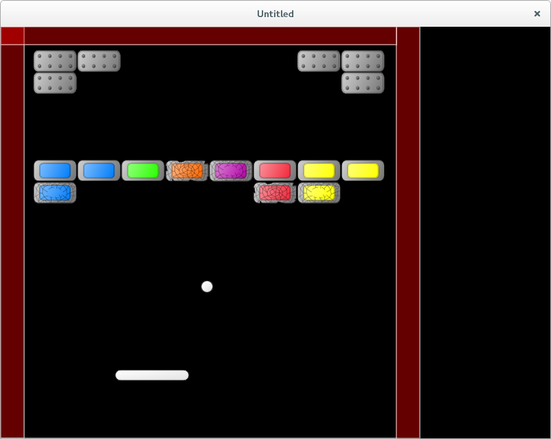

# 14. Different Brick Types

Currently different bricks respond identically to collisions with the ball - they disappears on the first hit.
In this part I'm going to add bricks, that can take several hits.

目前不同砖块对球的碰撞反应是一样的——被撞到一次就消失。本节我要加入可以承受多次击打的砖块。

<p align="center">

</p>

To implement different reactions, it is necessary to change the brick response on collision with the ball.
The idea is simple: we know the type of each brick, and we need to check it in collision.
That is, most of the changes will concern the `bricks.brick_hit_by_ball` function.

要实现不同的反应，需要修改砖块在与球碰撞时的处理逻辑。思路很简单：我们知道每块砖的类型，只要在碰撞时检查它即可。因此大部分改动都集中在 `bricks.brick_hit_by_ball` 这个函数里。

Currently, the brick type is encoded by a two-digit number.
We can continue to work with that, however, it helps the code readability to define human readable types.
It is possible to create a table, that maps two-digit types to human readable descriptions.
Instead, I'll use a simpler approach and just define several methods that determine brick properties based on it's type number.

当前砖块类型用两位数编码。我们可以继续用这个编码，但为了提升可读性，最好有一些更“人类可读”的类型定义。可以用表把两位数映射到描述文字，也可以像我这样用更简单的方式——写几个函数，根据类型数字判断砖块性质。

<p align="center">

</p>

Brick colors are blue, green, orange, purple, red and yellow.
In the first row bricks are 'simple', in the second -- 'armored', third -- 'scratched', fourth -- 'cracked'.
Fifth row is 'heavyarmored'.

砖块颜色分别是蓝、绿、橙、紫、红、黄。第一行是 “simple”，第二行是 “armored”，第三行是 “scratched”，第四行是 “cracked”，第五行是 “heavyarmored”。

The appropriate methods are following:

对应的判断函数如下：

```lua
function bricks.is_simple( single_brick )
   local row = math.floor( single_brick.bricktype / 10 )
   return ( row == 1 )
end

function bricks.is_armored( single_brick )
   local row = math.floor( single_brick.bricktype / 10 )
   return ( row == 2 )
end

function bricks.is_scratched( single_brick )
   local row = math.floor( single_brick.bricktype / 10 )
   return ( row == 3 )
end

function bricks.is_cracked( single_brick )
   local row = math.floor( single_brick.bricktype / 10 )
   return ( row == 4 )
end

function bricks.is_heavyarmored( single_brick )
   local row = math.floor( single_brick.bricktype / 10 )
   return ( row == 5 )
end
```

If the brick is 'simple', it is destroyed on the collision with the ball.
If it is 'armored', after collision it's type is changed to 'scratched'.
'Scratched' becomes 'cracked'. 'Cracked' is destroyed on collision.
'Heavyarmored' bricks are unaffected by collisions.

如果砖块是 “simple”，被球撞到就会直接消失；如果是 “armored”，碰撞后类型变成 “scratched”；“scratched” 再变成 “cracked”；“cracked” 被撞后消失。“heavyarmored” 则不会受到碰撞影响。

Here is a template for case analysis in the `bricks.brick_hit_by_ball`:

下面是 `bricks.brick_hit_by_ball` 的分支模板：

```lua
function bricks.brick_hit_by_ball( i, brick, shift_ball )
   if bricks.is_simple( brick ) then
      .....
   elseif bricks.is_armored( brick ) then
      .....
   elseif bricks.is_scratched( brick ) then
      .....
   elseif bricks.is_cracked( brick ) then
      .....
   elseif bricks.is_heavyarmored( brick ) then
      .....
   end
end
```

If the brick should be destroyed, it is enough to simply call the `table.remove` function.
To change brick type, it is convenient to have a special functions: `armored_to_scratched` and `scratched_to_cracked`. It is possible implement them simply by adding 10 to the brick type.
After brick type is changed it is also necessary to update it's quad; this is done by calling the
`bricktype_to_quad` function.

如果砖块要被销毁，直接调用 `table.remove` 就够了。要改变砖块类型，最好写两个辅助函数：`armored_to_scratched` 和 `scratched_to_cracked`。它们可以简单地通过给类型加 10 来实现。类型改变后，还要更新该砖块的 quad，这可以通过 `bricktype_to_quad` 来完成。

```lua
function bricks.armored_to_scratched( single_brick )
   single_brick.bricktype = single_brick.bricktype + 10
   single_brick.quad = bricks.bricktype_to_quad( single_brick.bricktype )
end

function bricks.scratched_to_cracked( single_brick )
   single_brick.bricktype = single_brick.bricktype + 10
   single_brick.quad = bricks.bricktype_to_quad( single_brick.bricktype )
end
```

With these functions, the collision resolution code looks like this:

有了这些函数之后，碰撞处理代码如下：

```lua
function bricks.brick_hit_by_ball( i, brick, shift_ball )
   if bricks.is_simple( brick ) then
      table.remove( bricks.current_level_bricks, i )
   elseif bricks.is_armored( brick ) then
      bricks.armored_to_scratched( brick )
   elseif bricks.is_scratched( brick ) then
      bricks.scratched_to_cracked( brick )
   elseif bricks.is_cracked( brick ) then
      table.remove( bricks.current_level_bricks, i )
   elseif bricks.is_heavyarmored( brick ) then
   end
end
```

It is also necessary not to forget to remove 'heavyarmored' bricks from the
check for next level switch and remove them from the `bricks.current_level_bricks`
before switching to the next level:

还要记得：在判断“是否切换到下一关”时，要忽略 “heavyarmored” 砖块；并且在切关前，把它们从 `bricks.current_level_bricks` 里移除：

```lua
function bricks.update( dt )
   local no_more_bricks = true
   for _, brick in pairs( bricks.current_level_bricks ) do
      if bricks.is_heavyarmored( brick ) then
         no_more_bricks = no_more_bricks and true           --(*1)
      else
         no_more_bricks = no_more_bricks and false
      end
   end
   bricks.no_more_bricks = no_more_bricks
end

function game.switch_to_next_level( bricks, ball, levels )
   if bricks.no_more_bricks then
      bricks.clear_current_level_bricks()                   --(*2)
      .....
end
```

(\*1): If there is a brick, but it's type is 'heavyarmored', we ignore it.  
(\*2): The remaining 'heavyarmored' bricks are removed from the `bricks.current_level_bricks`
before switching to the next level.

(\*1)：如果存在砖块但它是 “heavyarmored”，就忽略它。  
(\*2)：在切换到下一关之前，把剩余的 “heavyarmored” 砖块从 `bricks.current_level_bricks` 中移除。

Also, in the objects' `draw` methods I remove the auxiliary shapes and leave only quads.

另外，在各对象的 `draw` 方法里，我会去掉辅助的几何形状，仅保留 quad 绘制。
