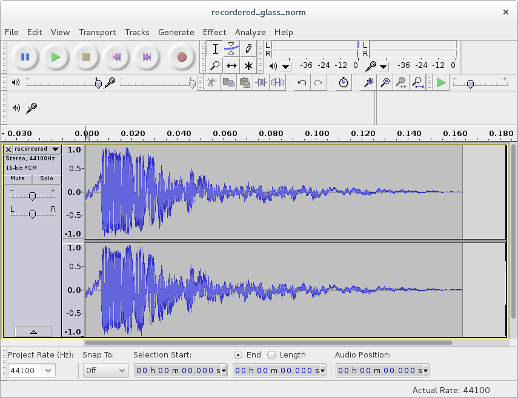

# 15. Basic Sound

In this part, I'm going to add basic sound effects and music to the game.

<p align="center">

<br>
<a href=http://www.audacityteam.org/>Audacity</a> - a free audio editor and recorder.
</p>

Sound effects are either synthesized from scratch, or some prerecorded samples are used.

I don't have any experience with sound synthesis, and the only thing I can recommend in this aspect is
[sfxr](http://www.drpetter.se/project_sfxr.html)/[bfxr](http://www.bfxr.net/) programs, which are excellent chiptune effects generators (a Lua port of sfxr [exists](https://love2d.org/wiki/sfxr.lua)).

Speaking of sound samples, a couple of sites to look for them are [OpenGameArt](http://opengameart.org/) and [Freesound](https://www.freesound.org/). Another possibility is to look for instrument samples pack, bundled with music-making software (such as [LMMS](https://lmms.io/) or [Hydrogen](http://hydrogen-music.org/hcms/)).
In dealing with samples, [Audacity](http://www.audacityteam.org/) is immensely helpful tool. It allows to extract a part of the track, normalize volume, suppress certain frequencies, and so on. The number of available editing options is more than enough.
Of course, instead of using someone else's samples, you can record your own. Such possibility should not be completely discarded: it is possible to get a decent result (enough to convey the idea) with minimal effort. For example, one of the sounds for this game is a tea cup hit by a pen, recorded on the internal microphone of my computer. Audacity makes the recording process simple enough.
When dealing with samples, my advice to keep track of all file renames.
They will be necessary to compile a proper credits list.

In LÖVE the sounds are [stored and played](https://love2d.org/wiki/Tutorial:Audio) by audio [sources](https://love2d.org/wiki/Source), which are
a part of the [`love.audio`](https://love2d.org/wiki/love.audio) module. Each source stores a single sound, which is usually specified on source creation. When needed, the sound can be played with the [`play`](https://love2d.org/wiki/Source:play) method of the source.

For now, I'm going to add sound effects only on ball-bricks collisions and I'll use
different sounds for collisions with different brick types.

First, we need to load the sounds from the disk and initialize the audio sources.
It is possible to make the sources local variables in the `bricks.lua` file.

```lua
local bricks = {}
.....
local simple_break_sound = love.audio.newSource(
   "sounds/recordered_glass_norm.ogg",
   "static")                                        --(*1)
local armored_hit_sound = love.audio.newSource(
   "sounds/qubodupImpactMetal_short_norm.ogg",
   "static")
local armored_break_sound = love.audio.newSource(
   "sounds/armored_glass_break_short_norm.ogg",
   "static")
local ball_heavyarmored_sound = love.audio.newSource(
   "sounds/cast_iron_clangs_11_short_norm.ogg",
   "static")
```

(\*1): "static" means that the sound is decompressed and stored in the memory, instead of being streamed
from the file. This is the preferred method for the small sounds, that are played frequently.

A good place to play the sound is `bricks.brick_hit_by_ball` function.
The sound is chosen according to the brick type.

```lua
function bricks.brick_hit_by_ball( i, brick, shift_ball )
   if bricks.is_simple( brick ) then
      table.remove( bricks.current_level_bricks, i )
      simple_break_sound:play()                         --(*1)
   elseif bricks.is_armored( brick ) then
      bricks.armored_to_scrathed( brick )
      armored_hit_sound:play()                          --(*2)
   elseif bricks.is_scratched( brick ) then
      bricks.scrathed_to_cracked( brick )
      armored_hit_sound:play()                          --(*2)
   elseif bricks.is_cracked( brick ) then
      table.remove( bricks.current_level_bricks, i )
      armored_break_sound:play()                        --(*3)
   elseif bricks.is_heavyarmored( brick ) then
      ball_heavyarmored_sound:play()                    --(*4)
   end
end
```

(\*1): `simple_break_sound` is played on collision of the ball with the 'simple' brick.  
(\*2): `armored_hit_sound` if the brick was 'armored' or 'scratched'.  
(\*3): `armored_break_sound` if the brick was 'cracked'.  
(\*4): `ball_heavyarmored_sound` if the brick was 'heavyarmored'.

Now to the music. Along with the sound effects, some good tracks can be found on [Freesound](https://www.freesound.org/) and [OpenGameArt](http://opengameart.org/).
Another resource worth checking is [Jamendo](https://www.jamendo.com/start).
It has a great collection of music, available free of charge for noncommercial applications.
However, most tracks require a special license for commercial usage.

In terms of the code, the handling of music is similar to the sound effects.
It is necessary to load the track from the hard drive, store it into some source and after that play it.
For now, I'll use only a single background track, which I set to loop, so it will automatically restart from the beginning. I want music to start playing in the menu, and then I'm going to manipulate it (pause and rewind) in the other gamestates. So instead of defining the source as a local variable to the "menu" state and passing it between gamestates, I define it global in the `main.lua`.

```lua
music = love.audio.newSource( "sounds/S31-Night Prowler.ogg" )
music:setLooping( true )
```

The music starts playing in the `menu.load`:

```lua
function menu.load( prev_state, ... )
   music:play()
end
```

When the game is paused, I pause the track, and resume it, when the game resumes.

```lua
function game.keyreleased( key, code )
   .....
   elseif  key == 'escape' then
      music:pause()                         --(*1)
      gamestates.set_state( "gamepaused", { ball, platform, bricks, walls } )
   end
end

function game.enter( prev_state, ... )
   .....
   if prev_state == "gamepaused" then
      music:resume()                        --(*2)
   end
   .....
end
```

(\*1): the music is paused on transition from the "game" to "gamepaused" state.  
(\*2): the music is resumed when the game resumes.

If the game is restarted after the "gamefinished" final screen, the track is rewound to the beginning.

```lua
function game.enter( prev_state, ... )
   .....
   if prev_state == "gamefinished" then
      music:rewind()
   end
   .....
end
```
