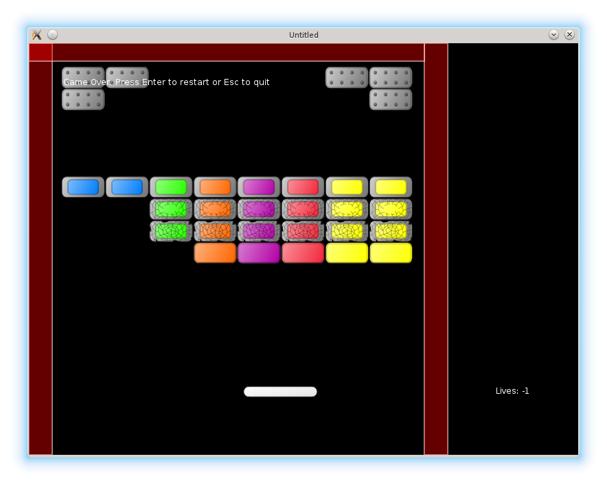

# 16. Game Over

So far, one important component has been missing - the game over condition.

<p align="center">

</p>

The mechanics is simple: it is necessary to add a lives counter
and remove one life if the ball escapes through the bottom border of the screen.
If the amount of lives becomes less than zero, the game over screen is shown.

I define a separate table `lives_display`, similar to the `ball` and the `platform`.
The lives are stored in the `lives` field; on start there are 5 of them.

```lua
local lives_display = {}
lives_display.lives = 5
```

The `update` function is empty, `draw` displays
the remaining lives in the bottom-right corner of the screen
defined by `lives_display.position = vector( 680, 500 )`.

```lua
function lives_display.update( dt )
end

function lives_display.draw()
   love.graphics.print( "Lives: " .. tostring( lives_display.lives ),
                        lives_display.position.x,
                        lives_display.position.y )
end
```

The `lives_display` has to be required from the `game.lua`:

```lua
.....
local walls = require "walls"
local lives_display = require "lives_display"
local collisions = require "collisions"
.....
```

After that, it is necessary to make changes in the `game.draw()` callback to
display the lives counter:

```lua
function game.draw()
   .....
   walls.draw()
   lives_display.draw()  --(*1)
end
```

(\*1): lives counter is displayed in the "game" state.  
I make similar changes to `love.update` even though the `lives_display.update` does nothing.

It is also necessary to pass `lives_update` to "gamepaused" state along with other game objects,
so that it is displayed properly.

```lua
function game.keyreleased( key, code )
   .....
   elseif  key == 'escape' then
      .....
      gamestates.set_state( "gamepaused",
                            { ball, platform, bricks, walls, lives_display } )
   end
end
```

Now to the lives decreasing.
It is possible to implement it by monitoring the ball collision with the currently existing bottom wall.
Alternatively it is possible to monitor ball y-coordinate:
if it becomes greater than screen height, the ball is considered lost.
I'll use the second method and remove the bottom wall.

```lua
function ball.update( dt )
   ball.position = ball.position + ball.speed * dt
   ball.check_escape_from_screen()                   --(*1)
end

function ball.check_escape_from_screen()
   local x, y = ball.position:unpack()
   local ball_top = y - ball.radius
   if ball_top > love.graphics.getHeight() then
      ball.escaped_screen = true                     --(*2)
   end
end

function walls.construct_walls()
   .....
   walls.current_level_walls["left"] = left_wall
   walls.current_level_walls["right"] = right_wall
   walls.current_level_walls["top"] = top_wall       --(*3)
end
```

(\*1): The ball presence on the screen is checked each update cycle.  
(\*2): If the ball goes through the bottom border of the screen, a corresponding flag is raised.
This flag is monitored by `check_no_more_balls` function defined further.  
(\*3): The bottom wall is not created.

If the ball leaves the screen, lives counter is decreased.
If the amount of remaining lives drops below zero, the game switches to gameover screen.

```lua
function game.update( dt )
   .....
   game.check_no_more_balls( ball, lives_display )    --(*1)
   game.switch_to_next_level( bricks, ball, levels )
end

function game.check_no_more_balls( ball, lives_display )
   if ball.escaped_screen then
      lives_display.lose_life()                       --(*2)
      if lives_display.lives < 0 then
         gamestates.set_state( "gameover",
                               { ball, platform, bricks, walls, lives_display } )
      else
         ball.reposition()
      end
   end
end

function lives_display.lose_life()                    --(*3)
   lives_display.lives = lives_display.lives - 1
end
```

(\*1): `game.check_no_more_balls` monitors `ball.escaped_screen` flag.  
(\*2): if the ball is lost, lives counter is decreased. If there are still
some lives, the ball is repositioned; if there are none, "gameover" state is activated.  
(\*3): function to decrease lives counter.

The "gameover" gamestate is similar to the "gamepaused" state, except the "Game Over!" message
and reaction on "Enter" key: the game restars from the first level.

```lua
function gameover.update( dt )                              --(*1)
end

function gameover.draw()
   for _, obj in pairs( game_objects ) do
      if type(obj) == "table" and obj.draw then
         obj.draw()
      end
   end
   love.graphics.print(                                     --(*2)
      "Game Over. Press Enter to continue or Esc to quit",
      50, 50)
end

function gameover.keyreleased( key, code )
   if key == "return" then
      gamestates.set_state( "game", { current_level = 1 } )   --(*3)
   elseif key == 'escape' then
      love.event.quit()
   end
end
```

(\*1): `update` part of "gameover" is empty.  
(\*2): in the `draw` part, a "Game Over" message and all the game objects are displayed.  
(\*3): on "Enter", the game restarts from the first level.

When the game restarts from the "gameover" or "gamefinished", it is necessary to reset the
lives counter and rewind the music.

```lua
function game.enter( prev_state, ... )
   .....
   if prev_state == "gameover" or prev_state == "gamefinished" then
      lives_display.reset()
      music:rewind()
   end
   .....
end
```
