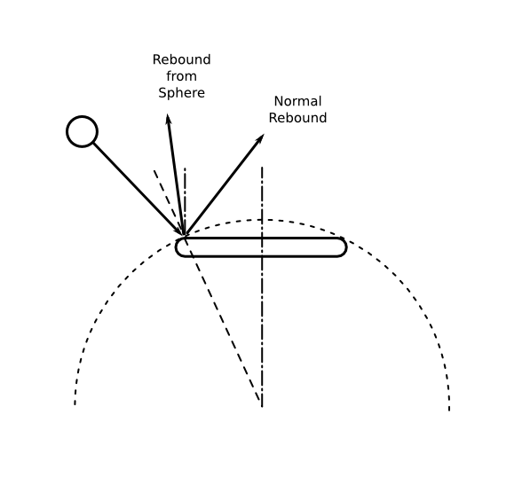
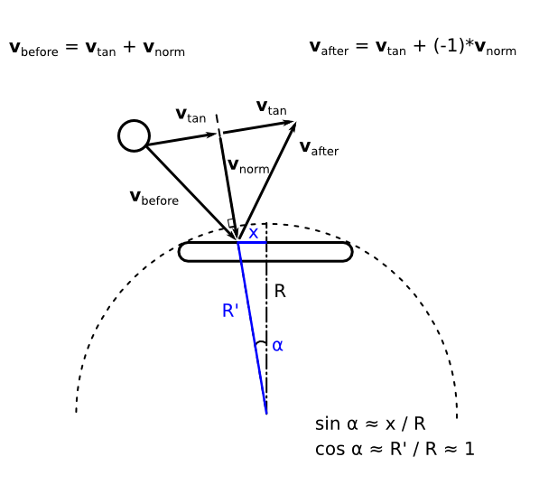

# 17. Improved Ball Rebounds

So far the ball rebounds upon collisions with the other objects have been very simple.
In particular, there was little control over a ball direction after a collision with the platform.
In this part, I want to improve this situation and introduce some other changes to rebound algorithms.

到目前为止，球与其它物体碰撞后的反弹都非常简单。尤其是球与平台碰撞后，几乎无法精确控制球的方向。本节我想改进这一点，并引入一些反弹算法上的改动。

<p align="center">

</p>

The ball participates in 3 types of collisions: ball-platform, ball-walls and ball-bricks.
For each type, I explicitly define a function to handle the corresponding rebound.

球会参与三类碰撞：球-平台、球-墙、球-砖块。我们为每一类碰撞明确写一个对应的反弹函数。

```lua
function collisions.ball_platform_collision( ball, platform )
   .....
   if overlap then
      ball.platform_rebound( shift_ball, ..... )
   end
end

function collisions.ball_walls_collision( ball, walls )
   .....
      if overlap then
         ball.wall_rebound( shift_ball )
      end
   .....
end

function collisions.ball_bricks_collision( ball, bricks )
   .....
      if overlap then
         ball.brick_rebound( shift_ball )
         bricks.brick_hit_by_ball( i, brick, shift_ball )
      end
   .....
end
```

The ball-brick rebound is the simplest of the three.
I leave it as the normal rebound.
However, I also want to increase the ball's speed after some number of collisions.
To implement this, it is necessary to maintain a collision counter inside the `ball` table.

球-砖块的反弹是三者中最简单的，我仍然使用普通反弹。但我还想在一定次数的碰撞后提高球速，因此需要在 `ball` 表中维护一个碰撞计数器。

```lua
function ball.brick_rebound( shift_ball )
   ball.normal_rebound( shift_ball )
   ball.increase_collision_counter()
   ball.increase_speed_after_collision()
end

function ball.increase_collision_counter()
   ball.collision_counter = ball.collision_counter + 1
end

function ball.increase_speed_after_collision()
   local speed_increase = 20
   local each_n_collisions = 10
   if ball.collision_counter ~= 0 and
      ball.collision_counter % each_n_collisions == 0 then
      ball.speed = ball.speed + ball.speed:normalized() * speed_increase
   end
end
```

In the ball-platform collision, the ball direction after the rebound should depend on the point
where the ball hit the platform. The first attempt might be to bind the rebound angle to a distance
between the platform and ball centers, i.e. something like

在球-平台碰撞中，反弹后的方向应该与球击中平台的位置有关。最直观的尝试是把反弹角度和球心与平台中心的距离绑定，比如这样：

```lua
ball_rebound_angle = (ball_center.x - platform_center.x) / platform.half_width
   * max_rebound_angle
ball.speed = ball.speed:len() * vector( math.sin( ball_rebound_angle ),
                                       -math.cos( ball_rebound_angle ) )  --(*1)
```

(\*1): `ball_rebound_angle` is counted from the vertical, 0-angle direction is up.

(\*1)：`ball_rebound_angle` 以竖直方向为基准，0 度朝上。

However, I don't like this approach. While simple, it results in counterintuitive mechanics and makes it hard to precisely control the direction of the ball (IMO).
Instead, a more complicated method is used. An idea is to make the ball rebound from the platform mimic a rebound from a spherical surface. To determine the ball speed, it is possible to use the same rule as for the normal rebound: the tangential component of the speed is conserved, whereas the normal is reversed.
The major difference, however, is the direction of the normal to the surface of the platform.
For a plane horizontal platform the normal is always oriented vertical. To imitate a spherical surface,
the direction of the normal at the point of the collision can be set as **n** = ( sin( alpha ), -cos( alpha ) ) (see the figure below). For the present purposes, it can be approximated as **n** ~ ( x / R, -1 ). The radius of the sphere R is a parameter that can be adjusted. The vector class has a method `projectOn` which allows to compute the normal component of the ball speed `local v_norm = ball.speed:projectOn( normal_direction )`. The tangential component is then calculated by subtracting the normal component from the whole vector `local v_tan = ball.speed - v_norm`. The speed after the collision is computed as `ball.speed = v_tan + (-1)* v_norm`.

不过我不太喜欢这种做法。它虽然简单，但手感往往反直觉，也让球的方向难以精确控制（至少在我看来）。所以我用了更复杂的方法：让球从平台反弹的感觉更像从球面上反弹。计算反弹速度时仍然遵循正常反弹的规则：切向分量保持不变，法向分量反向。
真正的差别在于平台表面法向量的方向。对于水平平面平台来说，法向量永远竖直向上；而为了模拟球面，碰撞点处的法向可以设为 **n** = ( sin( alpha ), -cos( alpha ) )（见下图）。在实际实现上，可以近似成 **n** ~ ( x / R, -1 )。其中 R 是球面的半径参数，可自行调整。向量类提供 `projectOn` 方法，可计算速度在法向量上的投影：`local v_norm = ball.speed:projectOn( normal_direction )`。切向分量则是 `local v_tan = ball.speed - v_norm`。最终反弹后的速度为 `ball.speed = v_tan + (-1)* v_norm`。

<p align="center">

</p>

Since the normal direction depends on the separation between the
centers of the platform and the ball, it is necessary to pass the coordinates of the
platform center into that function. I simply pass the whole platform object.

由于法向方向取决于平台中心与球心的相对位置，需要把平台中心坐标传进函数。我这里直接把整个平台对象传进去。

```lua
function ball.platform_rebound( shift_ball, platform )
   ball.bounce_from_sphere( shift_ball, platform )
   ball.increase_collision_counter()
   ball.increase_speed_after_collision()
end

function ball.bounce_from_sphere( shift_ball, platform )
   local actual_shift = ball.determine_actual_shift( shift_ball )
   ball.position = ball.position + actual_shift
   if actual_shift.x ~= 0 then
      ball.speed.x = -ball.speed.x
   end
   if actual_shift.y ~= 0 then
      local sphere_radius = 200
      local ball_center = ball.position
      local platform_center = platform.position +
         vector( platform.width / 2, platform.height / 2  )
      local separation = ( ball_center - platform_center )
      local normal_direction = vector( separation.x / sphere_radius, -1 )
      local v_norm = ball.speed:projectOn( normal_direction )
      local v_tan = ball.speed - v_norm
      local reverse_v_norm = v_norm * (-1)
      ball.speed = reverse_v_norm + v_tan
   end
end

function ball.determine_actual_shift( shift_ball )
   local actual_shift = vector( 0, 0 )
   local min_shift = math.min( math.abs( shift_ball.x ),
                               math.abs( shift_ball.y ) )
   if math.abs( shift_ball.x ) == min_shift then
      actual_shift.x = shift_ball.x
   else
      actual_shift.y = shift_ball.y
   end
   return actual_shift
end

function collisions.ball_platform_collision( ball, platform )
   .....
   if overlap then
      ball.platform_rebound( shift_ball, platform )
   end
end
```

Finally, the ball-wall rebound also remains the normal rebound, but with some modifications.
Changes in the platform-ball rebound algorithm made it possible for the ball to fly horizontally or almost horizontally. This is undesirable, because the ball can get stuck bouncing from left to right without reaching the platform. To prevent such a situation, during a ball-wall collision, the ball's speed angle to the horizontal is checked and set no less than some minimal angle.

最后，球-墙反弹仍然使用普通反弹，但要做一点修改。平台反弹算法的改变可能会让球水平或近乎水平地飞行，这样球可能只在左右墙之间来回反弹，永远碰不到平台。为避免这种情况，在球-墙碰撞时检查球速与水平线的夹角，并确保它不小于某个最小值。

```lua
function ball.wall_rebound( shift_ball )
   ball.normal_rebound( shift_ball )
   ball.min_angle_rebound()
   ball.increase_collision_counter()
   ball.increase_speed_after_collision()
end

function ball.min_angle_rebound()
   local min_horizontal_rebound_angle = math.rad( 20 )
   local vx, vy = ball.speed:unpack()
   local new_vx, new_vy = vx, vy
   rebound_angle = math.abs( math.atan( vy / vx ) )
   if rebound_angle < min_horizontal_rebound_angle then
      new_vx = sign( vx ) * ball.speed:len() *
         math.cos( min_horizontal_rebound_angle )
      new_vy = sign( vy ) * ball.speed:len() *
         math.sin( min_horizontal_rebound_angle )
   end
   ball.speed = vector( new_vx, new_vy )
end

local sign = math.sign or function(x) return x < 0 and -1 or x > 0 and 1 or 0 end
```
