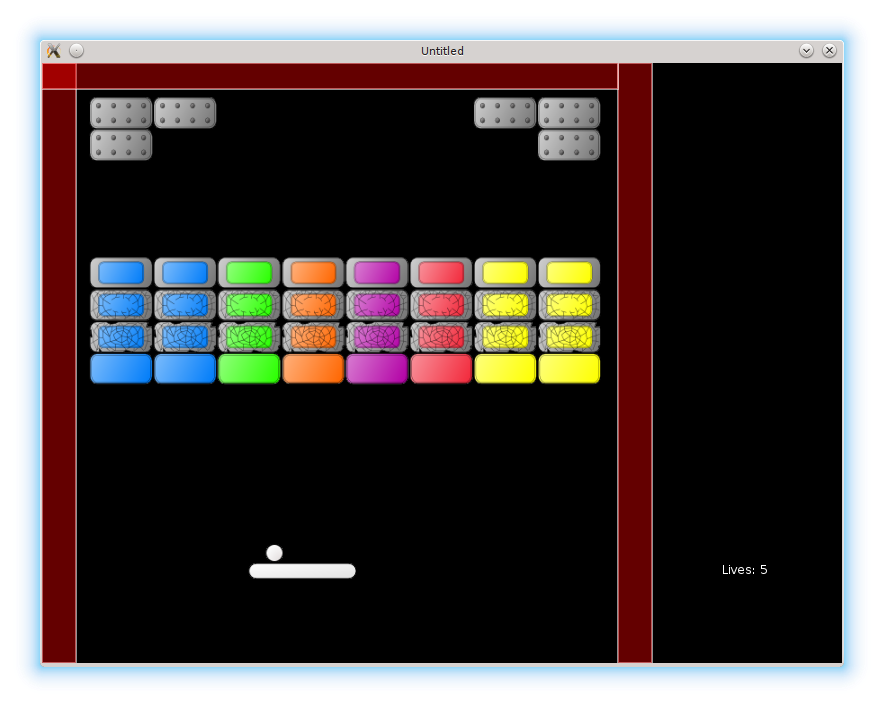

# 18. Ball Launch From Platform

Traditionally, in arkanoid a level is started with the ball glued to the platform.
When the player presses a key, the ball is launched.
In this part, I want to implement such a behavior.

<p align="center">

</p>

At first sight, to glue the ball to the platform, it is possible to set it's velocity to zero and make it react on arrow keys similarly to the platform (i.e. move left or right with the same speed as the platform). With such an approach, when the platform with the glued ball is pressed against the wall, the ball slides over the platform. There is nothing wrong with it, but I want a traditional mechanics, where the ball doesn't move over the platform. To implement it, a different strategy is required. For example, it is possible to fix a distance between the centers of the ball and the platform and when the platform moves, update the ball position relatively to the platform. This requires to store a `stuck_to_platform` flag and a `separation_from_platform_center` vector in the `ball` table. Since a level is started with the ball glued to the platform, default value for the `ball.stuck_to_platform` is `true`. Also, it is necessary to provide some initial ball-platform displacement.

```lua
local ball_x_shift = -28
local platform_height = 16
local platform_starting_pos = vector( 300, 500 )              --(*1)
ball.stuck_to_platform = true
ball.separation_from_platform_center = vector(
   ball_x_shift, -1 * platform_height / 2 - ball.radius - 1 )
ball.position = platform_starting_pos + ball.separation_from_platform_center  --(*1)
```

(\*1): In fact, there is no need to worry about the initial platform coordinates, since the ball will be positioned relative to the platform center automatically on the first call to the update method.

In the `ball.update` it is necessary to insert a check for the `stuck_to_platform` flag. If it is on, the ball should be positioned relatively to the platform. This requires to pass the platform coordinates into the `ball.update`. I pass the the whole platform object instead of coordinates only, because other platform properties will be necessary in the future.

```lua
function ball.update( dt, platform )
   ball.position = ball.position + ball.speed * dt
   if ball.stuck_to_platform then
      ball.follow_platform( platform )
   end
   ball.check_escape_from_screen()
end

function ball.follow_platform( platform )
   local platform_center = vector(
      platform.position.x + platform.width / 2,
      platform.position.y + platform.height / 2 )
   ball.position = platform_center + ball.separation_from_platform_center
end

function game.update( dt )
   ball.update( dt, platform )
   platform.update( dt )
   .....
end
```

Finally, the ball has to be launched on a key press.
An appropriate function in the `game.keyreleased` callback drops the `stuck_to_platform` flag and sets nonzero velocity to the ball (some initial velocity has to be stored in the `ball` table).

```lua
.....
local first_launch_speed = vector( -150, -300 )
ball.speed = vector( 0, 0 )
ball.image = love.graphics.newImage( "img/800x600/ball.png" )
.....

function ball.launch_from_platform()
   if ball.stuck_to_platform then
      ball.stuck_to_platform = false
      ball.speed = first_launch_speed:clone()
   end
end

function game.keyreleased( key, code )
   .....
   elseif key == 'space' or key == ' ' then   --(*1)
      ball.launch_from_platform()
   elseif .....
end
```

(\*1): Space key is represented as `'space'` in love-0.10 and as `' '` in love-0.9.

When the ball is lost, it is necessary to reposition it on the platform.
The ball position relative to the platform will be set automatically during the first call to the `ball.update`.

```lua
function ball.reposition()
   ball.escaped_screen = false
   ball.collision_counter = 0
   ball.stuck_to_platform = true
   ball.speed = vector( 0, 0 )
end
```
