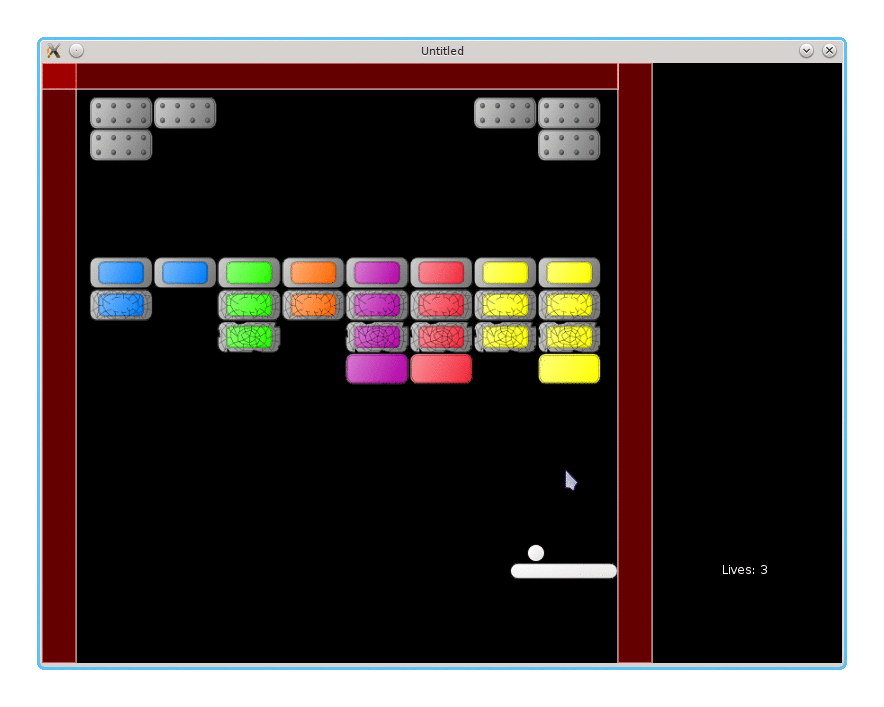

# 19. Mouse Controls

In this part I want to implement mouse controls for the game: the platform follows the mouse cursor, left click launches the ball, and right click - pauses the game.

这一部分要实现鼠标控制：平台跟随鼠标，左键发射球，右键暂停游戏。

<p align="center">

</p>

In general, to make the platform follow the mouse it is necessary to read the cursor position and then move the platform towards it. The first problem with the mouse controls is that it conflicts with the keyboard: it is going to be confusing if the platform follows the cursor and reacts on arrow keys simultaneously. As a compromise, it is possible to retain the keyboard controls when the cursor is outside of the game window and use the mouse controls when it is inside. LÖVE doesn't provide any built-in ways to make such a check, but it should be possible to implement it using functions from the [`love.window`](https://love2d.org/wiki/love.window) that return window size and position. However, instead of messing with it, I drop the keyboard controls entirely.

一般来说，要让平台跟随鼠标，需要读取鼠标坐标并让平台朝该位置移动。鼠标控制的第一个问题是与键盘控制冲突：如果平台同时跟随鼠标又响应方向键，会非常混乱。折中的方案是：鼠标在窗口内用鼠标控制，离开窗口就用键盘控制。LÖVE 没有内建方法直接判断鼠标是否在窗口内，但可以通过 [`love.window`](https://love2d.org/wiki/love.window) 获取窗口大小与位置自行实现。不过我懒得折腾，直接去掉键盘控制。

```lua
function platform.update( dt )
   platform.follow_mouse( dt )
end
```

The platform can move towards the cursor with a fixed speed (as was the case with the keyboard controls),
or it can be repositioned under the cursor immediately. I don't like the delay between the cursor and the platform trying to catch up with it, so I use the second variant. It allows cheating: pause the game, position the cursor, continue. I just ignore it.

平台可以以固定速度向鼠标位置移动（类似键盘控制），也可以直接瞬移到鼠标下方。我不喜欢平台追鼠标的延迟感，所以用了第二种。这样确实能作弊：暂停游戏、把鼠标挪到合适位置再继续。我就当没看到。

```lua
function platform.follow_mouse( dt )
   local x, y = love.mouse.getPosition()
   .....
      platform.position.x = x - platform.width / 2
   .....
end
```

The platform will follow the cursor even outside of the area with the bricks, i.e. on a side panel beyond the right wall. It is necessary to correct this situation. When the cursor is outside of the bricks area, the platform should be positioned to touch the walls without overlapping them.

平台会跟着鼠标走，即便鼠标跑到砖块区域之外，比如右侧墙体外的侧边栏。所以需要做限制：当鼠标在砖块区域外时，平台应该贴着墙移动，但不能穿过墙。

```lua
function platform.follow_mouse( dt )
   local x, y = love.mouse.getPosition()
   local left_wall_plus_half_platform = 34 + platform.width / 2
   local right_wall_minus_half_platform = 576 - platform.width / 2
   if ( x > left_wall_plus_half_platform and
        x < right_wall_minus_half_platform ) then
      platform.position.x = x - platform.width / 2
   elseif x < left_wall_plus_half_platform then
      platform.position.x =
         left_wall_plus_half_platform - platform.width / 2
   elseif x > right_wall_minus_half_platform then
      platform.position.x =
         right_wall_minus_half_platform - platform.width / 2
   end
end
```

To launch the ball on a mouse press, it is necessary to define an appropriate callback.
The function to launch the ball `ball.launch_from_platform` is the same as for the keyboard controls.

要用鼠标发射球，需要定义相应的回调。发射函数 `ball.launch_from_platform` 与键盘控制时一样。

```lua
function game.mousereleased( x, y, button, istouch )
   if button == 'l' or button == 1 then
      ball.launch_from_platform()
   elseif
      .....
   end
end
```

It is also necessary to register the `mousereleased` callback in the "gamestates" module.

同时要在 “gamestates” 模块中注册 `mousereleased` 回调。

```lua
function love.mousereleased( x, y, button, istouch )
   gamestates.state_event( "mousereleased", x, y, button, istouch )
end
```

Finally, the game is paused on the right mouse click.

最后，右键点击时暂停游戏。

```lua
function game.mousereleased( x, y, button, istouch )
   if button == 'l' or button == 1 then
      ball.launch_from_platform()
   elseif button == 'r' or button == 2 then
      music:pause()
      gamestates.set_state(
         "gamepaused",
         { ball, platform, bricks, walls, lives_display } )
   end
end
```

In the "gamepaused" state the left click resumes the game, and the right terminates it.

在 “gamepaused” 状态下，左键继续游戏，右键退出。

```lua
function gamepaused.mousereleased( x, y, button, istouch )
   if button == 'l' or button == 1 then
      gamestates.set_state( "game" )
   elseif button == 'r' or button == 2 then
      love.event.quit()
   end
end
```

In the "menu" and "gamefinished" the reaction on the mouse keys is similar.

在 “menu” 和 “gamefinished” 状态下，鼠标按键的响应也类似。
