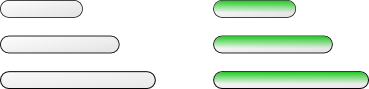

# 21. Bonus Effects

In this part I want to implement four bonus effects: acceleration-deceleration of the ball and increase-decrease of the platform size.

本节要实现四种奖励效果：球的加速与减速，以及平台的变大与变小。

<p align="center">

</p>

A bonus effect is applied when the player catches a falling bonus with the platform, i.e. on bonus-platform collision.
So, in the first place, it is necessary to detect such types of collisions.

奖励效果会在玩家用平台接住下落的奖励时触发，也就是奖励与平台发生碰撞时。因此首先要检测这种碰撞。

```lua
function collisions.resolve_collisions( ball, platform,
                                        walls, bricks, bonuses )
   .....
   collisions.platform_bonuses_collision( platform, bonuses, ball )       --(*1)
end

function collisions.platform_bonuses_collision( platform, bonuses, ball )
   local overlap
   local b = { x = platform.position.x,
               y = platform.position.y,
               width = platform.width,
               height = platform.height }
   for i, bonus in pairs( bonuses.current_level_bonuses ) do
      local a = { x = bonus.position.x - bonuses.radius,
                  y = bonus.position.y - bonuses.radius,
                  width = 2 * bonuses.radius,
                  height = 2 * bonuses.radius }
      overlap = collisions.check_rectangles_overlap( a, b )
      if overlap then
         bonuses.bonus_collected( i, bonus, ball, platform )             --(*2)
      end
   end
end
```

(\*1): A check for bonus-platform collisions is inserted along with the checks for other collisions.  
(\*2): A bonus-platform overlap is computed similarly to the platform-ball. If an overlap is detected,
a function `bonuses.bonus_collected` that applies bonus effect is called.

(\*1)：在其它碰撞检测的同时加入奖励-平台碰撞检测。  
(\*2)：奖励-平台重叠的计算方式与平台-球相似。如果检测到重叠，就调用 `bonuses.bonus_collected` 来应用奖励效果。

<p align="center">
<br>

<br>
Bonustypes from left to right: 11 - slowdown, 12 - glue, 13 - increase, 14 - new ball, 15 - accelerate,
16 - decrease, 17 - next level , 18 - new life.
<br>
</p>

奖励类型从左到右分别是：11 - 减速，12 - 粘性，13 - 变大，14 - 新球，15 - 加速，16 - 变小，17 - 下一关，18 - 新生命。

To apply bonus effect, first it is necessary to determine the bonus type.
The procedure is analogous to the determination of brick types on ball-brick collisions.
Slowdown and accelerate are 11 and 15, increase and decrease are 13 and 16.
The bonus has to be removed from the game after it's effect is applied.

要应用奖励效果，首先要判断奖励类型。这个过程类似于球-砖块碰撞里判断砖块类型。减速和加速是 11 和 15，变大和变小是 13 和 16。奖励效果触发后要把奖励从游戏中移除。

```lua
function bonuses.bonus_collected( i, bonus, ball, platform )
   if bonuses.is_slowdown( bonus ) then
      .....
   elseif bonuses.is_accelerate( bonus ) then
      .....
   elseif bonuses.is_increase( bonus ) then
      .....
   elseif bonuses.is_decrease( bonus ) then
      .....
   end
   table.remove( bonuses.current_level_bonuses, i )           --(*1)
end

function bonuses.is_slowdown( single_bonus )
   local col = single_bonus.bonustype % 10
   return ( col == 1 )
end

function bonuses.is_accelerate( single_bonus )
   local col = single_bonus.bonustype % 10
   return ( col == 5 )
end

function bonuses.is_increase( single_bonus )
   local col = single_bonus.bonustype % 10
   return ( col == 3 )
end

function bonuses.is_decrease( single_bonus )
   local col = single_bonus.bonustype % 10
   return ( col == 6 )
end
```

(\*1): Remove the bonus from the game.

(\*1)：把奖励从游戏中移除。

To accelerate or decelerate the ball, appropriate functions in the `ball` table
are defined. To call them, `bonuses.bonus_collected` needs an
access to the `ball` table. For this reason, it becomes necessary to pass the `ball` table as an argument
all the way down from the `collisions.platform_bonuses_collision` to `bonuses.bonus_collected( i, bonus, ball, platform )`.

为了加速或减速球，需要在 `ball` 表里定义对应函数。要调用这些函数，`bonuses.bonus_collected` 必须能访问 `ball` 表。因此必须把 `ball` 作为参数一路传下去，从 `collisions.platform_bonuses_collision` 到 `bonuses.bonus_collected( i, bonus, ball, platform )`。

```lua
function bonuses.bonus_collected( i, bonus, ball, platform )
   if bonuses.is_slowdown( bonus ) then
      ball.react_on_slow_down_bonus()
   elseif bonuses.is_accelerate( bonus ) then
      ball.react_on_accelerate_bonus()
   elseif
   .....
end

function ball.react_on_slow_down_bonus()
   local slowdown = 0.7
   ball.speed = ball.speed * slowdown         --(*1)
end

function ball.react_on_accelerate_bonus()
   local accelerate = 1.3
   ball.speed = ball.speed * accelerate       --(*1)
end
```

(\*1): Acceleration or deceleration of the ball changes it's speed.
The actual way it is done can be adjusted; I simply scale it by some constant.

(\*1)：球的加速/减速会改变球速。具体做法可以自行调整，这里我只是乘上一个常数。

To implement the platform increase-decrease effects, it is also necessary to put
calls to the appropriate functions from the `platform` table into the `bonuses.bonus_collected`.

要实现平台变大/变小的效果，还需要在 `bonuses.bonus_collected` 中调用 `platform` 表里的对应函数。

```lua
function bonuses.bonus_collected( i, bonus, ball, platform )
   if
      .....
   elseif bonuses.is_increase( bonus ) then
      platform.react_on_decrease_bonus()
   elseif bonuses.is_decrease( bonus ) then
      platform.react_on_increase_bonus()
   end
   table.remove( bonuses.current_level_bonuses, i )
end
```

Their actual implementation is a bit more complicated than ball acceleration and deceleration.
To change the platform size, it is necessary to change it's width and a tile that represents it.
There are three sizes of the platform: "small", "norm", and "large".
The "increase" bonus can enlarge the platform size from "norm" to "large" or from "small" to "norm";
it has no effect, if the platform is "large" already. The "decrease" bonus works in a similar fashion.

它们的具体实现比球的加速/减速更复杂一些。要改变平台大小，需要同时修改平台宽度和表示平台的 tile。平台有三种尺寸："small"、"norm" 和 "large"。"increase" 奖励会把平台从 "norm" 变成 "large"，或从 "small" 变成 "norm"；如果平台已经是 "large"，则不会有变化。"decrease" 奖励则相反。

```lua
.....
platform.width = platform.norm_tile_width
platform.height = platform.norm_tile_height
platform.size = "norm"                      --(*1)

function platform.react_on_increase_bonus()
   if platform.size == "small" then
      platform.width = platform.norm_tile_width
      platform.height = platform.norm_tile_height
      platform.quad = love.graphics.newQuad(
         platform.norm_tile_x_pos, platform.norm_tile_y_pos,
         platform.norm_tile_width, platform.norm_tile_height,
         platform.tileset_width, platform.tileset_height )
      platform.size = "norm"
   elseif platform.size == "norm" then
      platform.width = platform.large_tile_width
      platform.height = platform.large_tile_height
      platform.quad = love.graphics.newQuad(
         platform.large_tile_x_pos, platform.large_tile_y_pos,
         platform.large_tile_width, platform.large_tile_height,
         platform.tileset_width, platform.tileset_height )
      platform.size = "large"
   end
end

function platform.react_on_decrease_bonus()
   if platform.size == "norm" then
      platform.width = platform.small_tile_width
      platform.height = platform.small_tile_height
      platform.quad = love.graphics.newQuad(
         platform.small_tile_x_pos, platform.small_tile_y_pos,
         platform.small_tile_width, platform.small_tile_height,
         platform.tileset_width, platform.tileset_height )
      platform.size = "small"
   elseif platform.size == "large" then
      platform.width = platform.norm_tile_width
      platform.height = platform.norm_tile_height
      platform.quad = love.graphics.newQuad(
         platform.norm_tile_x_pos, platform.norm_tile_y_pos,
         platform.norm_tile_width, platform.norm_tile_height,
         platform.tileset_width, platform.tileset_height )
      platform.size = "norm"
   end
end
```

(\*1): platform current size has to be kept as an additional field inside the `platform` table.

(\*1)：需要在 `platform` 表里额外保存当前尺寸。

When the platform size changes, it also might be possible to change the "sphere radius"
parameter used for platform-ball collision resolution. But it seems to work fine without any
adjustments, so I won't make any changes to it.

当平台大小变化时，理论上也可以调整平台-球碰撞处理中使用的“球面半径”参数。但目前不调也能正常工作，所以我不做改动。

```lua
function ball.bounce_from_sphere( shift_ball, platform )
   .....
   if actual_shift.y ~= 0 then
      local sphere_radius = 200
      .....
      local normal_direction = vector( separation.x / sphere_radius, -1 )
      .....
   end
end
```

If the next level is reached or the ball is lost, it is necessary to reset
the platform size to normal.

当进入下一关或球丢失时，需要把平台尺寸重置回正常。

```lua
function game.enter( prev_state, ... )
   .....
   if args and args.current_level then
      .....
      ball.reposition()
      platform.reset_size_to_norm()
   end
end

function game.check_no_more_balls( ball, lives_display )
   if ball.escaped_screen then
      .....
         ball.reposition()
         platform.reset_size_to_norm()
      .....
   end
end

function platform.reset_size_to_norm()
   platform.width = platform.norm_tile_width
   platform.height = platform.norm_tile_height
   platform.quad = love.graphics.newQuad(
      platform.norm_tile_x_pos, platform.norm_tile_y_pos,
      platform.norm_tile_width, platform.norm_tile_height,
      platform.tileset_width, platform.tileset_height )
   platform.size = "norm"
end
```
