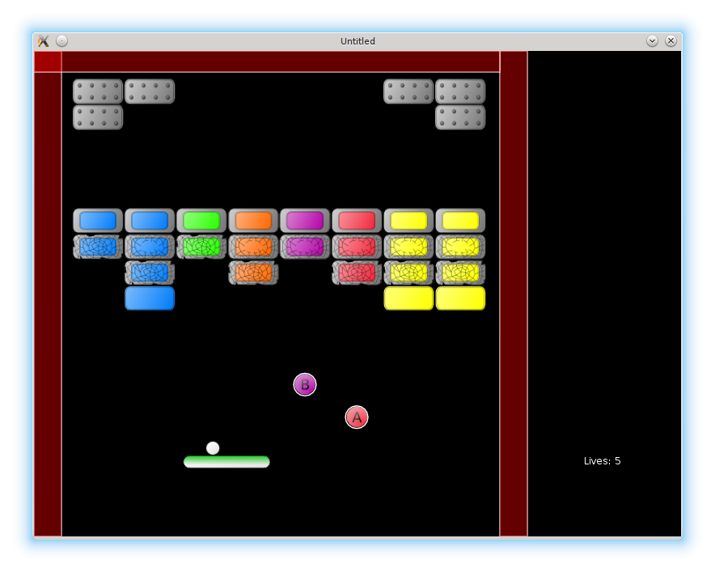

# 22. Glue Bonus

In this part I want to implement a "glue" bonus: when it's on, the ball doesn't rebound from the platform, but
sticks to it until the player presses a launch button.

本节要实现“粘性（glue）”奖励：激活后，球不会从平台反弹，而是粘在平台上，直到玩家按下发射按钮。

<p align="center">

</p>

First it is necessary to add recognition of the "glue" bonus type in the collision detection code.

首先要在碰撞检测代码中加入对 “glue” 奖励类型的识别。

```lua
function bonuses.bonus_collected( i, bonus, ball, platform )
   .....
   elseif bonuses.is_glue( bonus ) then
      platform.react_on_glue_bonus()
   end
   .....
end

function bonuses.is_glue( single_bonus )
   local col = single_bonus.bonustype % 10
   return ( col == 2 )
end
```

When a "glue" bonus is caught, `platform.glued` flag is raised and
the platform tile is changed to indicate the change visually.

当吃到 “glue” 奖励时，设置 `platform.glued` 标志，并切换平台 tile 来显示视觉变化。

```lua
function platform.react_on_glue_bonus()
   platform.glued = true
   if platform.size == "small" then
      platform.quad = love.graphics.newQuad(
         platform.small_tile_x_pos + platfrom.glued_x_pos_shift,
         platform.small_tile_y_pos,
         platform.small_tile_width,
         platform.small_tile_height,
         platform.tileset_width,
         platform.tileset_height )
   elseif platform.size == "norm" then
      platform.quad = love.graphics.newQuad(
         platform.norm_tile_x_pos + platfrom.glued_x_pos_shift,
         platform.norm_tile_y_pos,
         platform.norm_tile_width,
         platform.norm_tile_height,
         platform.tileset_width,
         platform.tileset_height )
   elseif platform.size == "large" then
      platform.quad = love.graphics.newQuad(
         platform.large_tile_x_pos + platfrom.glued_x_pos_shift,
         platform.large_tile_y_pos,
         platform.large_tile_width,
         platform.large_tile_height,
         platform.tileset_width,
         platform.tileset_height )
   end
end
```

Ball-platform collision depends on the value of the `glued` flag.

球-平台碰撞的处理取决于 `glued` 标志的值。

```lua
function ball.platform_rebound( shift_ball, platform )
   ball.increase_collision_counter()
   ball.increase_speed_after_collision()
   if not platform.glued then
      ball.bounce_from_sphere( shift_ball, platform )
   else
      ball.stuck_to_platform = true
      local actual_shift = ball.determine_actual_shift( shift_ball )
      ball.position = ball.position + actual_shift
      ball.platform_launch_speed_magnitude = ball.speed:len()            --(*1)
      ball.compute_ball_platform_separation( platform )
   end
end

function ball.compute_ball_platform_separation( platform )
   local platform_center = vector(
      platform.position.x + platform.width / 2,
      platform.position.y + platform.height / 2 )
   local ball_center = ball.position:clone()
   ball.separation_from_platform_center =
      ball_center - platform_center
   print( ball.separation_from_platform_center )
end
```

(\*1): On ball collision with the "glued" platform, ball speed magnitude is memorized and
used later, when the ball is launched from the platform.

(\*1)：当球撞到“粘性”平台时，会记录当前球速大小，之后球从平台发射时会用到它。

The `ball.launch_from_platform` procedure is changed.
Launch speed magnitude equals to the speed magnitude before the collision and
launch angle is determined from the distance between the ball and platform centers.

`ball.launch_from_platform` 需要修改。发射速度大小等于碰撞前的速度大小，而发射角度由球心与平台中心的相对位置决定。

```lua
function ball.launch_from_platform()
   if ball.stuck_to_platform then
      ball.stuck_to_platform = false
      local platform_halfwidth = 70       --(*1)
      local launch_direction = vector(
         ball.separation_from_platform_center.x / platform_halfwidth, -1 )
      ball.speed = launch_direction / launch_direction:len() *
         ball.platform_launch_speed_magnitude
   end
end
```

(\*1): Half-width of the big platform is used, since it provides more diverse angles.

(\*1)：使用大平台的半宽度，因为这样能产生更多样的角度。

For `ball.launch_from_platform` to be applicable on the start of the level
(i.e. when the ball is stuck to the platform, but the platform is not "glued"),
it is necessary to initialize `ball.platform_launch_speed_magnitude` and `ball.separation_from_platform_center`
with some initial values.

为了让 `ball.launch_from_platform` 在关卡开始时也能使用（此时球粘在平台上，但平台并未“胶黏”），需要为 `ball.platform_launch_speed_magnitude` 和 `ball.separation_from_platform_center` 设置初始值。

```lua
local initial_launch_speed_magnitude = 300
ball.platform_launch_speed_magnitude = initial_launch_speed_magnitude
local ball_platform_initial_separation = vector(
   ball_x_shift, -1 * platform_height / 2 - ball.radius - 1 )
ball.separation_from_platform_center = ball_platform_initial_separation
```

The glued effect is removed if any other bonus (except another "glue" bonus) is caught.

如果玩家吃到其它奖励（除“glue”外），粘性效果会被移除。

```lua
function bonuses.bonus_collected( i, bonus, ball, platform )
   if not bonuses.is_glue( bonus ) then
      platform.remove_glued_effect()
      ball.launch_from_platform()
   end
   .....
   table.remove( bonuses.current_level_bonuses, i )
end

function platform.remove_glued_effect()
   if platform.glued then
      platform.glued = false
      if platform.size == "small" then
         platform.quad = love.graphics.newQuad(
            platform.small_tile_x_pos,
            platform.small_tile_y_pos,
            platform.small_tile_width,
            platform.small_tile_height,
            platform.tileset_width,
            platform.tileset_height )
      elseif platform.size == "norm" then
         platform.quad = love.graphics.newQuad(
            platform.norm_tile_x_pos,
            platform.norm_tile_y_pos,
            platform.norm_tile_width,
            platform.norm_tile_height,
            platform.tileset_width,
            platform.tileset_height )
      elseif platform.size == "large" then
         platform.quad = love.graphics.newQuad(
            platform.large_tile_x_pos,
            platform.large_tile_y_pos,
            platform.large_tile_width,
            platform.large_tile_height,
            platform.tileset_width,
            platform.tileset_height )
      end
   end
end
```

The effect is also removed if the ball is lost, or the next level is reached.

当球丢失或进入下一关时，也要移除该效果。

```lua
function game.enter( prev_state, ... )
   .....
   if args and args.current_level then
      .....
      ball.reposition()
      platform.remove_bonuses_effects()
   end
end

function game.check_no_more_balls( ball, lives_display )
   if ball.escaped_screen then
         .....
         ball.reposition()
         platform.remove_bonuses_effects()
         .....
   end
end

function platform.remove_bonuses_effects()
   platform.remove_glued_effect()
   platform.reset_size_to_norm()
end

function ball.reposition()
   ball.escaped_screen = false
   ball.collision_counter = 0
   ball.stuck_to_platform = true
   ball.platform_launch_speed_magnitude = initial_launch_speed_magnitude
   ball.separation_from_platform_center = ball_platform_initial_separation
end
```
