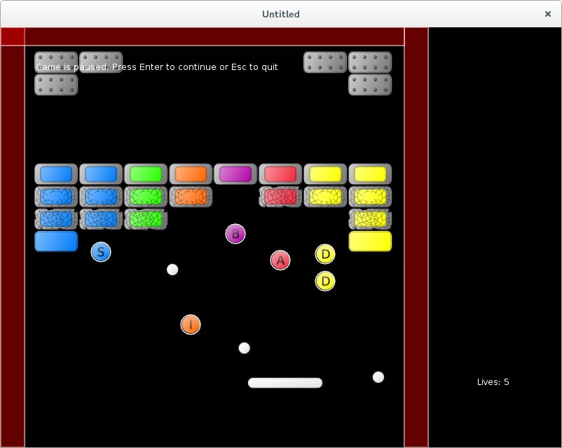

# 23. Add New Ball Bonus

In this part I want to implement a bonus that increases a number of balls in the game.

<p align="center">

</p>

Since there are going to be several balls, it is necessary to create an array-like storage for them,
just like for the bricks and the bonuses. Apart from the storage, a constructor for a single ball
is necessary.

```lua
balls.current_balls = {}
.....

function balls.new_ball( position, speed,
                         platform_launch_speed_magnitude,
                         stuck_to_platform )
   return( { position = position,
             speed = speed,
             platform_launch_speed_magnitude = platform_launch_speed_magnitude,
             stuck_to_platform = stuck_to_platform,
             radius = balls.radius,
             collision_counter = 0,
             separation_from_platform_center = ball_platform_initial_separation,
             quad = balls.quad } )
end


function balls.add_ball( single_ball )
   table.insert( balls.current_balls, single_ball )
end
```

Update and draw functions need to iterate over the balls container and call
`update_ball` and `draw_ball` for each individual ball.

```lua
function balls.update( dt, platform )
   for _, ball in ipairs( balls.current_balls ) do
      balls.update_ball( ball, dt, platform )
   end
   balls.check_balls_escaped_from_screen()
end

function balls.update_ball( single_ball, dt, platform )
   if single_ball.stuck_to_platform then
      balls.follow_platform( single_ball, platform )
   else
      single_ball.position = single_ball.position + single_ball.speed * dt
   end
end

function balls.draw()
   for _, ball in ipairs( balls.current_balls ) do
      balls.draw_ball( ball )
   end
end

function balls.draw_ball( single_ball )
   love.graphics.draw( balls.image,
                       single_ball.quad,
                       single_ball.position.x - single_ball.radius,
                       single_ball.position.y - single_ball.radius )
end
```

After these changes, collision detection should be updated.
Sub-procedures and arguments of `collisions.resolve_collisions` are renamed
to indicate that now there are several balls instead of a single one.

```lua
function collisions.resolve_collisions( balls, platform,
                                        walls, bricks, bonuses )
   collisions.balls_platform_collision( balls, platform )
   collisions.balls_walls_collision( balls, walls )
   collisions.balls_bricks_collision( balls, bricks, bonuses )
   collisions.platform_walls_collision( platform, walls )
   collisions.platform_bonuses_collision( platform, bonuses, balls )
end
```

In collision-detection functions it is necessary to loop over the balls container.
For example, for balls-platform:

```lua
function collisions.balls_platform_collision( balls, platform )
   local overlap, shift_ball
   local a = { x = platform.position.x,
               y = platform.position.y,
               width = platform.width,
               height = platform.height }
   for _, ball in pairs( balls.current_balls ) do
      local b = { x = ball.position.x - ball.radius,
                  y = ball.position.y - ball.radius,
                  width = 2 * ball.radius,
                  height = 2 * ball.radius }
      overlap, shift_ball =
         collisions.check_rectangles_overlap( a, b )
      if overlap then
         balls.platform_rebound( ball, shift_ball, platform )
      end
   end
end
```

Functions that resolve collisions need to accept a table with properties of the ball being
processed.

```lua
function balls.platform_rebound( single_ball, shift_ball, platform )
   balls.increase_collision_counter( single_ball )
   balls.increase_speed_after_collision( single_ball )
   if not platform.glued then
      balls.bounce_from_sphere( single_ball, shift_ball, platform )
   else
      single_ball.stuck_to_platform = true
      local actual_shift = balls.determine_actual_shift( shift_ball )
      single_ball.position = single_ball.position + actual_shift
      single_ball.platform_launch_speed_magnitude =
         single_ball.speed:len()
      balls.compute_ball_platform_separation( single_ball, platform )
   end
end


function balls.bounce_from_sphere( single_ball, shift_ball, platform )
   .....
end

function balls.compute_ball_platform_separation( single_ball, platform )
   .....
end
```

and so on. Similar changes are necessary for balls-walls and balls-bricks collisions.

The game states require an update to accomodate the name of the module.
In fact, only the "game" state has to be updated, since it is the only one accessing "balls" directly.

```lua
local balls = require "balls"
local platform = require "platform"
local bricks = require "bricks"
.....

function game.update( dt )
   balls.update( dt, platform )
   .....
   game.check_no_more_balls( balls, lives_display )
   .....
end

.....
```

Several balls can be present in the game simultaneously, so life is lost when all the balls have escaped the screen.

```lua
function game.check_no_more_balls( balls, lives_display )
   if balls.no_more_balls then
      lives_display.lose_life()
      .....
   end
end

function balls.check_balls_escaped_from_screen()
   for i, single_ball in pairs( balls.current_balls ) do
      local x, y = single_ball.position:unpack()
      local ball_top = y - single_ball.radius
      if ball_top > love.graphics.getHeight() then
         table.remove( balls.current_balls, i )
      end
   end
   if next( balls.current_balls ) == nil then
      balls.no_more_balls = true
   end
end
```

In the single ball case of the previous chapters, `ball.reposition` function
was responsible for setting the ball position on the start of the level and resetting it
In the multiball case it is replaced by `balls.reset`.

```lua
function balls.reset()
   balls.no_more_balls = false
   for i in pairs( balls.current_balls ) do
      balls.current_balls[i] = nil
   end
   local position = platform_starting_pos + ball_platform_initial_separation
   local speed = vector( 0, 0 )
   local platform_launch_speed_magnitude = initial_launch_speed_magnitude
   local stuck_to_platform = true
   balls.add_ball( balls.new_ball(
                      position, speed,
                      platform_launch_speed_magnitude,
                      stuck_to_platform ) )
end
```

Another set of necessary updates is balls reaction on bonuses.
We have to pass the whole balls array into `bonuses.bonus_collected` function.

```lua
function collisions.platform_bonuses_collision( platform, bonuses, balls )
   .....
      if overlap then
         bonuses.bonus_collected( i, bonus, balls, platform )
      end
   .....
end

function bonuses.bonus_collected( i, bonus, balls, platform )
   .....
   if bonuses.is_slowdown( bonus ) then
      balls.react_on_slow_down_bonus()
   elseif bonuses.is_accelerate( bonus ) then
      balls.react_on_accelerate_bonus()
   elseif .....
end
```

For acceleration-deceleration bonuses, I want the picked bonus to affect
all of the balls in the game. Therefore it is necessary to iterate over `balls.current_balls` table.

```lua
function balls.react_on_slow_down_bonus()
   local slowdown = 0.7
   for _, single_ball in pairs( balls.current_balls ) do
      single_ball.speed = single_ball.speed * slowdown
   end
end

function balls.react_on_accelerate_bonus()
   local accelerate = 1.3
   for _, single_ball in pairs( balls.current_balls ) do
      single_ball.speed = single_ball.speed * accelerate
   end
end
```

When glue bonus is active and several balls are stuck to platform, it is necessary to decide, which
ball to release. I don't want to maintain an order in which they were stuck, and simply
release the first one from the `balls.current_balls` that happens to have `stuck_to_platform` flag active.

```lua
function balls.launch_single_ball_from_platform()
   for _, single_ball in pairs( balls.current_balls ) do
      if single_ball.stuck_to_platform then
         single_ball.stuck_to_platform = false
         local platform_halfwidth = 70
         local launch_direction = vector(
            single_ball.separation_from_platform_center.x / platform_halfwidth, -1 )
         single_ball.speed = launch_direction / launch_direction:len() *
            single_ball.platform_launch_speed_magnitude
         break
      end
   end
end
```

Glue bonus is deactivated when another bonus is collected.
In that case, I want to release all of the balls, glued to the platform.

```lua
function bonuses.bonus_collected( i, bonus, balls, platform )
   if not bonuses.is_glue( bonus ) then
      platform.remove_glued_effect()
      balls.launch_all_glued_balls()
   end
   .....
end

function balls.launch_all_balls_from_platform()
   for _, single_ball in pairs( balls.current_balls ) do
      if single_ball.stuck_to_platform then
         single_ball.stuck_to_platform = false
         local platform_halfwidth = 70
         local launch_direction = vector(
            single_ball.separation_from_platform_center.x / platform_halfwidth, -1 )
         single_ball.speed = launch_direction / launch_direction:len() *
            single_ball.platform_launch_speed_magnitude
      end  --(*1)
   end
end
```

(\*1): The difference of the `balls.launch_all_balls_from_platform` function from the
`balls.launch_single_ball_from_platform` is the absence of the `break` statement at the end
of the `if` block.

Finally, we have arrived to the main goal of this part - add new ball bonus!!!
Is is necessary to add some code to recognize the bonus type in the `bonuses.bonus_collected`
function.

```lua
function bonuses.bonus_collected( i, bonus, balls, platform )
   .....
   elseif bonuses.is_add_new_ball( bonus ) then
      balls.react_on_add_new_ball_bonus()
   end
   .....
end

function bonuses.is_add_new_ball( single_bonus )
   local col = single_bonus.bonustype % 10
   return ( col == 4 )
end
```

To actually add a new ball, it is necessary to place it somewhere and decide on it's speed.
I copy the position and the speed and some other parameters of the first ball in the `ball.current_balls` table, rotate the speed 45 degrees, and construct the new ball with these parameters.
After that it is inserted into the `ball.current_balls` table.

```lua
function balls.react_on_add_new_ball_bonus()
   local first_ball = balls.current_balls[1]
   local new_ball_position = first_ball.position:clone()
   local new_ball_speed = first_ball.speed:rotated( math.pi / 4 )
   local new_ball_launch_speed_magnitude =
      first_ball.platform_launch_speed_magnitude
   local new_ball_stuck = first_ball.stuck_to_platform
   balls.add_ball(
      balls.new_ball( new_ball_position, new_ball_speed,
                      new_ball_launch_speed_magnitude,
                      new_ball_stuck ) )
end
```
