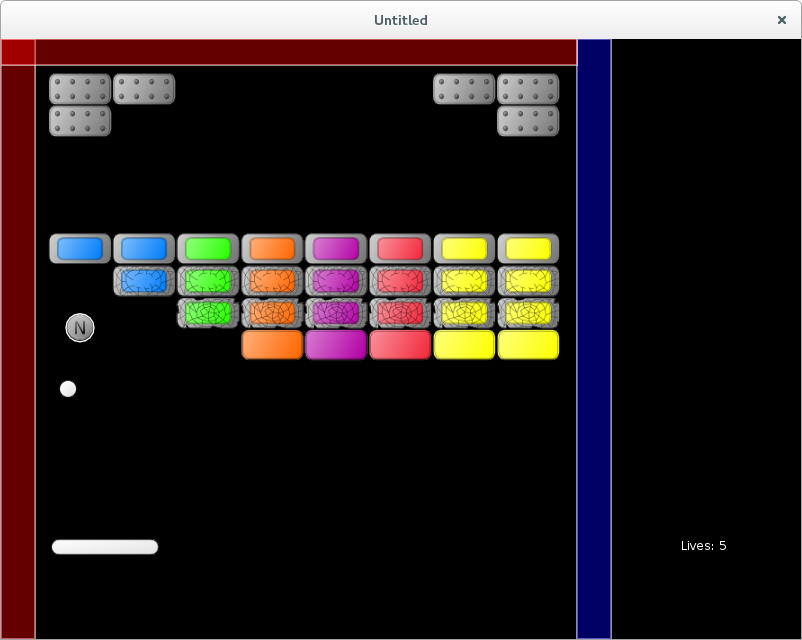

# 24. Life and Next Level Bonuses

In this part I want to implement two bonuses: one that adds a life and another that allows to
finish a level skipping remaining blocks.

本节要实现两个奖励：一个加生命，另一个可以跳过剩余砖块直接结束当前关卡。

<p align="center">

</p>

First it is necessary to add code to recognize "Life" and "Next Level" bonuses:

首先要加入对 “Life” 和 “Next Level” 奖励的识别代码：

```lua
function bonuses.bonus_collected( i, bonus, balls, platform )
   .....
   elseif bonuses.is_life( bonus ) then
      .....
   elseif bonuses.is_next_level( bonus ) then
      .....
   end
   .....
end

function bonuses.is_life( single_bonus )
   local col = single_bonus.bonustype % 10
   return ( col == 8 )
end

function bonuses.is_next_level( single_bonus )
   local col = single_bonus.bonustype % 10
   return ( col == 7 )
end
```

To reaction on "Add Life" bonus it is necessary to increase lives counter in the `lives_display` table.
An appropriate function is implemented as `lives_display.add_life()`.
I call it inside the `bonuses.bonus_collected`, where currently all other reactions on bonuses are placed.
To do this, it is necessary to supply `lives_display` as an argument to `bonus_collected`, which requires
to pass it all the way down from the `game.update` through collision-related functions (probably, not an optimal solution).

要响应 “Add Life” 奖励，需要把 `lives_display` 中的生命数加 1。可以实现一个 `lives_display.add_life()` 函数，并在 `bonuses.bonus_collected` 里调用。要做到这一点，需要把 `lives_display` 作为参数传给 `bonus_collected`，这意味着要从 `game.update` 经过一系列碰撞相关函数一路传下去（可能不是最优解）。

```lua
function game.update( dt )
   .....
   collisions.resolve_collisions( balls, platform,
                                  walls, bricks,
                                  bonuses, lives_display )
   .....
end

function collisions.resolve_collisions( balls, platform,
                                        walls, bricks,
                                        bonuses, lives_display )
   .....
   collisions.platform_bonuses_collision( platform, bonuses,
                                          balls, lives_display )
end

function collisions.platform_bonuses_collision( platform, bonuses,
                                                balls, lives_display )
   .....
      if overlap then
         bonuses.bonus_collected( i, bonus, balls, platform, lives_display )
      end
   .....
end

function bonuses.bonus_collected( i, bonus, balls, platform, lives_display )
   .....
   elseif bonuses.is_life( bonus ) then
      lives_display.add_life()
   elseif
   .....
end

function lives_display.add_life()
   lives_display.lives = lives_display.lives + 1
end
```

The "Next Level" bonus works the following way: when it is caught, a portal inside the right wall is activated.
If the player touches the portal with the platform, transition to the next level occurs.

“Next Level” 奖励的机制如下：吃到后，会在右侧墙体内激活一个传送门。如果玩家用平台触碰传送门，就会切换到下一关。

If the "Next Level" bonus is caught, a special flag in the right wall is activated
`walls.current_level_walls["right"].next_level_bonus = true`. This is done inside the `bonuses.bonus_collected` function and (again) requires to pass the `walls` table as an argument through all the collision-related functions.

吃到 “Next Level” 奖励后，需要激活右侧墙体里的一个标志 `walls.current_level_walls["right"].next_level_bonus = true`。这一步在 `bonuses.bonus_collected` 中完成，并且（再次）要求把 `walls` 表作为参数传过多层碰撞函数。

```lua
function collisions.resolve_collisions( balls, platform,
                                        walls, bricks,
                                        bonuses, lives_display )
   .....
   collisions.platform_bonuses_collision( platform, bonuses,
                                          balls, walls,
                                          lives_display )
end

function collisions.platform_bonuses_collision( platform, bonuses,
                                                balls, walls,
                                                lives_display )
   .....
      if overlap then
         bonuses.bonus_collected( i, bonus,
                                  balls, platform,
                                  walls, lives_display )
      end
   .....
end

function bonuses.bonus_collected( i, bonus,
                                  balls, platform,
                                  walls, lives_display )
   .....
   elseif bonuses.is_next_level( bonus ) then
      walls.current_level_walls["right"].next_level_bonus = true
   end
   .....
end
```

To indicate that a portal to the next level is open, appearance of the wall is changed.

为了提示传送门已开启，需要改变墙体的外观。

```lua
function walls.draw_wall( single_wall )
   .....
   love.graphics.setColor( 255, 0, 0, 100 )
   if single_wall.next_level_bonus then
      love.graphics.setColor( 0, 0, 255, 100 )
   end
   love.graphics.rectangle( 'fill',
                            single_wall.position.x,
                            single_wall.position.y,
                            single_wall.width,
                            single_wall.height )
   .....
end
```

If the platform touches the right wall, the game switches
to the next level. Instead of calling `game.switch_to_next_level` from
collision-resolution functions, it is more convenient to raise a special flag in the
platform object and check it each update cycle.

如果平台触碰到右侧墙体，游戏就切换到下一关。相比在碰撞处理函数里直接调用 `game.switch_to_next_level`，更方便的做法是设置平台对象上的一个标志，然后在每次更新时检查它。

```lua
function collisions.platform_walls_collision( platform, walls )
   .....
      if overlap then
         platform.bounce_from_wall( shift_platform, wall )
      end
   .....
end

function platform.bounce_from_wall( shift_platform, wall )
   platform.position.x = platform.position.x + shift_platform.x
   if wall.next_level_bonus then
      platform.activated_next_level_bonus = true
   end
end

function game.switch_to_next_level( bricks, levels )
   if bricks.no_more_bricks or platform.activated_next_level_bonus then
      .....
   end
end
```

The effect of the bonus is lost if next level is reached or all the balls are lost.

如果进入下一关，或所有球都丢失，则奖励效果会失效。

```lua
function game.enter( prev_state, ... )
   .....
   if args and args.current_level then
      .....
      platform.remove_bonuses_effects()
      walls.remove_bonuses_effects()
   end
end

function game.check_no_more_balls( balls, lives_display )
   if balls.no_more_balls then
       .....
         platform.remove_bonuses_effects()
         walls.remove_bonuses_effects()
       .....
   end
end

function platform.remove_bonuses_effects()
   platform.remove_glued_effect()
   platform.reset_size_to_norm()
   platform.activated_next_level_bonus = false
end

function walls.remove_bonuses_effects()
   walls.current_level_walls["right"].next_level_bonus = false
end
```
