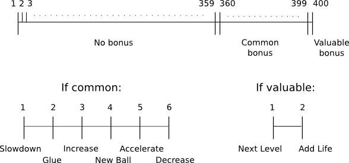
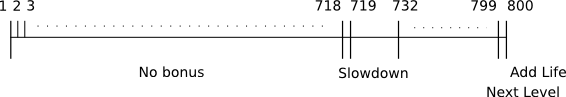

# 25. Random Bonuses

Currently bonuses generated on bricks destruction are predefined in the level description.
In this part I want to add random bonus generation into the game.

目前砖块被摧毁时生成的奖励是在关卡描述里预先定义的。本节要加入随机奖励生成机制。

<p align="center">
<br>

<br>
</p>

First, in the level map some way to denote that a bonus to create on brick destruction
should be random is necessary. It's possible to reserve any number or a string for this, but I simply use `00`.

首先要在关卡地图里标记哪些砖块对应的奖励是随机的。可以用任意数字或字符串来表示，我这里直接用 `00`。

```lua
function bonuses.bonustype_denotes_random( bonustype )
   return bonustype == 0
end
```

Bonuses are generated on bricks destruction by `bonus.generate_bonus` function.

奖励是在砖块被摧毁时通过 `bonus.generate_bonus` 生成的。

```lua
function bricks.brick_hit_by_ball( i, brick, shift_ball, bonuses )
   if bricks.is_simple( brick ) then
      bonuses.generate_bonus(
         vector( brick.position.x + brick.width / 2,
                 brick.position.y + brick.height / 2 ),
         brick.bonustype )
      table.remove( bricks.current_level_bricks, i )
   .....
   end
end
```

In this function, a bonustype associated with the brick is checked.
If it is one of the previously defined "valid" bonustypes (from 11 to 18),
a corresponding bonus is generated.
Check on random bonustype also should be placed in this function.
To explicitly tell, that no bonus should be associated with the brick, it is enough to provide any
"invalid" bonustype, such as `-1`.

在这个函数中会检查砖块关联的 bonustype。如果它是之前定义的有效类型（11 到 18），就生成对应奖励。对随机 bonustype 的判断也应该放在这里。如果想明确表示该砖块不生成奖励，只要给一个“无效”的 bonustype，例如 `-1`。

```lua
function bonuses.generate_bonus( position, bonustype )
   if bonuses.bonustype_denotes_random( bonustype ) then
      bonustype = bonuses.random_bonustype()
   end
   if bonuses.valid_bonustype( bonustype ) then
      bonuses.add_bonus( bonuses.new_bonus( position, bonustype ) )
   end
end

function bonuses.valid_bonustype( bonustype )
   if bonustype and bonustype > 10 and bonustype < 19 then
      return true
   else
      return false
   end
end
```

Random bonus generation is done under following scheme.
There are valuable bonuses and common bonuses; valuable are "Add Life" and "Next Level",
common are everything else. I want a common bonus to appear approximately each 10 brick,
and a valuable bonus - approximately once in 5 levels.
There are maximum 8\*11 ~ 90 bricks in each level. Since usually there are
some unbreakable and missing bricks, there are, roughly 80 bricks per level or 400 bricks in 5 levels.
So, on brick destruction, a common bonus (of randomly decided type) should drop with probability 1/10 and
one of the valuable bonuses - with probability 1/400. It might be reasonable to increase those probabilities for armored blocks compared to simple, but I don't want to do this.

随机奖励采用如下方案：奖励分为“稀有”和“普通”。稀有的是 “Add Life” 和 “Next Level”，普通是其它所有。我的目标是大约每 10 块砖掉一次普通奖励，大约每 5 关掉一次稀有奖励。每关最多有 8*11 ≈ 90 块砖，但因为通常有不可打碎或缺失的砖，平均每关约 80 块，5 关约 400 块。因此，每块砖被摧毁时，普通奖励的概率是 1/10，稀有奖励是 1/400。我知道对于装甲砖可能应该提高概率，但我不打算这么做。

If a random number in interval [1,400] is generated, a probability to get a certain predefined number, say 293 or 400, is exactly 1/400. To obtain an event with probability of 1/10, it is necessary to agree on 40 such numbers ( 40 numbers \* 1/400 prob for each number = 1/10), an interval [360, 399] for example.

如果随机生成区间 [1, 400] 的数字，那么命中特定数字（比如 293 或 400）的概率就是 1/400。要得到 1/10 的概率，就要让 40 个数字代表这一事件（40 * 1/400 = 1/10），例如区间 [360, 399]。

It is possible to generate a bonus with two rolls of dice: on the first roll decide whether a valuable bonus should be generated, a common, or no bonus at all. Then in the two former cases decide an exact type with the second roll.

可以用两次掷骰子来生成奖励：第一次决定是稀有奖励、普通奖励，还是不掉奖励；如果是前两者，再用第二次决定具体类型。

<p align="center">

</p>

```lua
local bonustype_rng = love.math.newRandomGenerator( os.time() )    --(*1)

function bonuses.random_bonustype()
   local bonustype
   local prob = bonustype_rng:random( 400 )
   if prob == 400 then
      bonustype = bonuses.choose_random_valuable_bonus()
   elseif prob >= 360 then
      bonustype = bonuses.choose_random_common_bonus()
   else
      bonustype = nil
   end
   return bonustype
end

function bonuses.choose_random_valuable_bonus()
   local valuable_bonustypes = { 17, 18 }
   return valuable_bonustypes[ bonustype_rng:random( #valuable_bonustypes )]
end

function bonuses.choose_random_common_bonus()
   local common_bonustypes = { 11, 12, 13, 14, 15, 16 }
   return common_bonustypes[ bonustype_rng:random( #common_bonustypes )]
end
```

(\*1): To generate random bonustype first it is necessary to initialize random number generator.

(\*1)：生成随机 bonustype 前需要先初始化随机数生成器。

Instead of using two calls to a random number generator, it is possible to generate a bonus in a single call.
For this, it is necessary to map a correspondence between certain intervals and bonustypes, instead of dividing the range simply into "common bonuses" and "valuable bonuses".

除了两次随机，也可以一次随机就决定奖励。做法是把某些数值区间直接映射到具体 bonustype，而不是先分“普通/稀有”。

The "valuable bonus" event with probability 1/400 consists of two events "Next Level" and "Add Life"
with probabilities 1/800 (1/800 prob for "add life" + 1/800 prob for "next level" = 1/400 prob for "valuable bonus").
Thus, instead of using range [1,400] it is necessary to use [1,800].
Let's assign 800 to "Add Life", and 799 to "Next Level".
A common bonus should be generated if the number falls in a range [798-800/10=718, 798].
It should be split in 6 intervals and a common bonustype assigned to each one,
e.g. "Slowdown" is in the range [718, 718 + (798-718)/6], "Accelerate" is in the range
[718 + 4*(798-718)/6, 718 + 5*(798-718)/6] and so on.

概率为 1/400 的“稀有奖励”事件由两个概率为 1/800 的事件组成："Next Level" 与 "Add Life"（1/800 + 1/800 = 1/400）。因此随机范围要从 [1, 400] 改为 [1, 800]。比如把 800 对应 “Add Life”，799 对应 “Next Level”。普通奖励则在区间 [798 - 800/10 = 718, 798] 内生成。这个区间再拆成 6 份，每份对应一种普通奖励，比如 “Slowdown” 对应 [718, 718 + (798-718)/6]， “Accelerate” 对应 [718 + 4*(798-718)/6, 718 + 5*(798-718)/6]，以此类推。

<p align="center">
<br>

<br>
</p>

```lua
local bonustype_rng = love.math.newRandomGenerator( os.time() )

function bonuses.random_bonustype()
   local bonustype
   local common_bonuses = { 11, 12, 13, 14, 15, 16 }
   local common_bonus_range = (798 - 718) / ( #common_bonuses )
   local prob = bonustype_rng:random( 800 )
   if prob == 800 then
      bonustype = 18
   elseif prob == 799 then
      bonustype = 17
   elseif prob >= 718 then
      bonustype =
         common_bonuses[1 + math.floor(( prob - 718 ) / common_bonus_range)]  --(*1)
   else
      bonustype = nil
   end
   return bonustype
end
```

(\*1): such method introduces rounding which results in uneven probabilities, but the difference is not very significant.

(\*1)：这种方法会因为取整导致概率略微不均匀，但差异不大。
