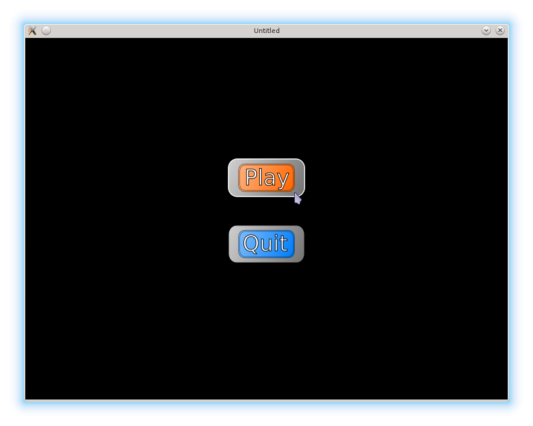
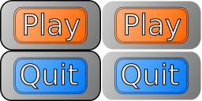

# 26. Menu Buttons

In this part I want to implement a simple main menu screen.

<p align="center">

</p>

The menu I use consists of just two buttons: "Play" and "Quit".
Each button is rectangular, with it's own image (in fact, different quads of the same image).
A button has a `selected` flag, which is activated if a mouse pointer hovers over it.
If a button is `selected`, it's image changes.

<p align="center">
<br>

<br>
In the left column outline of the buttons is black, in the right - white. 
White outline version is used when the mouse cursor hovers over a button.
</p>

As a rectangle, a button needs position, width, and height.
To display a texture, it needs an image and a quad. A different quad is used if
the `selected` flag is active. If no image or quad is provided, a text is displayed instead.
According to this description, a button constructor has the following form.

```lua
function buttons.new_button( o )
   return( { position = o.position or vector( 300, 300 ),
             width = o.width or 100,
             height = o.height or 50,
             text = o.text or "hello",
             image = o.image or nil,
             quad = o.quad or nil,
             quad_when_selected = o.quad_when_selected or nil,
             selected = false } )
end
```

In the `update` function mouse cursor position is monitored continuously.
If the cursor is inside the button's rectangle, the `selected` flag is activated.

```lua
function buttons.update_button( single_button, dt )
   local mouse_pos = vector( love.mouse.getPosition() )
   if( buttons.inside( single_button, mouse_pos ) ) then
      single_button.selected = true
   else
      single_button.selected = false
   end
end

function buttons.inside( single_button, pos )
   return
      single_button.position.x < pos.x and
      pos.x < ( single_button.position.x + single_button.width ) and
      single_button.position.y < pos.y and
      pos.y < ( single_button.position.y + single_button.height )
end
```

The `draw` function displays the specified quad of the image.
If the image or quad are invalid, a rectangle is drawn with LÖVE primitives
and default text is displayed. The quad and the color of the rectangle and the text depend
on the value of the `selected` flag.

```lua
function buttons.draw_button( single_button )
   if single_button.selected then
      if single_button.image and single_button.quad_when_selected then
         love.graphics.draw( single_button.image,
                             single_button.quad_when_selected,
                             single_button.position.x,
                             single_button.position.y )
      else
         love.graphics.rectangle( 'line',
                                  single_button.position.x,
                                  single_button.position.y,
                                  single_button.width,
                                  single_button.height )
         local r, g, b, a = love.graphics.getColor()
         love.graphics.setColor( 255, 0, 0, 100 )
         love.graphics.print( single_button.text,
                              single_button.position.x,
                              single_button.position.y )
         love.graphics.setColor( r, g, b, a )
      end
   else
      if single_button.image and single_button.quad then
         love.graphics.draw( single_button.image,
                             single_button.quad,
                             single_button.position.x,
                             single_button.position.y )
      else
         love.graphics.rectangle( 'line',
                                  single_button.position.x,
                                  single_button.position.y,
                                  single_button.width,
                                  single_button.height )
         love.graphics.print( single_button.text,
                              single_button.position.x,
                              single_button.position.y )
      end
   end
end
```

Unlike the ball, the platform and other game objects, buttons can be used from different game states
and with different tile images. For this reason, a description of the menu button tileset is placed
in the `menu.lua` where the buttons are created and not in the `buttons.lua`.

```lua
local buttons = require "buttons"

local menu_buttons_image = love.graphics.newImage( "img/800x600/buttons.png" )
local button_tile_width = 128
local button_tile_height = 64
local play_button_tile_x_pos = 0
local play_button_tile_y_pos = 0
local quit_button_tile_x_pos = 0
local quit_button_tile_y_pos = 64
local selected_x_shift = 128
local tileset_width = 256
local tileset_height = 128
local play_button_quad = love.graphics.newQuad(
   play_button_tile_x_pos,
   play_button_tile_y_pos,
   button_tile_width,
   button_tile_height,
   tileset_width,
   tileset_height )
local play_button_selected_quad = love.graphics.newQuad(
   play_button_tile_x_pos + selected_x_shift,
   play_button_tile_y_pos,
   button_tile_width,
   button_tile_height,
   tileset_width,
   tileset_height )
local quit_button_quad = love.graphics.newQuad(
   quit_button_tile_x_pos,
   quit_button_tile_y_pos,
   button_tile_width,
   button_tile_height,
   tileset_width,
   tileset_height )
local quit_button_selected_quad = love.graphics.newQuad(
   quit_button_tile_x_pos + selected_x_shift,
   quit_button_tile_y_pos,
   button_tile_width,
   button_tile_height,
   tileset_width,
   tileset_height )
```

"Play" and "Quit" buttons are created in the `menu.load`. They are declared `local` in the scope of the `menu.lua`. This is necessary to provide access to these variables from other `menu` functions, such as `menu.update` and `menu.draw`.

```lua
local start_button = {}
local quit_button = {}

function menu.load( prev_state, ... )
   start_button = buttons.new_button{
      text = "New game",
      position = vector( (800 - button_tile_width) / 2, 200),
      width = button_tile_width,
      height = button_tile_height,
      image = menu_buttons_image,
      quad = play_button_quad,
      quad_when_selected = play_button_selected_quad
   }
   quit_button = buttons.new_button{
      text = "Quit",
      position = vector( (800 - button_tile_width) / 2, 310),
      width = button_tile_width,
      height = button_tile_height,
      image = menu_buttons_image,
      quad = quit_button_quad,
      quad_when_selected = quit_button_selected_quad
   }
   music:play()
end
```

Buttons are drawn and updated in the appropriate `menu` callbacks.

```lua
function menu.update( dt )
   buttons.update_button( start_button, dt )
   buttons.update_button( quit_button, dt )
end

function menu.draw()
   buttons.draw_button( start_button )
   buttons.draw_button( quit_button )
end
```

If "Play" button is clicked, it is necessary to activate the "game" gamestate; in case of "Quit", `love.event.quit` should be called. To check, whether the click was made inside the button or outside, it is enough to return the value of the `selected` flag, since it is active only when the mouse hovers over the button (`buttons.mousereleased` function). I do not associate any `on_click`-functions with buttons. Instead, I check each button directly and perform corresponding actions.

```lua
function menu.mousereleased( x, y, button, istouch )
   if button == 'l' or button == 1 then
      if buttons.mousereleased( start_button, x, y, button ) then
         gamestates.set_state( "game", { current_level = 1 } )
      elseif buttons.mousereleased( quit_button, x, y, button ) then
         love.event.quit()
      end
   elseif button == 'r' or button == 2 then
      love.event.quit()
   end
end

function buttons.mousereleased( single_button, x, y, button )
   return single_button.selected
end
```
