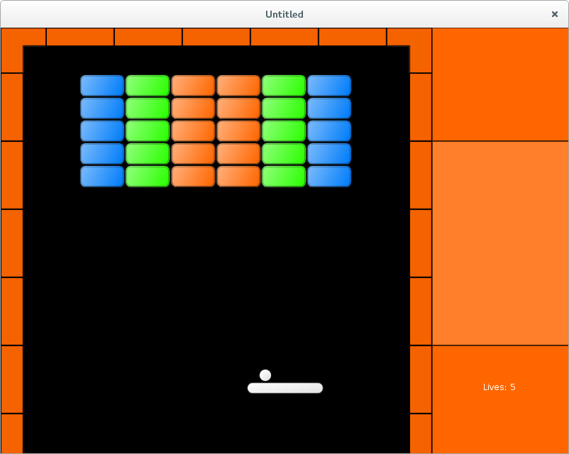

# 28. Side Panel

This part is devoted to the panel on the right side of the game screen.

<p align="center">

</p>

It is enough to define a simple function to draw a fancy background image at some part of the screen.
Instead, I make the side panel a full-fledged game object with it's own `draw` and `update` methods.
An advantage of such an approach is that it allows to easily pass the side panel between the gamestates.

While it is possible to use an image as a background, I just draw three rectangular segments of uniform color (top, middle, and bottom). This can be implemented using `love.graphics` primitives.

```lua
local side_panel = {}
local position_x = 608
local width = 200
local height_top = 160
local height_middle = 288
local height_bottom = 160
local position_top = vector( position_x, 0 )
local position_middle = vector( position_x, height_top )
local position_bottom = vector( position_x, height_top + height_middle )

function side_panel.draw()
   side_panel.draw_background()
   .....
end

function side_panel.draw_background()
   local drawtype = 'fill'
   local r, g, b, a = love.graphics.getColor( )
   -- top
   love.graphics.setColor( 255, 102, 0, 255 )
   love.graphics.rectangle("fill",
                           position_top.x,
                           position_top.y,
                           width,
                           height_top )
   love.graphics.setColor( 0, 0, 0, 255 )
   love.graphics.rectangle("line",
                           position_top.x,
                           position_top.y,
                           width,
                           height_top )
   -- middle
   love.graphics.setColor( 255, 127, 42, 255 )
   love.graphics.rectangle("fill",
                           position_middle.x,
                           position_middle.y,
                           width,
                           height_middle )
   love.graphics.setColor( 0, 0, 0, 255 )
   love.graphics.rectangle("line",
                           position_middle.x,
                           position_middle.y,
                           width,
                           height_middle )
   -- bottom
   love.graphics.setColor( 255, 102, 0, 255 )
   love.graphics.rectangle("fill",
                           position_bottom.x,
                           position_bottom.y,
                           width,
                           height_bottom )
   love.graphics.setColor( 0, 0, 0, 255 )
   love.graphics.rectangle("line",
                           position_bottom.x,
                           position_bottom.y,
                           width,
                           height_bottom )
   love.graphics.setColor( r, g, b, a )
end
```

Another use for the `side_panel` object is that it serves as a container for `lives_display`.
While it slightly reduces a number of variables in the "game" gamestate, the main
advantage of such approach is that it allows to achieve a fixed drawing order for
elements on the side panel: background at the bottom and `lives_display` at the top.
This is controlled by the `side_panel.draw` function.

```lua
local lives_display = require "lives_display"

side_panel.lives_display = lives_display

function side_panel.update( dt )
   side_panel.lives_display.update( dt )
end

function side_panel.draw()                      --(*1)
   side_panel.draw_background()
   side_panel.lives_display.draw()
end
```

(\*1): The drawing order is controlled by `side_panel.draw` function.
The background is drawn first, and `lives_display` on top of it.

Such rearrangement requires certain updates in the "game" game state.

```lua
.....
local side_panel = require "side_panel"
.....


function game.enter( prev_state, ... )
   .....
   if prev_state == "gameover" or prev_state == "gamefinished" then
      side_panel.lives_display.reset()
      music:rewind()
   end
   .....
end


function game.update( dt )
   .....
   walls.update( dt )
   side_panel.update( dt )
   collisions.resolve_collisions( balls, platform,
                                  walls, bricks,
                                  bonuses, side_panel.lives_display )
   game.check_no_more_balls( balls, side_panel.lives_display )
   .....
end

function game.draw()
   balls.draw()
   .....
   side_panel.draw()
end

function game.keyreleased( key, code )
   .....
   elseif  key == 'escape' then
      music:pause()
      gamestates.set_state(
         "gamepaused",
         { balls, platform, bricks, bonuses, walls, side_panel } )
   end
end

function game.mousereleased( x, y, button, istouch )
   .....
   elseif button == 'r' or button == 2 then
      music:pause()
      gamestates.set_state(
         "gamepaused",
         { balls, platform, bricks, bonuses, walls, side_panel } )
   end
end

function game.check_no_more_balls( balls, lives_display )
   if balls.no_more_balls then
      .....
      if lives_display.lives < 0 then
         gamestates.set_state( "gameover",
                               { balls, platform, bricks,
                                 bonuses, walls, side_panel } )
      else
      .....
   end
end
```
