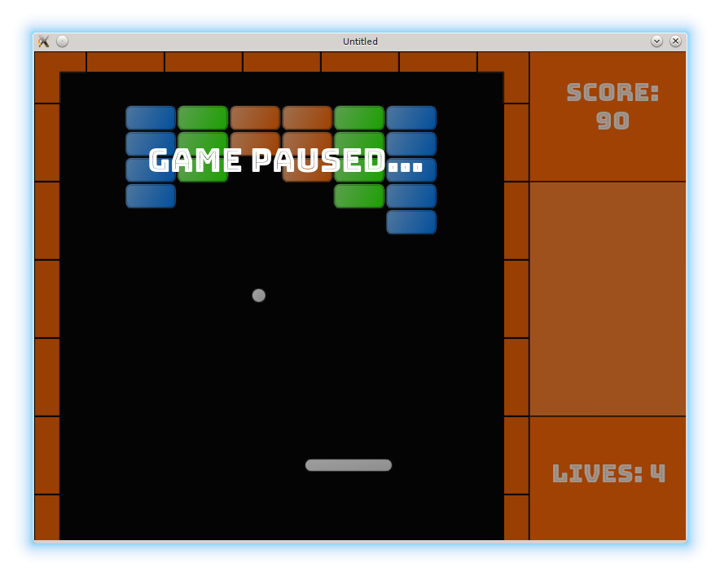

# 30. Fonts

In this part, new fonts are added into the game.

<p align="center">

</p>

LÖVE's single embedded font is good for prototyping, but may not fit nicely with other art. This can be fixed by using custom fonts. There are [two ways](https://love2d.org/wiki/Tutorial:Fonts_and_Text) to specify them: by a font \*.ttx file, or by an image.

A good place to start looking for fonts is [Google fonts](https://fonts.google.com/). Apart from that, a decent collection of videogames-oriented fonts can be found on [OpenGameArt](https://opengameart.org/art-search?keys=font). Be sure to check license agreement for the font of your choice. In the current case, I've thought that [Bungee Inline](https://fonts.google.com/specimen/Bungee+Inline) is a good fit. After downloading an archive with the \*.ttx file, I've placed it into the `fonts/Bungee_Inline` folder.

There are several places where the new font should be used: lives and score displays, "game paused" and "game finished" screens. Let's start from `score_display`.

To use a font, first it is necessary to load it.
After that, in the drawing function it is necessary to save the old font, set the new one, print something, and restore the old font.

```lua
local score_display = {}
.....
local separation = 35                              --(*1)

local bungee_font = love.graphics.newFont(
   "/fonts/Bungee_Inline/BungeeInline-Regular.ttf", 30 )

function score_display.draw()
   local oldfont = love.graphics.getFont()
   love.graphics.setFont( bungee_font )
   local r, g, b, a = love.graphics.getColor()
   love.graphics.setColor( 255, 255, 255, 230 )
   love.graphics.printf( "Score:",                 --(*2)
                         position.x,
                         position.y,
                         width,
                         "center" )
   love.graphics.printf( score_display.score,
                         position.x,
                         position.y + separation,
                         width,
                         "center" )
   love.graphics.setFont( oldfont )
   love.graphics.setColor( r, g, b, a )
end
```

(\*1): Score is displayed in two lines. Vertical separation between them is specified by `separation` variable.  
(\*2): I use [`love.graphics.printf`](https://love2d.org/wiki/love.graphics.printf) instead of [`love.graphics.print`](https://love2d.org/wiki/love.graphics.print) to position the text.

For `lives_display` changes are similar.

```lua
local bungee_font = love.graphics.newFont(
   "/fonts/Bungee_Inline/BungeeInline-Regular.ttf", 30 )

function lives_display.draw()
   local oldfont = love.graphics.getFont()
   love.graphics.setFont( bungee_font )
   local r, g, b, a = love.graphics.getColor( )
   love.graphics.setColor( 255, 255, 255, 230 )
   love.graphics.printf( "Lives: " .. tostring( lives_display.lives ),
                         position.x,
                         position.y,
                         width,
                         "center" )
   love.graphics.setFont( oldfont )
   love.graphics.setColor( r, g, b, a )
end
```

In the "game paused" screen, the text is centered.
Besides, `cast_shadow` function is added which provides darkening effect
by drawing half-transparent black rectangle on top of the game objects.

```lua
bungee_font = love.graphics.newFont(
   "/fonts/Bungee_Inline/BungeeInline-Regular.ttf", 40 )

function gamepaused.draw()
   for _, obj in pairs( game_objects ) do
      if type(obj) == "table" and obj.draw then
         obj.draw()
      end
   end
   gamepaused.cast_shadow()

   local oldfont = love.graphics.getFont()
   love.graphics.setFont( bungee_font )
   love.graphics.printf( "Game Paused...",
                         108, 110, 400, "center" )
   love.graphics.setFont( oldfont )
end

function gamepaused.cast_shadow()
   local r, g, b, a = love.graphics.getColor( )
   love.graphics.setColor( 10, 10, 10, 100 )
   love.graphics.rectangle("fill",
                           0,
                           0,
                           love.graphics.getWidth(),
                           love.graphics.getHeight() )
   love.graphics.setColor( r, g, b, a )
end
```

Finally, "gamefinished" screen is also updated.

```lua
bungee_font = love.graphics.newFont(
   "/fonts/Bungee_Inline/BungeeInline-Regular.ttf", 30 )

function gamefinished.draw()
   local oldfont = love.graphics.getFont()
   love.graphics.setFont( bungee_font )
   love.graphics.printf( "Congratulations!",
                         235, 200, 350, "center" )
   love.graphics.printf( "You have finished the game!",
                         100, 240, 600, "center" )
   love.graphics.setFont( oldfont )
end
```
