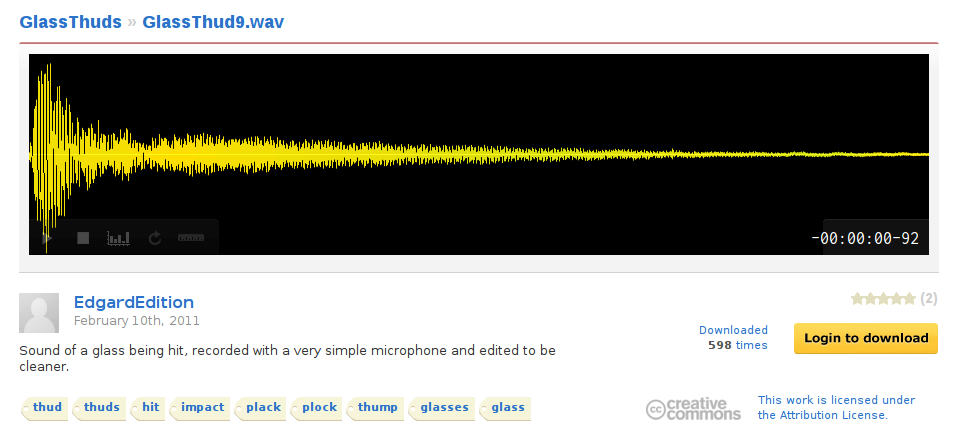

# 31. More Sounds

In this part, more sound effects are added.

本节会加入更多音效。

<p align="center">
<a href="https://www.freesound.org/people/EdgardEdition/sounds/114201/">

</a>
<br>
<a href=https://www.freesound.org/>Freesound</a> is a collaborative database of Creative Commons Licensed sounds and a good place to look for sound effects.
</p>

<p align="center">
<a href="https://www.freesound.org/people/EdgardEdition/sounds/114201/">

</a>
<br>
<a href=https://www.freesound.org/>Freesound</a> 是一个基于 Creative Commons 授权的音效协作库，也是寻找音效的好地方。
</p>

So far, apart from music, sounds have been played only on ball-brick collisions.
Besides, there has been only a single sound for each brick type.
To add some diversity, sound effects for other collision types can be implemented and instead of a single sound, several effects for each collision event can be provided to choose from.

目前除了音乐之外，声音只在球-砖块碰撞时播放，而且每种砖块只用一种声音。为了增加多样性，可以为其它碰撞类型加入音效，并为每类碰撞提供多个音效供随机选择。

I'll continue to use [`love.audio.Source`](https://love2d.org/wiki/Source)s directly.
However, several modules, such as [SLAM](https://love2d.org/wiki/SLAM) and [TEsound](https://love2d.org/wiki/TEsound) are available to simplify sound management. Check out another possibilities at the [libraries list on the LÖVE wiki](https://love2d.org/wiki/Category:Libraries).

我继续直接使用 [`love.audio.Source`](https://love2d.org/wiki/Source)。不过也有一些模块可以简化声音管理，比如 [SLAM](https://love2d.org/wiki/SLAM) 和 [TEsound](https://love2d.org/wiki/TEsound)。更多选择可以看 [LÖVE wiki 的库列表](https://love2d.org/wiki/Category:Libraries)。

New sounds for ball-brick collisions are grouped in tables according to brick type:

新的球-砖块音效按砖块类型分组存放在表中：

```lua
local simple_break_sound = {
   love.audio.newSource(
      "sounds/simple_break/recordered_glass_norm.ogg",
      "static"),
   love.audio.newSource(
      "sounds/simple_break/edgardedition_glass_hit_norm.ogg",
      "static") }

local armored_hit_sound = {
   love.audio.newSource(
      "sounds/armored_hit/qubodupImpactMetal_short_norm.ogg",
      "static"),
   love.audio.newSource(
      "sounds/armored_hit/cast_iron_clangs_14_short_norm.ogg",
      "static"),
   love.audio.newSource(
      "sounds/armored_hit/cast_iron_clangs_22_short_norm.ogg",
      "static") }

local armored_break_sound = {
   love.audio.newSource(
      "sounds/armored_break/armored_glass_break_short_norm.ogg",
      "static"),
   love.audio.newSource(
      "sounds/armored_break/ngruber__breaking-glass_6_short_norm.ogg",
      "static") }

local ball_heavyarmored_sound = {
   love.audio.newSource(
      "sounds/heavyarmored_hit/cast_iron_clangs_11_short_norm.ogg",
      "static"),
   love.audio.newSource(
      "sounds/heavyarmored_hit/cast_iron_clangs_18_short_norm.ogg",
      "static") }
```

Sounds when bonus is picked:

拾取奖励时的音效：

```lua
local bonus_collected_sound = {
   love.audio.newSource("sounds/bonus/bonus1.wav", "static"),
   love.audio.newSource("sounds/bonus/bonus2.wav", "static"),
   love.audio.newSource("sounds/bonus/bonus3.wav", "static")
}
```

Ball-wall collision sound:

球-墙碰撞音效：

```lua
local ball_wall_sound = love.audio.newSource(
   "sounds/ball_wall/pumpkin_break_01_short_norm.ogg",
   "static")
```

After the sounds are loaded, it is necessary to select and play one of them.
Selection is random, and several random number generators are created specially for this purpose.

音效加载后，需要随机选择并播放其中一个。为此会专门创建随机数生成器。

For ball-brick collisions:

球-砖块碰撞：

```lua
local snd_rng = love.math.newRandomGenerator( os.time() )                      --(*1)

function bricks.brick_hit_by_ball( i, brick, shift_ball, bonuses, score_display )
   if bricks.is_simple( brick ) then
      .....
      table.remove( bricks.current_level_bricks, i )
      local snd = simple_break_sound[ snd_rng:random( #simple_break_sound ) ]  --(*2)
      snd:play()
   elseif bricks.is_armored( brick ) then
      bricks.armored_to_scrathed( brick )
      local snd = armored_hit_sound[ snd_rng:random( #armored_hit_sound ) ]
      snd:play()
   elseif bricks.is_scratched( brick ) then
      bricks.scrathed_to_cracked( brick )
      local snd = armored_hit_sound[ snd_rng:random( #armored_hit_sound ) ]
      snd:play()
   elseif bricks.is_cracked( brick ) then
      .....
      table.remove( bricks.current_level_bricks, i )
      local snd = armored_break_sound[ snd_rng:random( #armored_break_sound ) ]
      snd:play()
   elseif bricks.is_heavyarmored( brick ) then
      local snd =
         ball_heavyarmored_sound[ snd_rng:random( #ball_heavyarmored_sound ) ]
      snd:play()
   end
end
```

(\*1): New random number generator  
(\*2): `snd_rng:random( #simple_break_sound )` generates a random number between 1 and
the length of the `simple_break_sound`. This number is passed as an index into the
`simple_break_sound[ ..... ]`, which effectively selects a random element from the `simple_break_sound`

(\*1)：新的随机数生成器。  
(\*2)：`snd_rng:random( #simple_break_sound )` 生成 1 到 `simple_break_sound` 长度之间的随机数，用作索引，从而随机选取一个音效。

Same for the bonuses:

奖励同理：

```lua
local snd_rng = love.math.newRandomGenerator( os.time() )

function bonuses.bonus_collected( i, bonus,
                                  balls, platform,
                                  walls, lives_display )
   .....
   table.remove( bonuses.current_level_bonuses, i )
   local snd = bonus_collected_sound[ snd_rng:random( #bonus_collected_sound ) ]
   snd:play()
end
```

Since there is only a single sound for ball-wall collisions, there is no need for
random number generator.

由于球-墙只有一个音效，因此不需要随机数生成器。

```lua
function balls.wall_rebound( single_ball, shift_ball )
   .....
   balls.increase_speed_after_collision( single_ball )
   ball_wall_sound:play()
end
```
