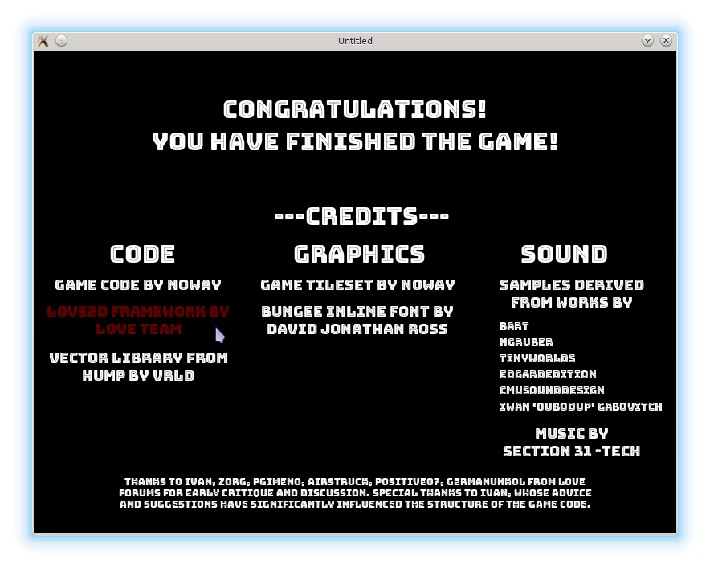

# 32. Final Screen

In this part I want to add a credits screen at the end of the game.

本节要在游戏结束时加入致谢（credits）界面。

<p align="center">

</p>

On the credits screen it is customary to mention people who have been involved in the project
and resources that have been used. I'm going to use simple text buttons and attach a URL to each one.
When cursor hovers over a button, the text changes color; the URL is opened on mouse click.

在致谢界面里，通常会列出参与项目的人以及使用过的资源。我会用简单的文本按钮，并给每个按钮附上一个 URL。鼠标悬停时文字变色，点击时打开链接。

Most of the required functionality has already been implemented in the [buttons class](./26) and it is possible to reuse certain parts of the code. Instead of implementing some kind of an OOP system or using advanced Lua facilities, I deliberately stick to a simpler approach.

所需功能大部分在[按钮类](./26)里已经实现，可以复用部分代码。我刻意不引入复杂的面向对象系统或高级 Lua 特性，而是保持简洁的实现方式。

To construct a button with URL, it is possible to use a constructor from the old buttons class and insert a URL manually. To achieve a better control over the text appearance, it is also convenient to specify font and text alignment on button construction.

要构造带 URL 的按钮，可以使用旧按钮类的构造函数，然后手动添加 URL。为了更好地控制文字表现，还可以在构造时指定字体与对齐方式。

```lua
local buttons = require "buttons"

local buttons_with_url = {}

function buttons_with_url.new_button( o )
   btn = buttons.new_button( o )
   btn.url = o.url or nil
   btn.font = o.font or love.graphics.getFont()
   btn.text_align = o.text_align or "center"
   .....
   return( btn )
end
```

The functionality of the `update` and `inside` callbacks
of the `buttons_with_url` is identical to the similar callbacks of the `buttons`.
In fact, it is possible to simply use an assignment such as
`buttons_with_url.update_button = buttons.update_button`.
However, I redirect them explicitly.

`buttons_with_url` 的 `update` 与 `inside` 回调和 `buttons` 中的功能完全一致。其实可以直接写 `buttons_with_url.update_button = buttons.update_button` 这样的赋值，但我选择显式转发。

```lua
function buttons_with_url.update_button( single_button, dt )
   buttons.update_button( single_button, dt )
end

function buttons_with_url.inside( single_button, pos )
   buttons.inside( single_button, pos )
end
```

The `draw` callback is redefined to use fonts and text alignment specified on construction.

`draw` 回调被重新定义，使用构造时指定的字体与对齐方式。

```lua
function buttons_with_url.draw_button( single_button )
   local oldfont = love.graphics.getFont()
   love.graphics.setFont( single_button.font )
   if single_button.selected then
      local r, g, b, a = love.graphics.getColor()
      love.graphics.setColor( 255, 0, 0, 100 )
      love.graphics.printf( single_button.text,
                            single_button.position.x,
                            single_button.position.y,
                            single_button.width,
                            single_button.text_align )
      love.graphics.setColor( r, g, b, a )
   else
      love.graphics.printf( single_button.text,
                            single_button.position.x,
                            single_button.position.y,
                            single_button.width,
                            single_button.text_align )
   end
   love.graphics.setFont( oldfont )
end
```

To open a URL on a mouse click, `love.system.openURL` can be used.
The `mousereleased` callback is redefined instead of being redirected to the `buttons.mousereleased`.

要在点击时打开链接，可以使用 `love.system.openURL`。`mousereleased` 回调也需要重写，而不是再转发到 `buttons.mousereleased`。

```lua
function buttons_with_url.mousereleased( single_button, x, y, button )
   if single_button.selected then
      local status = love.system.openURL( single_button.url )
   end
   return single_button.selected
end
```

These definitions are sufficient to create the necessary buttons on the final screen (at least, that is how I've implemented it initially). The problem is, there are 13 of them; together with non-clickable text labels there are 20 elements, and each one has to be positioned manually. This is cumbersome to maintain: for example, to shift the 'Sound' column 15 pixels right it is necessary to update positions of the 9 elements.

这些定义足以创建最终界面所需的按钮（至少我最初就是这么做的）。问题在于：按钮有 13 个，加上不可点击的文字标签一共有 20 个元素，每个都要手动定位。这维护起来很麻烦，例如要把 “Sound” 列右移 15 像素，就要改动 9 个元素的坐标。

This problem can be alleviated to some extent by grouping buttons into layouts.
A layout has a position, a default width and a height for it's elements and
an offset between them. This information allows to calculate a position of each
element in the layout automatically.

这个问题可以通过把按钮分组到布局（layout）中来缓解。布局包含位置、默认宽高以及元素间距。利用这些信息，可以自动计算布局内每个元素的位置。

```lua
function buttons_with_url.new_layout( o )
   return( { position = o.position or vector( 300, 300 ),
             default_width = o.default_width or 100,
             default_height = o.default_height or 50,
             default_offset = o.default_offset or vector( 10, 10 ),
             orientation = o.orientation or "vertical",
             children = o.children or {} } )
end
```

An element agrees that it's position and size should be determined by the layout if
it has fields `positioning` and `sizing` set to `"auto"`. Still,
it is allowed to shift from automatically calculated position by `displacement_from_auto` vector.

如果元素的 `positioning` 和 `sizing` 都设为 `"auto"`，就表示它接受由布局来决定位置和尺寸。不过仍然可以用 `displacement_from_auto` 对自动位置进行微调。

```lua
function buttons_with_url.new_button( o )
   btn = buttons.new_button( o )
   .....
   btn.sizing = o.sizing or nil
   btn.positioning = o.positioning or nil
   btn.displacement_from_auto = o.displacement_from_auto or vector(0, 0)
   return( btn )
end
```

When an element with `positioning = "auto"` and `sizing = "auto"` is added into a layout,
it's position and size are computed by the layout, taking into account already present elements.

当带有 `positioning = "auto"` 和 `sizing = "auto"` 的元素被添加到布局中时，其位置和尺寸由布局计算，并考虑已有元素的占位。

```lua
function buttons_with_url.add_to_layout( layout, element )
   if element.positioning and element.positioning == 'auto' then
      local position = layout.position
      for i, el in ipairs( layout.children ) do
         if layout.orientation == "vertical" then                             --(*1)
            position = position + vector( 0, el.height ) + layout.default_offset
         else
            print( "unknown layout orientation" )
         end
      end
      element.position = position + element.displacement_from_auto
   end
   if element.sizing and element.sizing == 'auto' then
      element.width = layout.default_width
      element.height = layout.default_height
   end
   table.insert( layout.children, element )
end
```

(\*1): In GUI toolkits it is typical to have both vertical and horizontal layouts.
For the final screen I use only vertical layouts, so I do not define horizontal.

(\*1)：GUI 工具通常既有纵向布局也有横向布局。最终界面只用纵向布局，所以我没实现横向布局。

In the `draw`, `update` and `mousereleased` callbacks, a layout iterates over it's elements
and calls an appropriate callback for each one.

在 `draw`、`update` 和 `mousereleased` 回调中，layout 会遍历自身元素并调用相应回调。

```lua
function buttons_with_url.update_layout( layout, dt )
   for _, btn in pairs( layout.children ) do
      buttons_with_url.update_button( btn, dt )
   end
end

function buttons_with_url.draw_layout( layout )
   for _, btn in pairs( layout.children ) do
      buttons_with_url.draw_button( btn )
   end
end

function buttons_with_url.mousereleased_layout( layout, x, y, button )
   for _, btn in pairs( layout.children ) do
      buttons_with_url.mousereleased_button( btn, x, y, button )
   end
end
```

Such layouts are a partial solution: they accepts only `button_with_url` as their elements.
An attempt to add an element of another type, e.g. a simple button, would have resulted  
in problems with choosing which `update` and `draw` methods to call for this element (`buttons_with_url.draw_button` would not fit for a simple button). To handle it, each element should either
have a reference to each of it's callbacks or it should store a type and dispatch on this type has to be performed.
For the former approach, Lua provides and elegant way - metatables. I plan to address this issue in one of the appendices.

这种布局只解决了一部分问题：它只能接受 `button_with_url` 类型的元素。如果添加其它类型（比如普通按钮），就会出现该调用哪一个 `update/draw` 的问题（`buttons_with_url.draw_button` 也不适用于普通按钮）。要解决这个问题，要么让每个元素带上自己的回调引用，要么保存一个类型并进行分发。前一种方式在 Lua 中可以用元表（metatable）优雅解决，我计划在附录里讨论。

With layouts defined, it is possible to create several of them for the final screen.
Still, a lot of manual positioning is necessary.

有了布局之后，可以为最终界面创建多个布局，但仍然需要不少手动定位。

```lua
local buttons_with_url = require "buttons_with_url"
local vector = require "vector"

local gamefinished = {}

bungee_font = love.graphics.newFont(
   "/fonts/Bungee_Inline/BungeeInline-Regular.ttf", 30 )
bungee_font_links = love.graphics.newFont(
   "/fonts/Bungee_Inline/BungeeInline-Regular.ttf", 18 )
.....

local section_start_y = 280
local section_width = 250
local section_line_height = 25

function gamefinished.load( prev_state, ... )
   code_section = buttons_with_url.new_layout{
      position = vector( 5, section_start_y ),
      default_width = section_width,
      default_height = section_line_height,
      default_offset = vector( 0, 8 )
   }
   buttons_with_url.add_to_layout(
      code_section,
      buttons_with_url.new_button{
         text = "Game code by noway",
         url = "https://github.com/noooway/love2d_arkanoid_tutorial",
         font = bungee_font_links,
         positioning = "auto",
         sizing = "auto"
   })
   buttons_with_url.add_to_layout(
      code_section,
      buttons_with_url.new_button{
         text = "Love2d framework by Love Team",
         url = "http://love2d.org/",
         positioning = "auto",
         width = code_section.default_width,
         height = 2 * code_section.default_height,
         font = bungee_font_links
   })
   .....
end
```

Along with the buttons, some additional text is also printed.

除了按钮之外，还要绘制一些额外的文字。

```lua
function gamefinished.draw()
   local oldfont = love.graphics.getFont()
   love.graphics.setFont( bungee_font )
   love.graphics.printf( "Congratulations!",
                         0, 55, love.graphics.getWidth(), "center" )
   love.graphics.printf( "You have finished the game!",
                         0, 95, love.graphics.getWidth(), "center" )
   love.graphics.printf( "---Credits---",
                         5, 188, love.graphics.getWidth(), "center" )

   local section_names_y = 235
   local section_width = 260
   love.graphics.printf( "Code",
                         5, section_names_y, section_width, "center" )
   love.graphics.printf( "Graphics",
                         275, section_names_y, section_width, "center" )
   love.graphics.printf( "Sound",
                         530, section_names_y, section_width, "center" )

   love.graphics.setFont( bungee_font_links )
   love.graphics.printf( "Samples derived from works by",
                         570, section_start_y, 200, "center" )
   love.graphics.setFont( oldfont )

   buttons_with_url.draw_layout( code_section )
   buttons_with_url.draw_layout( graphics_section )
   buttons_with_url.draw_layout( sound_effects_section )
   buttons_with_url.draw_button( music_button )
   buttons_with_url.draw_button( thanks_button )
end
```
