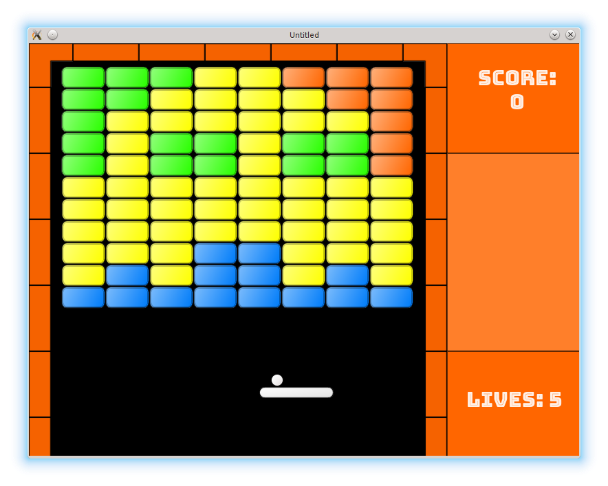

# 33. Packaging

Before shipping the game to the public, it is necessary to add several game levels, get rid of the bugs, test and polish everything. I won't describe details of this process but it is actually what constitutes significant part of game development work.

<p align="center">

</p>

When the game is ready for release, it is necessary to package it into distributable form.
LÖVE provides two possibilities for this.
The first method is to create a `.love` file (which is in fact just a zip archive), that can be
executed by the LÖVE interpreter. The second method is to bind the LÖVE interpreter together with the
game and distribute a self-contained executable file.

Advantage of the first approach is simplicity for the developer: creation of a `.love` file is easy to accomplish.
Advantage of the second is simplicity for the user: there is no need to install any additional software to run the game.

For this project, I'll use the first method, but for commercial games the second approach is preferable. I plan to address it in one of the appendices. [Love-release](https://github.com/MisterDA/love-release) is a helpful tool to automate creation of `.love` packages and stand-alone executables for various platforms. Besides, with external tools such as [love.js](https://github.com/TannerRogalsky/love.js) it is relatively easy to
create a web-version of your game. Give them a try.

On GNU/Linux, a convenient way to create a `*.love` archive is by `make` utility.

There are [lots of](https://gist.github.com/isaacs/62a2d1825d04437c6f08) [tutorials](https://www.gnu.org/software/make/manual/html_node/index.html#Top) [describing](http://mrbook.org/blog/tutorials/make/) Makefile syntax.
In short, a typical entry - called "rule" - has the following form:

```make
target: dependency1 dependency2 .....
	command1
	command2
	.....
```

The following recursive strategy is used: to execute the rule with
the name `target`, first execute the rules for each of it's dependencies;
after that, execute each command in the list of the commands. So, typing `make target`
will result in Make looking for and executing rules for `dependency1`, `dependency2` etc,
and after that executing a series of commands `command1`, `command2` etc.

For the current project the following `Makefile` is used:

```make
NAME=love2d_arkanoid_tutorial

all: love

love:
	zip -r ${NAME}.love *.lua \
			fonts img levels sounds \
			credits.txt Makefile \
			../LICENSE ../README.md

clean:
	rm -f *.love
```

Commands `make`, `make all` and `make love` will create a LÖVE package (zip archive with `love` extension) with all
the necessary files to run the game; `make clean` will delete this archive.
